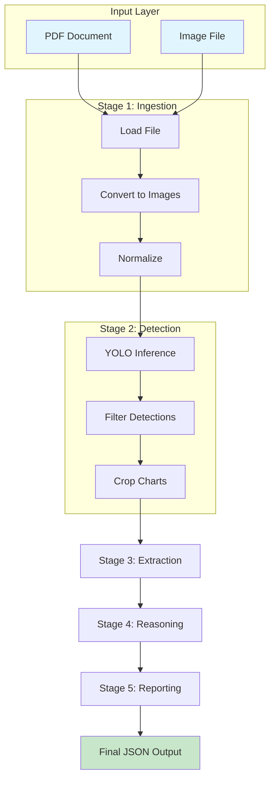
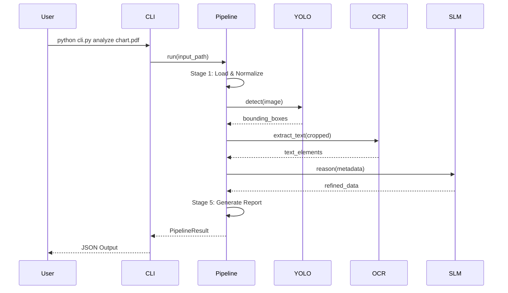
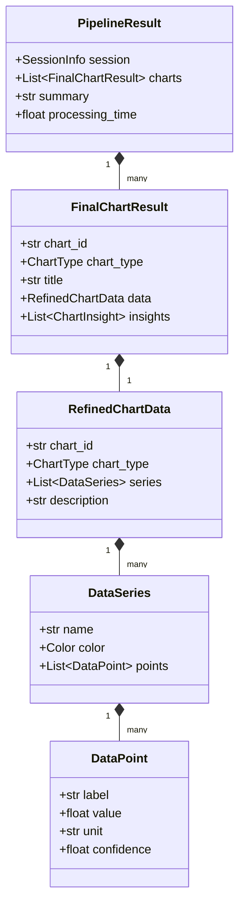
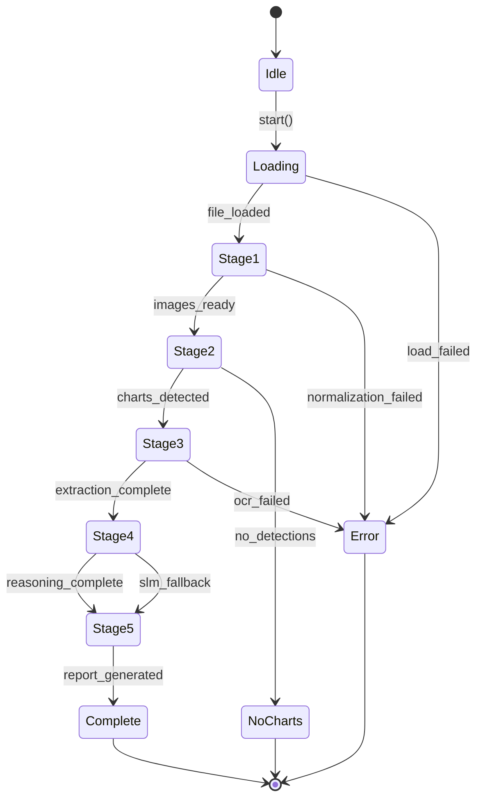
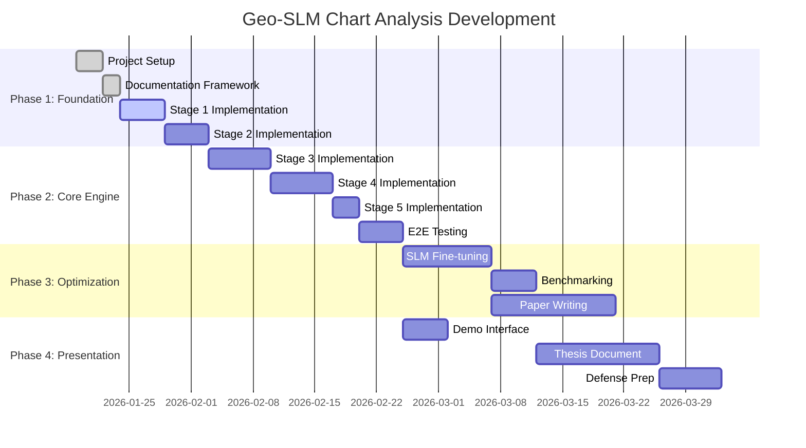
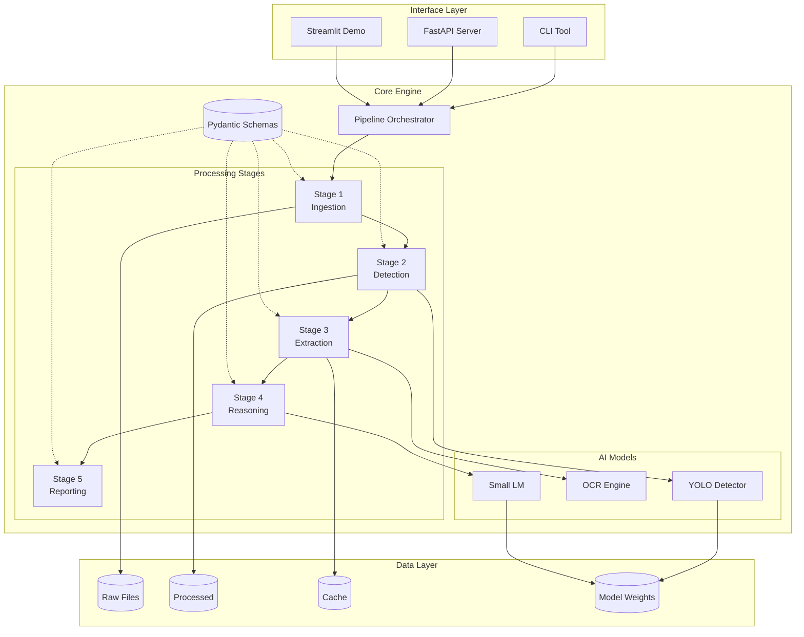

# DOCUMENTATION INSTRUCTIONS - Docs Standards

| Version | Date | Author | Description |
| --- | --- | --- | --- |
| 1.0.0 | 2026-01-19 | That Le | Documentation standards and mermaid diagrams |

## 1. Documentation Philosophy

> "Documentation is the first user interface of your code."

**Principles:**
1. **Accuracy**: All code examples must be tested and working
2. **Completeness**: Include prerequisites, examples, and troubleshooting
3. **Maintainability**: Update docs when code changes
4. **Accessibility**: Write for varied skill levels

## 2. Documentation Structure

### 2.1. Root Documentation

| File | Purpose | Update Frequency |
| --- | --- | --- |
| `README.md` | Project overview, quick start | Major releases |
| `MASTER_CONTEXT.md` | AI agent context, architecture | Monthly |
| `CHANGELOG.md` | Version history | Every release |
| `CONTRIBUTING.md` | Contribution guidelines | As needed |

### 2.2. Docs Directory

```
docs/
├── MASTER_CONTEXT.md           # Project overview for AI agents
├── architecture/
│   ├── SYSTEM_OVERVIEW.md      # High-level architecture
│   ├── PIPELINE_FLOW.md        # Stage-by-stage flow (mermaid)
│   ├── DATA_SCHEMAS.md         # Data structure definitions
│   └── DEPLOYMENT.md           # Deployment architecture
├── research/
│   ├── PAPER_NOTES.md          # Summary of referenced papers
│   ├── EXPERIMENTS.md          # Experiment log
│   └── METHODOLOGY.md          # Research methodology
├── guides/
│   ├── QUICK_START.md          # Getting started guide
│   ├── DEVELOPMENT.md          # Development setup
│   ├── TRAINING.md             # Model training guide
│   └── TROUBLESHOOTING.md      # Common issues
└── reports/
    ├── thesis/                 # LaTeX thesis files
    └── weekly/                 # Weekly progress reports
```

## 3. Markdown Standards

### 3.1. File Header

Every documentation file MUST start with a version table:

```markdown
# Document Title

| Version | Date | Author | Description |
| --- | --- | --- | --- |
| 1.0.0 | 2026-01-19 | Name | Initial version |
| 1.1.0 | 2026-02-01 | Name | Added section X |
```

### 3.2. Section Hierarchy

```markdown
# Document Title (H1) - One per document

## Major Section (H2)

### Subsection (H3)

#### Detail Level (H4) - Use sparingly

##### Deep Detail (H5) - Avoid if possible
```

### 3.3. Code Blocks

**Always specify language:**

````markdown
```python
def example():
    return "Always specify language"
```
````

**Include context comments:**

```python
# Install dependencies first
# pip install ultralytics pydantic

from ultralytics import YOLO

model = YOLO("models/weights/chart_detector.pt")
results = model.predict("chart.png")
```

**Show expected output:**

```bash
$ python scripts/test_detection.py

# Expected output:
[INFO] Loading model from models/weights/chart_detector.pt
[INFO] Detected 3 charts with confidence > 0.5
[INFO] Results saved to outputs/detections.json
```

### 3.4. Tables

Use tables for structured information:

| Stage | Input | Output | Key Component |
| --- | --- | --- | --- |
| 1. Ingestion | PDF/Image | Clean Images | PyMuPDF |
| 2. Detection | Images | Cropped Charts | YOLO |
| 3. Extraction | Charts | Raw Metadata | PaddleOCR |
| 4. Reasoning | Metadata | Refined Data | SLM |
| 5. Reporting | Data | JSON + Report | Jinja2 |

### 3.5. Status Indicators

Use consistent text-based indicators (NO emojis):

- `[DONE]` - Completed
- `[IN PROGRESS]` - Currently working
- `[TODO]` - Not started
- `[BLOCKED]` - Waiting on dependency
- `[DEPRECATED]` - No longer used

## 4. Mermaid Diagrams

### 4.1. When to Use Mermaid

| Diagram Type | Use Case | Mermaid Type |
| --- | --- | --- |
| System Architecture | Component relationships | `flowchart` |
| Data Flow | Pipeline stages | `flowchart` |
| Sequence | API interactions | `sequenceDiagram` |
| State Machine | Object lifecycle | `stateDiagram-v2` |
| Class Structure | Schema relationships | `classDiagram` |
| Timeline | Project phases | `gantt` |

### 4.2. Flowchart (Pipeline Flow)



### 4.3. Sequence Diagram (API Flow)



### 4.4. Class Diagram (Schema Structure)



### 4.5. State Diagram (Pipeline State)



### 4.6. Gantt Chart (Project Timeline)



### 4.7. Architecture Diagram



## 5. MASTER_CONTEXT Template

The MASTER_CONTEXT.md file should follow this structure:

```markdown
# MASTER CONTEXT - Geo-SLM Chart Analysis

| Version | Date | Author | Description |
| --- | --- | --- | --- |
| 1.0.0 | 2026-01-19 | That Le | Initial context |

## Quick Summary

| Property | Value |
| --- | --- |
| Project Name | Geo-SLM Chart Analysis |
| Project Type | AI Research / Thesis Project |
| Core Method | Hybrid (YOLO + Geometry + SLM) |
| Language | Python 3.11+ |
| Status | Phase 1 - Foundation |

## 1. Project Identity

### 1.1. What We Are Building
[Description]

### 1.2. What We Are NOT Building
[Anti-patterns]

## 2. Technology Stack

### 2.1. Core Components
[Table of technologies]

## 3. Architecture Overview

### 3.1. System Diagram
[Mermaid diagram]

### 3.2. Data Flow
[Mermaid diagram]

## 4. Current Status

### 4.1. Completed
- [x] Item 1
- [x] Item 2

### 4.2. In Progress
- [ ] Item 3

### 4.3. Blocked
- [ ] Item 4 (reason)

## 5. Key Decisions

| Decision | Rationale | Date |
| --- | --- | --- |
| Use YOLO for detection | Fast, accurate, trainable | 2026-01-19 |

## 6. References

- [Paper 1](url)
- [Documentation](url)
```

## 6. Report & Document Management Rules

### 6.1. Report Types and Placement

| Report Type | Location | Naming Convention | Trigger |
| --- | --- | --- | --- |
| Weekly progress | `docs/progress/` | `WEEKLY_PROGRESS_YYYYMMDD.md` | Every Sunday (or start of work week) |
| Data pipeline | `docs/reports/` | `data_pipeline_report_vN.md` | After major data stage completion |
| Failure analysis | `docs/reports/` | `failure_analysis_<component>_vN.md` | When bug/regression is resolved |
| Experiment log | `docs/reports/` | `experiment_<name>_YYYYMMDD.md` | After each training run |
| Architecture decision | `docs/architecture/` | `ADR_<topic>.md` | When a major design decision is made |

### 6.2. When to Update Existing Docs vs Create New

| Situation | Action |
| --- | --- |
| Tech stack addition/removal | Update `MASTER_CONTEXT.md` + relevant architecture doc |
| Bug discovered and fixed | Create `failure_analysis_*.md` + update MASTER_CONTEXT status |
| Phase transition (e.g., data done, training starts) | Update `MASTER_CONTEXT.md` version |
| Training run completed | Create `experiment_*.md` + update `module-training.instructions.md` status |
| New script added | Update `scripts/README.md` + relevant module instruction |
| Script archived/removed | Update `scripts/README.md`, mark `[DEPRECATED]` in relevant instruction |
| New week starts | Create new `WEEKLY_PROGRESS_*.md` |

**Rules:**
- NEVER silently delete or rename a document without updating references to it
- ALWAYS bump the version table at the top of a doc when making significant edits
- DO NOT create a new report for minor single-line fixes; use inline comments instead
- Reports in `docs/reports/` are write-once; to revise, increment the version table header

### 6.3. Instruction File Update Rules

When updating `.github/instructions/*.instructions.md`:

| Condition | What to Update |
| --- | --- |
| Module status changes | Update the status tables in the relevant module instruction |
| Dataset numbers change | Update `module-training.instructions.md` Section 3.1 |
| New file/script created | Add to the "Key Files" section of the appropriate instruction |
| File archived | Mark `[DEPRECATED]` in Key Files table with archive path |
| Command syntax changes | Update all code blocks in Step-by-Step sections |
| Config structure changes | Update YAML examples to match real config |

**CRITICAL:** Instruction files are not just documentation — they are loaded by AI agents as context. Outdated values (wrong sample counts, wrong paths, wrong status) directly cause incorrect agent behavior. Keep them accurate.

### 6.4. MASTER_CONTEXT Update Triggers

The `docs/MASTER_CONTEXT.md` MUST be updated when:

1. A development phase completes or starts
2. A major dataset milestone is reached (e.g., extraction 100%)
3. A trained model is ready for integration
4. The test count changes significantly
5. A new permanent tool/resource is added to the stack

Bump the version as follows:
- Patch (x.y.**Z**): Typo fixes, wording improvements
- Minor (x.**Y**.0): Status updates, new scripts, new docs
- Major (**X**.0.0): Phase transitions, architecture changes

## 7. Weekly Report Template

```markdown
# Week N Progress Report

| Property | Value |
| --- | --- |
| Week | N (YYYY-MM-DD to YYYY-MM-DD) |
| Author | Name |
| Status | On Track / At Risk / Blocked |

## Summary

[1-2 sentence summary of the week]

## Completed Tasks

- [x] Task 1 - Brief description
- [x] Task 2 - Brief description

## In Progress

| Task | Progress | ETA | Blockers |
| --- | --- | --- | --- |
| Task 3 | 70% | Next week | None |
| Task 4 | 30% | 2 weeks | Waiting for data |

## Metrics

| Metric | This Week | Last Week | Target |
| --- | --- | --- | --- |
| Detection Accuracy | 0.85 | 0.82 | 0.90 |
| OCR Accuracy | 0.88 | 0.88 | 0.95 |

## Challenges & Solutions

### Challenge 1: [Title]
- **Problem**: [Description]
- **Solution**: [How resolved or plan]

## Next Week Plan

1. [ ] Priority task 1
2. [ ] Priority task 2
3. [ ] Priority task 3

## Questions / Decisions Needed

- [ ] Question 1?
- [ ] Decision needed on X

## Notes

[Any additional notes or observations]
```

## 7. Failure Analysis Report Template

**Purpose:** In AI/ML, understanding WHY the model fails is more valuable than celebrating successes.

```markdown
# Failure Analysis Report: [Experiment/Model Name]

| Property | Value |
| --- | --- |
| Date | YYYY-MM-DD |
| Model Version | v1.2.3 |
| Dataset | chart_detection_v2 |
| Author | Name |

## Executive Summary

[1-2 sentences: What failed and the main cause]

## Failure Statistics

| Metric | Value | Target | Gap |
| --- | --- | --- | --- |
| Overall Accuracy | 0.78 | 0.85 | -0.07 |
| False Positives | 125 | <50 | +75 |
| False Negatives | 89 | <30 | +59 |

### Failure Distribution by Category

| Category | Count | Percentage | Example IDs |
| --- | --- | --- | --- |
| Misclassified bar as line | 45 | 28% | img_001, img_045 |
| Missed small charts | 32 | 20% | img_012, img_078 |
| OCR text corruption | 28 | 17% | img_023, img_091 |
| Low contrast images | 25 | 15% | img_034, img_056 |
| Other | 32 | 20% | - |

## Detailed Failure Analysis

### Category 1: [Misclassified bar as line]

**Sample Cases:**

| Image ID | Predicted | Actual | Confidence | Notes |
| --- | --- | --- | --- | --- |
| img_001 | line | bar | 0.72 | Horizontal bars look like lines |
| img_045 | line | bar | 0.68 | Thin bar width |

**Visual Examples:**

[Include 2-3 representative failure images with annotations]

**Root Cause Analysis:**
1. Training data has few horizontal bar charts
2. Bars with width < 10px are ambiguous
3. Model relies too heavily on orientation

**Proposed Fix:**
- [ ] Augment training data with horizontal bars
- [ ] Add bar width as explicit feature
- [ ] Ensemble with rule-based aspect ratio check

### Category 2: [Missed small charts]

[Repeat analysis structure...]

## Confusion Matrix

```
              Predicted
            bar  line  pie  scatter
Actual bar   85   12    2     1
      line    8   78    3     1
      pie     1    2   92     0
   scatter    3    5    1    86
```

## Error Pattern Summary

| Pattern | Impact | Difficulty to Fix | Priority |
| --- | --- | --- | --- |
| Horizontal bar confusion | High | Medium | P1 |
| Small chart detection | High | Hard | P2 |
| Low contrast handling | Medium | Easy | P3 |

## Action Items

| Action | Owner | Deadline | Status |
| --- | --- | --- | --- |
| Collect 200 horizontal bar samples | - | Week 3 | TODO |
| Implement contrast enhancement | - | Week 2 | TODO |
| Retrain with augmented data | - | Week 4 | TODO |

## Lessons Learned

1. [Key insight from this failure analysis]
2. [What to do differently next time]
3. [What worked well in the analysis process]

## References

- [Link to experiment log]
- [Link to related failure analysis]
```
