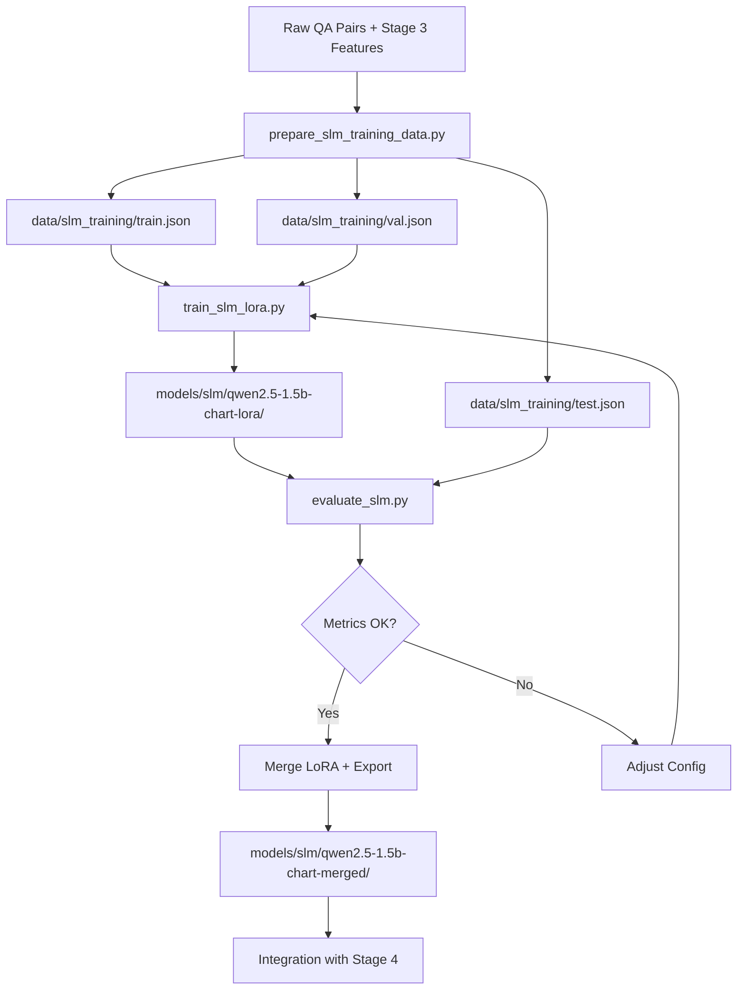

# MODULE INSTRUCTIONS - SLM Training & Fine-tuning

| Version | Date | Author | Description |
| --- | --- | --- | --- |
| 1.1.0 | 2026-03-01 | That Le | Dataset v3 complete (268k samples, all 8 types, axis info) |
| 1.0.0 | 2026-02-28 | That Le | SLM training framework design for chart analysis |

---

## 1. Overview

**SLM Training Module** manages the full lifecycle of fine-tuning Small Language Models (Qwen-2.5, Llama-3.2) for chart analysis tasks. This is a core academic contribution of the thesis -- building a specialized, locally-runnable model that replaces cloud API dependency.

**Key Files:**
- `scripts/prepare_slm_training_v3.py` - Data pipeline v3 (Stage3 features + QA -> training format) [PRIMARY]
- `scripts/prepare_slm_training_data.py` - [DEPRECATED] replaced by v3 script; archived to `scripts/_archive/`
- `scripts/train_slm_lora.py` - LoRA fine-tuning with PEFT
- `scripts/test_qwen_slm.py` - Inference testing
- `scripts/evaluate_slm.py` - Benchmark evaluation [TO CREATE]
- `scripts/merge_slm_lora.py` - Merge LoRA into base model [TO CREATE]
- `config/models.yaml` - Model paths, hyperparameters
- `config/training.yaml` - Training configuration [TO CREATE]
- `data/slm_training_v3/` - Primary training dataset (v3, 268k samples) [PRIMARY]
- `data/slm_training_v2/` - Archived baseline dataset (27k samples)
- `models/slm/` - Trained LoRA adapters and merged weights

---

## 2. Model Selection Strategy

### 2.1. Candidate Models

| Model | Size | VRAM (4-bit) | Strengths | Status |
| --- | --- | --- | --- | --- |
| Qwen2.5-1.5B-Instruct | 1.5B | ~2GB | Best reasoning/size ratio, strong JSON output | PRIMARY |
| Qwen2.5-3B-Instruct | 3B | ~3GB | Better complex reasoning, fits RTX 3060 | CANDIDATE |
| Llama-3.2-1B-Instruct | 1B | ~1.5GB | Smallest, fastest inference | LIGHTWEIGHT |
| Llama-3.2-3B-Instruct | 3B | ~3GB | Good general capability | CANDIDATE |
| Phi-3.5-mini-instruct | 3.8B | ~3.5GB | Strong reasoning, Microsoft | BACKUP |

### 2.2. Selection Criteria

| Criterion | Weight | Rationale |
| --- | --- | --- |
| VRAM fit (<=6GB with 4-bit) | CRITICAL | RTX 3060 constraint |
| JSON output quality | HIGH | Pipeline requires structured output |
| Vietnamese/English bilingual | MEDIUM | Some charts have Vietnamese text |
| Inference speed | MEDIUM | <2s per chart target |
| Fine-tuning stability | MEDIUM | LoRA must converge with small dataset |

### 2.3. Download & Cache Strategy

```python
# Models are downloaded from HuggingFace Hub and cached locally
# Default cache: ~/.cache/huggingface/hub/
# Override with HF_HOME environment variable

# To pre-download a model:
from huggingface_hub import snapshot_download
snapshot_download("Qwen/Qwen2.5-1.5B-Instruct", cache_dir="models/hub")
```

**Rules:**
- NEVER commit model weights to git (add to `.gitignore`)
- Use `huggingface_hub` for reproducible downloads
- Pin model revisions in `config/training.yaml` for reproducibility
- Store only LoRA adapters in `models/slm/` (small, ~50MB vs 3GB base)

---

## 3. Training Data Pipeline

### 3.1. Data Sources (Complete as of 2026-03-01)

| Source | Records | Format | Location | Status |
| --- | --- | --- | --- | --- |
| Chart QA pairs (v2) | 32,364 | JSON (question-answer) | `data/academic_dataset/chart_qa_v2/generated/` | COMPLETE |
| Stage 3 geometric features | 32,364 | JSON (OCR roles + axis + elements) | `data/academic_dataset/stage3_features/` | COMPLETE, 0% error |
| OCR cache | 46,910 | JSON flat cache | `data/cache/ocr_cache.json` (589 MB) | COMPLETE |
| SLM training set v2 (baseline) | 27,200 | ChatML conversations | `data/slm_training_v2/` | ARCHIVED BASELINE |
| SLM training set v3 (current) | 268,799 | ChatML conversations | `data/slm_training_v3/` | READY FOR TRAINING |

**v3 dataset breakdown:**

| Chart Type | Samples | Axis info% |
| --- | --- | --- |
| line | 108,419 | 66% |
| scatter | 52,163 | 62% |
| bar | 47,330 | 31% |
| heatmap | 33,373 | 51% |
| histogram | 8,438 | 72% |
| box | 7,362 | 45% |
| pie | 6,607 | 14% |
| area | 5,107 | 0% |
| **TOTAL** | **268,799** | **69.9%** |

**Key v3 improvements over v2:**

| Improvement | v2 | v3 |
| --- | --- | --- |
| Total samples | 27,200 | 268,799 (+9.9x) |
| Line chart samples | 0 | 108,419 |
| Axis info in prompts | ~4% (bugged) | 69.9% (fixed) |
| OCR text roles | Flat string | Grouped by role ([TITLE], [LEGEND], etc.) |
| Element breakdown | None | `[ELEMENTS]: bar=24, point=0` |
| Split method | Random | By chart_id (no leakage) |
| Zero-text marker | Silent | `[OCR_QUALITY]: low` |

### 3.2. Training Data Format (ChatML)

All training data MUST use ChatML format compatible with Qwen/Llama:

```json
{
  "conversations": [
    {
      "role": "system",
      "content": "You are a chart analysis expert. Given raw chart metadata, correct OCR errors and extract structured data."
    },
    {
      "role": "user",
      "content": "Chart Type: bar\nOCR Texts: ['Reverue', '2021', '2022', '2023', '$10M', '$15M', '$20M']\nDetected Elements: 3 bars\nAxis Info: x=['2021','2022','2023'], y_range=[0, 25]\n\nExtract the structured data as JSON."
    },
    {
      "role": "assistant",
      "content": "{\"title\": \"Revenue\", \"chart_type\": \"bar\", \"x_axis\": \"Year\", \"y_axis\": \"Revenue ($M)\", \"series\": [{\"name\": \"Revenue\", \"data\": [{\"x\": \"2021\", \"y\": 10}, {\"x\": \"2022\", \"y\": 15}, {\"x\": \"2023\", \"y\": 20}]}]}"
    }
  ],
  "metadata": {
    "chart_type": "bar",
    "source": "academic_dataset",
    "difficulty": "easy",
    "curriculum_stage": 1
  }
}
```

### 3.3. Curriculum Learning Stages

Training follows a 4-stage curriculum (easy -> hard):

| Stage | Focus | Data Filter | Target |
| --- | --- | --- | --- |
| Stage 1: Structure | Chart type + axis labels | Simple bar/line charts | Model learns output format |
| Stage 2: Numeric | Value extraction + OCR fix | Charts with clear numbers | Model learns numeric precision |
| Stage 3: Reasoning | Trends + comparisons | Multi-series charts | Model learns analytical reasoning |
| Stage 4: Robustness | Noisy OCR + complex layouts | Hardest examples | Model handles edge cases |

**Rules:**
- Train Stage 1 first, then incrementally add harder data
- Each stage MUST be evaluated before proceeding to next
- Keep curriculum_stage in metadata for filtering

### 3.4. Data Preparation Script

`scripts/prepare_slm_training_data.py` handles:
1. Load QA pairs from `data/academic_dataset/chart_qa_v2/`
2. Load Stage 3 features from `data/academic_dataset/stage3_features/`
3. Merge into ChatML conversations
4. Split into train/val/test (80/10/10)
5. Apply curriculum stage labels
6. Save to `data/slm_training/`

**Current status [2026-03-01]:** `prepare_slm_training_v3.py` is ready and validated via dry-run. Produces 268,799 samples covering all 8 chart types. Run with `--dry-run` to verify before writing output.

---

## 4. Training Configuration

### 4.1. LoRA Hyperparameters

```yaml
# config/training.yaml (NEW)
slm_training:
  # Base model
  base_model: "Qwen/Qwen2.5-1.5B-Instruct"
  model_revision: "main"  # Pin for reproducibility
  
  # LoRA configuration
  lora:
    rank: 16                    # LoRA rank (8-64, higher = more capacity)
    alpha: 32                   # LoRA alpha (typically 2x rank)
    dropout: 0.05
    target_modules:             # Which layers to apply LoRA
      - q_proj
      - k_proj
      - v_proj
      - o_proj
      - gate_proj
      - up_proj
      - down_proj
    bias: "none"
  
  # Training parameters
  training:
    epochs: 3
    batch_size: 4
    gradient_accumulation_steps: 4
    learning_rate: 2.0e-4
    lr_scheduler: "cosine"
    warmup_ratio: 0.05
    weight_decay: 0.01
    max_seq_length: 512
    fp16: true
    
  # Quantization (for RTX 3060 6GB VRAM)
  quantization:
    use_4bit: true
    bnb_4bit_quant_type: "nf4"
    bnb_4bit_compute_dtype: "float16"
    bnb_4bit_use_double_quant: true
  
  # Evaluation
  evaluation:
    eval_steps: 100
    save_steps: 200
    save_total_limit: 3
    metric_for_best_model: "eval_loss"
    
  # Output
  output_dir: "models/slm/qwen2.5-1.5b-chart-lora"
  
  # Curriculum
  curriculum:
    enabled: true
    stages: [1, 2, 3, 4]
    current_stage: 1
```

### 4.2. Hardware Requirements

| Config | VRAM | Speed | Quality |
| --- | --- | --- | --- |
| 4-bit + LoRA r=16 | ~4GB | ~2h (3 epochs, 1K samples) | Good baseline |
| 4-bit + LoRA r=32 | ~5GB | ~3h | Better for complex tasks |
| 8-bit + LoRA r=16 | ~6GB | ~3h | Better gradients |
| Full precision | >12GB | N/A | Not feasible on RTX 3060 |

**Recommended for RTX 3060:** 4-bit quantization + LoRA rank 16

---

## 5. Training Workflow

### 5.1. Full Pipeline



### 5.2. Step-by-Step Commands

```bash
# Step 1: Dry-run to verify dataset stats (no files written)
.venv/Scripts/python.exe scripts/prepare_slm_training_v3.py --dry-run

# Step 1b: Build training dataset v3
.venv/Scripts/python.exe scripts/prepare_slm_training_v3.py \
    --output-dir data/slm_training_v3

# Optional: Per-type cap when low on RAM
.venv/Scripts/python.exe scripts/prepare_slm_training_v3.py \
    --output-dir data/slm_training_v3 --max-per-type 3000

# Step 2: Download base model (one-time)
.venv/Scripts/python.exe -c "
from huggingface_hub import snapshot_download
snapshot_download('Qwen/Qwen2.5-1.5B-Instruct')
"

# Step 3: Train with LoRA
.venv/Scripts/python.exe scripts/train_slm_lora.py \
    --data-dir data/slm_training_v3 \
    --output-dir models/slm/qwen2.5-1.5b-chart-lora-v3 \
    --epochs 3 \
    --batch-size 4 \
    --lora-rank 16

# Step 4: Evaluate on test set [script TO CREATE]
.venv/Scripts/python.exe scripts/evaluate_slm.py \
    --model-path models/slm/qwen2.5-1.5b-chart-lora-v3/final \
    --test-data data/slm_training_v3/test.json \
    --output models/evaluation/slm_eval_v3_results.json

# Step 5: Merge LoRA adapters into base model [script TO CREATE]
.venv/Scripts/python.exe scripts/merge_slm_lora.py \
    --base-model Qwen/Qwen2.5-1.5B-Instruct \
    --lora-path models/slm/qwen2.5-1.5b-chart-lora-v3/final \
    --output-dir models/slm/qwen2.5-1.5b-chart-merged-v3
```

### 5.3. Evaluation Metrics

| Metric | Description | Target |
| --- | --- | --- |
| JSON Valid Rate | % of outputs that are valid JSON | >95% |
| Field Accuracy | Correct chart_type, title, axis labels | >90% |
| Numeric Accuracy | Value extraction within 5% tolerance | >85% |
| OCR Correction Rate | % of OCR errors successfully fixed | >80% |
| Inference Latency | Time per chart (1.5B model, fp16) | <2s |
| VRAM Usage | Peak memory during inference | <4GB |

### 5.4. Experiment Tracking

Every training run MUST produce:

```
models/slm/qwen2.5-1.5b-chart-lora/
    final/                      # Final LoRA adapter weights
        adapter_config.json
        adapter_model.safetensors
    training_info.json          # Hyperparams, dataset stats, timing
    trainer_state.json          # Checkpoints, best metrics
    eval_results.json           # Test set evaluation
    tensorboard/                # TensorBoard logs
```

---

## 6. Integration with Stage 4

### 6.1. LocalSLMAdapter (in AI Router)

After training, the LoRA model integrates through the Adapter pattern:

```python
# src/core_engine/ai/adapters/local_slm_adapter.py
class LocalSLMAdapter(BaseAIAdapter):
    """Local SLM inference using fine-tuned Qwen/Llama."""
    
    provider_id = "local_slm"
    
    def __init__(self, model_path: str, device: str = "auto"):
        # Load base model + LoRA adapter (or merged model)
        self.model = AutoModelForCausalLM.from_pretrained(
            model_path, torch_dtype=torch.float16, device_map=device
        )
        self.tokenizer = AutoTokenizer.from_pretrained(model_path)
    
    async def reason(self, prompt, model_id, **kwargs) -> ReasoningResult:
        # Generate with ChatML format
        messages = [
            {"role": "system", "content": CHART_SYSTEM_PROMPT},
            {"role": "user", "content": prompt},
        ]
        response = self._generate(messages)
        return ReasoningResult(
            content=response,
            model_used=model_id,
            provider=self.provider_id,
        )
```

### 6.2. Fallback Logic

```python
# In AIRouter, Stage 4 reasoning uses:
FALLBACK_CHAINS = {
    TaskType.CHART_REASONING: ["local_slm", "gemini", "openai"],
    TaskType.OCR_CORRECTION: ["local_slm", "gemini"],
}

# If local_slm inference fails or confidence < threshold:
# -> Automatically try gemini
# -> If gemini also fails -> try openai
```

---

## 7. Model Comparison Experiment (Planned)

### 7.1. Experiment Design

Compare all candidate models on the same test set:

| Model | Size | Method | Test Set |
| --- | --- | --- | --- |
| Qwen2.5-1.5B (base) | 1.5B | Zero-shot | test.json |
| Qwen2.5-1.5B (LoRA) | 1.5B + 50MB | Fine-tuned | test.json |
| Qwen2.5-3B (base) | 3B | Zero-shot | test.json |
| Llama-3.2-1B (base) | 1B | Zero-shot | test.json |
| Llama-3.2-3B (LoRA) | 3B + 50MB | Fine-tuned | test.json |
| Gemini 2.0 Flash | Cloud | Zero-shot API | test.json |
| GPT-4o-mini | Cloud | Zero-shot API | test.json |

### 7.2. Metrics Matrix

| Metric | Qwen-1.5B-base | Qwen-1.5B-LoRA | Gemini | GPT-4o-mini |
| --- | --- | --- | --- | --- |
| JSON Valid Rate | ? | ? | ? | ? |
| Field Accuracy | ? | ? | ? | ? |
| Numeric Accuracy | ? | ? | ? | ? |
| Latency | ? | ? | ? | ? |
| Cost per 1K charts | $0 | $0 | ~$X | ~$Y |

**This comparison table is a key thesis contribution** -- demonstrating that a fine-tuned 1.5B model can approach cloud LLM quality for domain-specific tasks.*

---

## 8. Files to Create (NEW)

| File | Purpose | Status |
| --- | --- | --- |
| `config/training.yaml` | Training hyperparams | TO CREATE |
| `scripts/evaluate_slm.py` | Model evaluation benchmark | TO CREATE |
| `scripts/merge_slm_lora.py` | Merge LoRA into base model | TO CREATE |
| `scripts/download_models.py` | Download + verify base models | EXISTS (update) |
| `models/slm/README.md` | SLM model registry | TO CREATE |

---

## 9. Rules

1. **NEVER** train on test set data -- strict train/val/test separation
2. **ALWAYS** log training config hash for reproducibility
3. **ALWAYS** evaluate on the SAME test set across all experiments
4. **NEVER** commit model weights to git -- only configs and LoRA adapters (<100MB)
5. **ALWAYS** record VRAM usage and training time in experiment logs
6. **PIN** model revisions in config for reproducibility
7. **USE** curriculum learning -- do not skip stages
8. Training scripts MUST exit cleanly with error code on failure
9. All evaluation results MUST be saved as JSON (not just printed to console)
