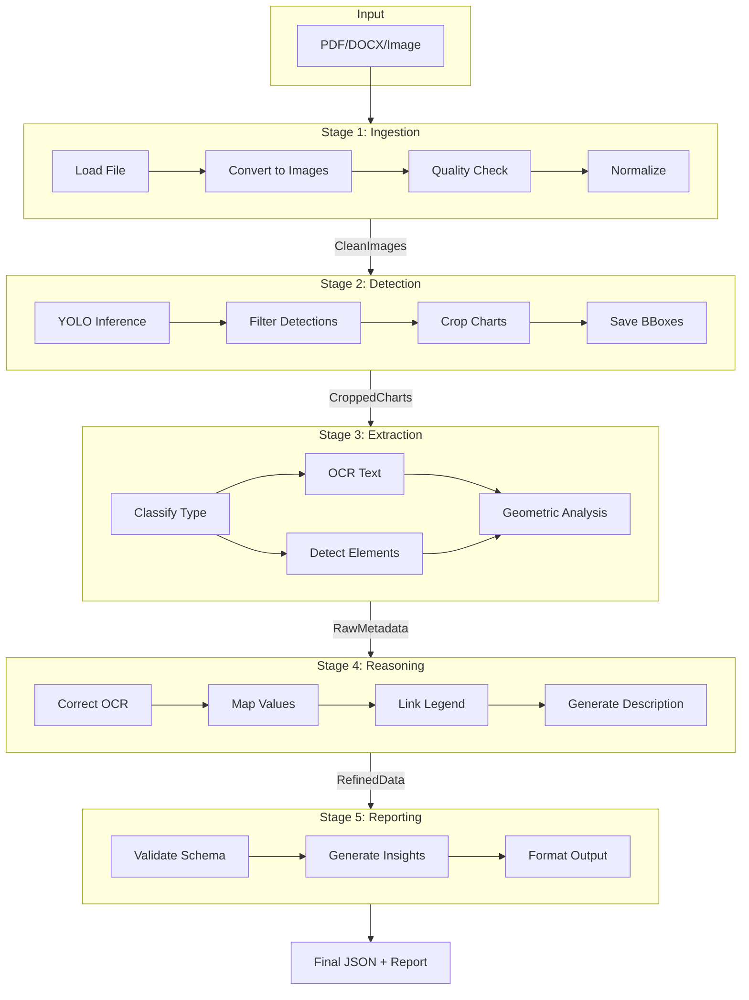
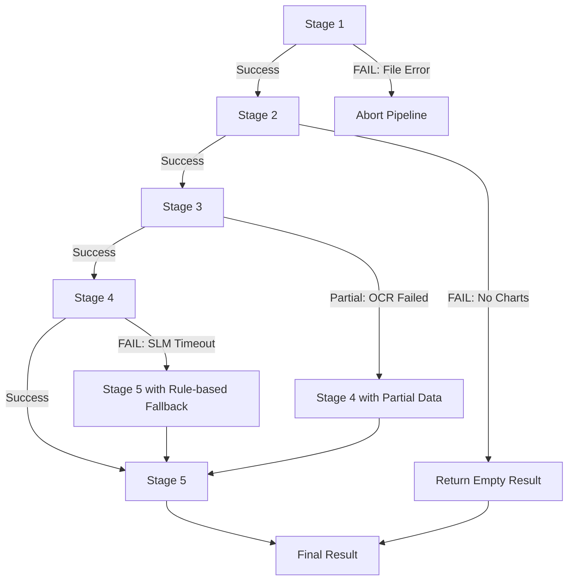

# PIPELINE INSTRUCTIONS - Core Engine

| Version | Date | Author | Description |
| --- | --- | --- | --- |
| 1.1.0 | 2026-03-02 | That Le | Updated to reflect all 5 stages implemented, AI Router wired, 232 tests |
| 1.0.0 | 2026-01-19 | That Le | Pipeline architecture and schema definitions |

## 1. Pipeline Architecture

### 1.1. Design Pattern: Pipeline Pattern

The core engine follows the **Pipeline Pattern** where data flows through sequential stages:

```python
class ChartAnalysisPipeline:
    """
    Main orchestrator for chart analysis.
    
    Example:
        pipeline = ChartAnalysisPipeline(config)
        result = pipeline.run(input_path)
    """
    
    def __init__(self, config: PipelineConfig):
        self.stages = [
            Stage1Ingestion(config.ingestion),
            Stage2Detection(config.detection),
            Stage3Extraction(config.extraction),
            Stage4Reasoning(config.reasoning),
            Stage5Reporting(config.reporting),
        ]
    
    def run(self, input_path: Path) -> PipelineResult:
        data = input_path
        for stage in self.stages:
            data = stage.process(data)
        return data
```

### 1.2. Stage Interface

Every stage MUST implement this interface:

```python
from abc import ABC, abstractmethod
from typing import TypeVar, Generic

InputT = TypeVar('InputT')
OutputT = TypeVar('OutputT')

class BaseStage(ABC, Generic[InputT, OutputT]):
    """Base class for all pipeline stages."""
    
    def __init__(self, config: StageConfig):
        self.config = config
        self.logger = logging.getLogger(self.__class__.__name__)
    
    @abstractmethod
    def process(self, input_data: InputT) -> OutputT:
        """Process input and return output."""
        pass
    
    @abstractmethod
    def validate_input(self, input_data: InputT) -> bool:
        """Validate input before processing."""
        pass
    
    def __call__(self, input_data: InputT) -> OutputT:
        if not self.validate_input(input_data):
            raise StageInputError(f"Invalid input for {self.__class__.__name__}")
        return self.process(input_data)
```

## 2. Data Flow Diagram (Mermaid)



## 2.1. Error Handling Strategy (Fail Gracefully)

**[CRITICAL]** Define how errors propagate between stages:



### Error Classification

| Stage | Error Type | Severity | Action |
| --- | --- | --- | --- |
| S1 | File not found | CRITICAL | Abort pipeline, return error |
| S1 | Corrupted file | CRITICAL | Abort pipeline, return error |
| S1 | Low quality image | WARNING | Skip image, continue with others |
| S2 | Model not loaded | CRITICAL | Abort pipeline, return error |
| S2 | No charts detected | NORMAL | Return empty result (not an error) |
| S2 | Low confidence detection | WARNING | Include with warning flag |
| S3 | OCR failed | WARNING | Continue with empty text |
| S3 | Classification uncertain | WARNING | Use "unknown" type, continue |
| S4 | SLM timeout | WARNING | Fall back to rule-based extraction |
| S4 | Value mapping failed | WARNING | Return raw values with low confidence |
| S5 | Validation failed | WARNING | Return unvalidated result with flag |

### Implementation Pattern

```python
class ChartAnalysisPipeline:
    def run(self, input_path: Path) -> PipelineResult:
        errors: List[PipelineError] = []
        warnings: List[str] = []
        
        # Stage 1: Critical - must succeed
        try:
            stage1_output = self.stage1.process(input_path)
        except Stage1Error as e:
            return PipelineResult.failed(error=e, stage="ingestion")
        
        # Stage 2: No detections is valid result
        stage2_output = self.stage2.process(stage1_output)
        if not stage2_output.charts:
            return PipelineResult.empty(
                message="No charts detected in input",
                session=stage1_output.session
            )
        
        # Stage 3-5: Graceful degradation
        try:
            stage3_output = self.stage3.process(stage2_output)
        except OCRError as e:
            warnings.append(f"OCR failed: {e}, using empty text")
            stage3_output = self.stage3.fallback_output(stage2_output)
        
        try:
            stage4_output = self.stage4.process(stage3_output)
        except SLMTimeoutError as e:
            warnings.append(f"SLM timeout: {e}, using rule-based extraction")
            stage4_output = self.stage4.rule_based_fallback(stage3_output)
        
        stage5_output = self.stage5.process(stage4_output)
        stage5_output.warnings = warnings
        
        return stage5_output
```

### Result Status Codes

| Status | Meaning | When |
| --- | --- | --- |
| `completed` | Full success | All stages passed |
| `partial` | Degraded success | Some stages used fallback |
| `empty` | Valid empty result | No charts detected |
| `failed` | Pipeline failed | Critical stage failed |

## 3. Schema Definitions

### 3.1. File: `schemas/common.py`

```python
"""Common schema types used across all stages."""

from datetime import datetime
from enum import Enum
from pathlib import Path
from typing import List, Optional, Tuple
from pydantic import BaseModel, Field

class ChartType(str, Enum):
    """Supported chart types."""
    BAR = "bar"
    LINE = "line"
    PIE = "pie"
    SCATTER = "scatter"
    AREA = "area"
    UNKNOWN = "unknown"

class BoundingBox(BaseModel):
    """Bounding box coordinates (pixel space)."""
    x_min: int = Field(..., ge=0, description="Left edge")
    y_min: int = Field(..., ge=0, description="Top edge")
    x_max: int = Field(..., gt=0, description="Right edge")
    y_max: int = Field(..., gt=0, description="Bottom edge")
    confidence: float = Field(..., ge=0, le=1, description="Detection confidence")
    
    @property
    def width(self) -> int:
        return self.x_max - self.x_min
    
    @property
    def height(self) -> int:
        return self.y_max - self.y_min
    
    @property
    def center(self) -> Tuple[int, int]:
        return ((self.x_min + self.x_max) // 2, (self.y_min + self.y_max) // 2)

class Point(BaseModel):
    """2D point in pixel coordinates."""
    x: int
    y: int

class Color(BaseModel):
    """RGB color representation."""
    r: int = Field(..., ge=0, le=255)
    g: int = Field(..., ge=0, le=255)
    b: int = Field(..., ge=0, le=255)
    
    @property
    def hex(self) -> str:
        return f"#{self.r:02x}{self.g:02x}{self.b:02x}"

class SessionInfo(BaseModel):
    """Processing session metadata."""
    session_id: str = Field(..., description="Unique session identifier")
    created_at: datetime = Field(default_factory=datetime.now)
    source_file: Path
    total_pages: int = 1
    config_hash: str = Field(..., description="Hash of config for reproducibility")
```

### 3.2. File: `schemas/stage_outputs.py`

```python
"""Output schemas for each pipeline stage."""

from typing import List, Optional, Dict, Any
from pydantic import BaseModel, Field
from .common import BoundingBox, ChartType, Color, Point, SessionInfo

# ============ Stage 1 Output ============

class CleanImage(BaseModel):
    """Single cleaned image from Stage 1."""
    image_path: Path = Field(..., description="Path to normalized image")
    original_path: Path = Field(..., description="Path to source file")
    page_number: int = Field(default=1, ge=1)
    width: int
    height: int
    is_grayscale: bool = False

class Stage1Output(BaseModel):
    """Output from Stage 1: Ingestion."""
    session: SessionInfo
    images: List[CleanImage]
    warnings: List[str] = Field(default_factory=list)

# ============ Stage 2 Output ============

class DetectedChart(BaseModel):
    """Single detected chart from Stage 2."""
    chart_id: str = Field(..., description="Unique chart identifier")
    source_image: Path
    cropped_path: Path = Field(..., description="Path to cropped chart image")
    bbox: BoundingBox
    page_number: int = 1

class Stage2Output(BaseModel):
    """Output from Stage 2: Detection."""
    session: SessionInfo
    charts: List[DetectedChart]
    total_detected: int
    skipped_low_confidence: int = 0

# ============ Stage 3 Output ============

class OCRText(BaseModel):
    """Extracted text element."""
    text: str
    bbox: BoundingBox
    confidence: float
    role: Optional[str] = Field(None, description="title|xlabel|ylabel|legend|value")

class ChartElement(BaseModel):
    """Detected chart element (bar, point, slice)."""
    element_type: str = Field(..., description="bar|point|slice|line")
    bbox: BoundingBox
    center: Point
    color: Optional[Color] = None
    area_pixels: Optional[int] = None

class RawMetadata(BaseModel):
    """Raw extracted data from Stage 3."""
    chart_id: str
    chart_type: ChartType
    texts: List[OCRText]
    elements: List[ChartElement]
    axis_info: Optional[Dict[str, Any]] = None

class Stage3Output(BaseModel):
    """Output from Stage 3: Extraction."""
    session: SessionInfo
    metadata: List[RawMetadata]

# ============ Stage 4 Output ============

class DataPoint(BaseModel):
    """Single data point with actual value."""
    label: str
    value: float
    unit: Optional[str] = None
    confidence: float = Field(..., ge=0, le=1)

class DataSeries(BaseModel):
    """A series of data points (one legend item)."""
    name: str
    color: Optional[Color] = None
    points: List[DataPoint]

class RefinedChartData(BaseModel):
    """Refined data after SLM reasoning."""
    chart_id: str
    chart_type: ChartType
    title: Optional[str] = None
    x_axis_label: Optional[str] = None
    y_axis_label: Optional[str] = None
    series: List[DataSeries]
    description: str = Field(..., description="Academic-style description")
    correction_log: List[str] = Field(default_factory=list, description="OCR corrections made")

class Stage4Output(BaseModel):
    """Output from Stage 4: Reasoning."""
    session: SessionInfo
    charts: List[RefinedChartData]

# ============ Stage 5 Output ============

class ChartInsight(BaseModel):
    """Generated insight about the chart."""
    insight_type: str = Field(..., description="trend|comparison|anomaly|summary")
    text: str
    confidence: float

class FinalChartResult(BaseModel):
    """Final output for a single chart."""
    chart_id: str
    chart_type: ChartType
    title: Optional[str]
    data: RefinedChartData
    insights: List[ChartInsight]
    source_info: Dict[str, Any] = Field(..., description="Traceability info")

class PipelineResult(BaseModel):
    """Final pipeline output (Stage 5)."""
    session: SessionInfo
    charts: List[FinalChartResult]
    summary: str
    processing_time_seconds: float
    model_versions: Dict[str, str]
```

## 4. Stage Implementation Guidelines

### 4.1. Stage 1: Ingestion

**Location:** `src/core_engine/stages/s1_ingestion.py`

```python
class Stage1Ingestion(BaseStage[Path, Stage1Output]):
    """
    Load and normalize input files.
    
    Supported formats:
    - PDF (multi-page)
    - DOCX (embedded images)
    - PNG, JPG, JPEG
    """
    
    def process(self, input_path: Path) -> Stage1Output:
        # 1. Detect file type
        # 2. Convert to images (if PDF/DOCX)
        # 3. Validate quality
        # 4. Normalize (resize if too large, enhance contrast)
        # 5. Generate session ID
        pass
```

**Key Library:** PyMuPDF (fitz)

```python
import fitz  # PyMuPDF

def pdf_to_images(pdf_path: Path, dpi: int = 150) -> List[np.ndarray]:
    """Convert PDF pages to images."""
    doc = fitz.open(pdf_path)
    images = []
    for page in doc:
        mat = fitz.Matrix(dpi / 72, dpi / 72)
        pix = page.get_pixmap(matrix=mat)
        img = np.frombuffer(pix.samples, dtype=np.uint8)
        img = img.reshape(pix.height, pix.width, pix.n)
        images.append(img)
    return images
```

### 4.2. Stage 2: Detection

**Location:** `src/core_engine/stages/s2_detection.py`

```python
class Stage2Detection(BaseStage[Stage1Output, Stage2Output]):
    """
    Detect and crop chart regions using YOLO.
    """
    
    def __init__(self, config: DetectionConfig):
        super().__init__(config)
        self.model = YOLO(config.model_path)
    
    def process(self, input_data: Stage1Output) -> Stage2Output:
        charts = []
        for image in input_data.images:
            results = self.model.predict(image.image_path)
            for box in results[0].boxes:
                if box.conf >= self.config.confidence_threshold:
                    cropped = self._crop_and_save(image, box)
                    charts.append(cropped)
        return Stage2Output(session=input_data.session, charts=charts)
```

### 4.3. Stage 3: Extraction

**Location:** `src/core_engine/stages/s3_extraction/`

This stage has multiple sub-modules:

```
s3_extraction/
├── __init__.py
├── classifier.py      # Chart type classification
├── ocr_engine.py      # Text extraction
├── element_detector.py # Bar/point/slice detection
└── geometric.py       # Coordinate calculations
```

**Parallel Processing:**
```python
from concurrent.futures import ThreadPoolExecutor

class Stage3Extraction(BaseStage):
    def process(self, input_data: Stage2Output) -> Stage3Output:
        with ThreadPoolExecutor(max_workers=3) as executor:
            # Run classification, OCR, and element detection in parallel
            type_future = executor.submit(self.classify, chart)
            ocr_future = executor.submit(self.extract_text, chart)
            elem_future = executor.submit(self.detect_elements, chart)
            
            chart_type = type_future.result()
            texts = ocr_future.result()
            elements = elem_future.result()
```

### 4.4. Stage 4: Reasoning

**Location:** `src/core_engine/stages/s4_reasoning.py`

```python
class Stage4Reasoning(BaseStage[Stage3Output, Stage4Output]):
    """
    Apply SLM for semantic reasoning and error correction.
    """
    
    def __init__(self, config: ReasoningConfig):
        super().__init__(config)
        self.slm = self._load_slm(config.model_name)
        self.geometric_mapper = GeometricMapper()
    
    def process(self, input_data: Stage3Output) -> Stage4Output:
        refined_charts = []
        for metadata in input_data.metadata:
            # 1. Map pixel coordinates to values
            mapped = self.geometric_mapper.map_values(metadata)
            
            # 2. Use SLM for correction and description
            prompt = self._build_prompt(metadata, mapped)
            correction = self.slm.generate(prompt)
            
            # 3. Apply corrections
            refined = self._apply_corrections(mapped, correction)
            refined_charts.append(refined)
        
        return Stage4Output(session=input_data.session, charts=refined_charts)
```

### 4.5. Stage 5: Reporting

**Location:** `src/core_engine/stages/s5_reporting.py`

```python
class Stage5Reporting(BaseStage[Stage4Output, PipelineResult]):
    """
    Generate final JSON output and text report.
    """
    
    def process(self, input_data: Stage4Output) -> PipelineResult:
        results = []
        for chart in input_data.charts:
            # Generate insights
            insights = self._generate_insights(chart)
            
            # Build traceability info
            source_info = self._build_source_info(chart)
            
            results.append(FinalChartResult(
                chart_id=chart.chart_id,
                chart_type=chart.chart_type,
                title=chart.title,
                data=chart,
                insights=insights,
                source_info=source_info,
            ))
        
        return PipelineResult(
            session=input_data.session,
            charts=results,
            summary=self._generate_summary(results),
            processing_time_seconds=self._calculate_time(),
            model_versions=self._get_model_versions(),
        )
```

## 5. Error Handling

### 5.1. Custom Exceptions

```python
# src/core_engine/exceptions.py

class PipelineError(Exception):
    """Base exception for pipeline errors."""
    pass

class StageInputError(PipelineError):
    """Invalid input to a stage."""
    pass

class StageProcessingError(PipelineError):
    """Error during stage processing."""
    def __init__(self, stage_name: str, message: str, original_error: Exception = None):
        self.stage_name = stage_name
        self.original_error = original_error
        super().__init__(f"[{stage_name}] {message}")

class ModelNotLoadedError(PipelineError):
    """Model weights not found or failed to load."""
    pass

class OCRError(StageProcessingError):
    """OCR extraction failed."""
    pass

class GeometricCalculationError(StageProcessingError):
    """Geometric value mapping failed."""
    pass
```

### 5.2. Error Recovery Strategy

```python
class Pipeline:
    def run_with_recovery(self, input_path: Path) -> PipelineResult:
        """Run pipeline with automatic recovery for non-critical errors."""
        data = input_path
        errors = []
        
        for stage in self.stages:
            try:
                data = stage(data)
            except StageProcessingError as e:
                if stage.is_critical:
                    raise
                errors.append(e)
                data = stage.get_fallback_output(data)
                self.logger.warning(f"Stage {stage.name} failed, using fallback")
        
        result = data
        result.errors = errors
        return result
```

## 6. Configuration Schema

### 6.1. Pipeline Config (`config/pipeline.yaml`)

```yaml
pipeline:
  name: "geo-slm-chart-analysis"
  version: "1.0.0"
  
  stages:
    ingestion:
      enabled: true
      max_image_size: 4096
      dpi: 150
      enhance_contrast: true
      
    detection:
      enabled: true
      confidence_threshold: 0.5
      max_detections_per_image: 10
      
    extraction:
      enabled: true
      ocr_engine: "paddleocr"  # or "tesseract"
      languages: ["en", "vi"]
      
    reasoning:
      enabled: true
      use_slm: true
      fallback_to_rules: true
      
    reporting:
      enabled: true
      output_format: "json"
      include_insights: true

  caching:
    enabled: true
    cache_dir: "data/cache"
    ttl_hours: 24
```

### 6.2. Models Config (`config/models.yaml`)

```yaml
models:
  yolo:
    path: "models/weights/chart_detector.pt"
    device: "auto"  # cpu, cuda, mps, auto
    input_size: 640
    
  slm:
    name: "Qwen/Qwen2.5-1.5B-Instruct"
    device: "auto"
    max_tokens: 512
    temperature: 0.3
    
  ocr:
    paddleocr:
      use_gpu: true
      lang: "en"
    tesseract:
      config: "--psm 6"
```

## 7. Testing Guidelines

### 7.1. Stage Unit Tests

Each stage should have dedicated tests:

```python
# tests/test_stages/test_s2_detection.py

import pytest
from core_engine.stages import Stage2Detection
from core_engine.schemas import Stage1Output, CleanImage

@pytest.fixture
def sample_stage1_output(tmp_path):
    # Create test image
    image_path = tmp_path / "test.png"
    # ... create test image ...
    return Stage1Output(
        session=...,
        images=[CleanImage(image_path=image_path, ...)]
    )

def test_detection_finds_charts(sample_stage1_output, detection_stage):
    result = detection_stage.process(sample_stage1_output)
    assert len(result.charts) > 0
    assert all(c.bbox.confidence >= 0.5 for c in result.charts)

def test_detection_handles_no_charts(empty_image_output, detection_stage):
    result = detection_stage.process(empty_image_output)
    assert len(result.charts) == 0
    assert result.total_detected == 0
```

### 7.2. Integration Tests

```python
# tests/test_pipeline_e2e.py

def test_full_pipeline(sample_pdf, pipeline):
    result = pipeline.run(sample_pdf)
    
    # Verify schema
    assert isinstance(result, PipelineResult)
    assert len(result.charts) > 0
    
    # Verify traceability
    for chart in result.charts:
        assert chart.source_info is not None
        assert "bbox" in chart.source_info
```
