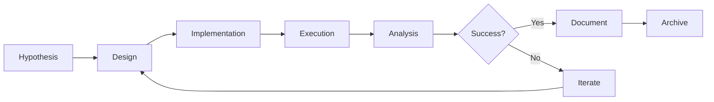

# RESEARCH INSTRUCTIONS - Experiment & Training Workflow

| Version | Date | Author | Description |
| --- | --- | --- | --- |
| 1.0.0 | 2026-01-19 | That Le | Research workflow and experiment tracking |

## 1. Research Philosophy

### 1.1. Academic Rigor

This project aims for **publication-quality research**. Every experiment must be:

1. **Reproducible**: Same code + data + config = same results
2. **Documented**: Hypothesis, method, results, analysis
3. **Versioned**: Track data, code, and model versions
4. **Comparable**: Use consistent metrics across experiments

### 1.2. Research Contributions

| Area | Contribution Type | Output |
| --- | --- | --- |
| Hybrid Detection | Novel System Design | Architecture paper |
| SLM Distillation | Knowledge Transfer | Training methodology |
| Geometric Mapping | Algorithm Design | Precision analysis |
| Error Correction | Multi-stage Pipeline | Accuracy comparison |

## 2. Experiment Workflow

### 2.1. Experiment Lifecycle



### 2.2. Experiment Naming Convention

```
experiments/
├── exp_001_baseline_yolo_detection/
├── exp_002_paddleocr_vs_tesseract/
├── exp_003_geometric_value_mapping/
├── exp_004_slm_distillation_v1/
└── exp_005_full_pipeline_benchmark/
```

**Naming Format:** `exp_<number>_<short_description>/`

### 2.3. Experiment Directory Structure

```
exp_XXX_name/
├── README.md           # Hypothesis, method, results summary
├── config.yaml         # Full configuration (frozen)
├── run.py              # Main experiment script
├── data/
│   └── manifest.json   # Dataset version info
├── outputs/
│   ├── metrics.json    # Quantitative results
│   ├── plots/          # Visualizations
│   └── artifacts/      # Model checkpoints, etc.
└── analysis.ipynb      # Post-hoc analysis
```

## 3. Experiment Documentation Template

### 3.1. README.md Template

```markdown
# Experiment XXX: [Title]

| Property | Value |
| --- | --- |
| Created | YYYY-MM-DD |
| Status | Planning / Running / Complete / Archived |
| Author | Name |

## Hypothesis

[Clear statement of what you're testing]

## Background

[Why this experiment? What prior work informs it?]

## Method

### Dataset
- Name: [dataset name]
- Version: [hash or tag]
- Size: [N samples]
- Split: [train/val/test ratio]

### Model Configuration
[Key parameters, link to config.yaml]

### Metrics
- Primary: [main metric]
- Secondary: [other metrics]

## Results

| Metric | Value | Baseline | Delta |
| --- | --- | --- | --- |
| Accuracy | X.XX | Y.YY | +Z.ZZ |

## Analysis

[Interpretation of results]

## Conclusion

[Did hypothesis hold? What's next?]

## References

- [Paper 1]
- [Prior experiment XXX]
```

## 4. Dataset Management

### 4.1. Dataset Versioning

Use hash-based versioning for datasets:

```python
import hashlib
from pathlib import Path

def compute_dataset_hash(data_dir: Path) -> str:
    """Compute deterministic hash of dataset directory."""
    hash_md5 = hashlib.md5()
    for filepath in sorted(data_dir.rglob("*")):
        if filepath.is_file():
            hash_md5.update(filepath.name.encode())
            hash_md5.update(filepath.read_bytes())
    return hash_md5.hexdigest()[:12]
```

### 4.2. Data Manifest

Every experiment must include `data/manifest.json`:

```json
{
  "dataset_name": "chart_detection_v2",
  "dataset_hash": "a1b2c3d4e5f6",
  "created_date": "2026-01-19",
  "source": "arxiv_papers_2024",
  "statistics": {
    "total_samples": 5000,
    "train": 4000,
    "val": 500,
    "test": 500
  },
  "class_distribution": {
    "bar": 2000,
    "line": 1500,
    "pie": 1000,
    "scatter": 500
  },
  "preprocessing": [
    "resize_to_640",
    "normalize_brightness"
  ]
}
```

### 4.3. Dataset Split Rules

- **Training**: 80% of data
- **Validation**: 10% of data (for hyperparameter tuning)
- **Test**: 10% of data (NEVER touch during development)

```python
from sklearn.model_selection import train_test_split

def create_splits(data: List, seed: int = 42):
    train, temp = train_test_split(data, test_size=0.2, random_state=seed)
    val, test = train_test_split(temp, test_size=0.5, random_state=seed)
    return train, val, test
```

### 4.4. Seed Management (Reproducibility)

**[CRITICAL]** Every experiment MUST set fixed random seeds to ensure reproducibility:

```python
import random
import numpy as np
import torch

def set_seed(seed: int = 42) -> None:
    """
    Set random seed for reproducibility across all libraries.
    
    Call this at the START of every experiment.
    """
    random.seed(seed)
    np.random.seed(seed)
    torch.manual_seed(seed)
    torch.cuda.manual_seed_all(seed)
    
    # For complete determinism (may slow down training)
    torch.backends.cudnn.deterministic = True
    torch.backends.cudnn.benchmark = False

# Usage in experiment
set_seed(42)  # ALWAYS call before any random operation
```

**Seed Recording in Config:**

```yaml
# config.yaml
experiment:
  name: "exp_001_baseline"
  random_seed: 42  # REQUIRED - document this for reproducibility
  
training:
  epochs: 100
  # ... other params
```

**Verification:** Running the same experiment twice with the same seed MUST produce identical results.

## 5. Model Training

### 5.1. Training Script Template

```python
#!/usr/bin/env python
"""
Experiment: [Name]
Description: [Brief description]
"""

import logging
from pathlib import Path
from datetime import datetime

import yaml
from omegaconf import OmegaConf

# Setup logging
logging.basicConfig(
    level=logging.INFO,
    format="%(asctime)s [%(levelname)s] %(message)s",
    handlers=[
        logging.FileHandler(f"outputs/train_{datetime.now():%Y%m%d_%H%M%S}.log"),
        logging.StreamHandler()
    ]
)
logger = logging.getLogger(__name__)

def main():
    # Load config
    config = OmegaConf.load("config.yaml")
    logger.info(f"Config: {OmegaConf.to_yaml(config)}")
    
    # Load data
    train_data = load_dataset(config.data.train_path)
    val_data = load_dataset(config.data.val_path)
    
    # Initialize model
    model = create_model(config.model)
    
    # Training loop
    best_metric = 0
    for epoch in range(config.training.epochs):
        train_loss = train_epoch(model, train_data, config)
        val_metrics = evaluate(model, val_data, config)
        
        logger.info(f"Epoch {epoch}: loss={train_loss:.4f}, val_acc={val_metrics['accuracy']:.4f}")
        
        # Save best model
        if val_metrics['accuracy'] > best_metric:
            best_metric = val_metrics['accuracy']
            save_checkpoint(model, "outputs/best_model.pt")
    
    # Final evaluation
    test_data = load_dataset(config.data.test_path)
    test_metrics = evaluate(model, test_data, config)
    
    # Save results
    save_metrics(test_metrics, "outputs/metrics.json")
    logger.info(f"Final test metrics: {test_metrics}")

if __name__ == "__main__":
    main()
```

### 5.2. YOLO Training (Ultralytics)

```python
from ultralytics import YOLO

def train_yolo(config):
    """Fine-tune YOLO for chart detection."""
    model = YOLO(config.model.pretrained)
    
    results = model.train(
        data=config.data.yaml_path,
        epochs=config.training.epochs,
        imgsz=config.model.input_size,
        batch=config.training.batch_size,
        device=config.model.device,
        project="results/training_runs",
        name=config.experiment.name,
        # Augmentation
        augment=True,
        mosaic=0.5,
        mixup=0.1,
        # Optimization
        optimizer="AdamW",
        lr0=config.training.lr,
        weight_decay=0.01,
        # Saving
        save=True,
        save_period=10,
    )
    
    return results
```

### 5.3. SLM Fine-tuning (LoRA)

```python
from transformers import AutoModelForCausalLM, AutoTokenizer
from peft import LoraConfig, get_peft_model

def setup_slm_training(config):
    """Setup SLM with LoRA for efficient fine-tuning."""
    
    # Load base model
    model = AutoModelForCausalLM.from_pretrained(
        config.model.name,
        torch_dtype=torch.float16,
        device_map="auto",
    )
    tokenizer = AutoTokenizer.from_pretrained(config.model.name)
    
    # Configure LoRA
    lora_config = LoraConfig(
        r=16,  # Rank
        lora_alpha=32,
        target_modules=["q_proj", "v_proj"],
        lora_dropout=0.1,
        bias="none",
        task_type="CAUSAL_LM",
    )
    
    model = get_peft_model(model, lora_config)
    model.print_trainable_parameters()
    
    return model, tokenizer
```

## 6. Metrics and Evaluation

### 6.1. Standard Metrics

| Task | Metrics | Implementation |
| --- | --- | --- |
| Object Detection | mAP@50, mAP@50-95 | Ultralytics built-in |
| Classification | Accuracy, F1, Confusion Matrix | sklearn |
| OCR | Character Error Rate (CER), Word Error Rate (WER) | editdistance |
| Value Extraction | MAE, MAPE, Correlation | numpy, scipy |
| End-to-End | Custom accuracy per field | Manual |

### 6.2. Evaluation Script Template

```python
from sklearn.metrics import accuracy_score, f1_score, confusion_matrix
import numpy as np

def evaluate_classification(y_true, y_pred, class_names):
    """Compute classification metrics."""
    return {
        "accuracy": accuracy_score(y_true, y_pred),
        "f1_macro": f1_score(y_true, y_pred, average="macro"),
        "f1_per_class": dict(zip(
            class_names,
            f1_score(y_true, y_pred, average=None)
        )),
        "confusion_matrix": confusion_matrix(y_true, y_pred).tolist(),
    }

def evaluate_value_extraction(y_true, y_pred):
    """Compute regression metrics for extracted values."""
    y_true = np.array(y_true)
    y_pred = np.array(y_pred)
    
    mae = np.mean(np.abs(y_true - y_pred))
    mape = np.mean(np.abs((y_true - y_pred) / (y_true + 1e-8))) * 100
    correlation = np.corrcoef(y_true, y_pred)[0, 1]
    
    return {
        "mae": mae,
        "mape": mape,
        "correlation": correlation,
    }
```

## 7. Notebook Guidelines

### 7.1. Notebook Structure

```python
# Cell 1: Header
"""
# Notebook Title
Author: Name
Date: YYYY-MM-DD
Purpose: [Brief description]
"""

# Cell 2: Imports
import numpy as np
import pandas as pd
import matplotlib.pyplot as plt
# ...

# Cell 3: Configuration
CONFIG = {
    "data_path": "data/processed/",
    "model_path": "models/weights/best.pt",
    # ...
}

# Cell 4-N: Analysis sections with markdown headers

# Final Cell: Summary
"""
## Summary
- Finding 1
- Finding 2
- Next steps
"""
```

### 7.2. Notebook Best Practices

1. **Clear Headers**: Use markdown cells to separate sections
2. **Reproducible**: Set random seeds, document dependencies
3. **Clean Output**: Clear all outputs before committing
4. **Export Ready**: Notebooks should run top-to-bottom without errors

### 7.3. Visualization Standards

```python
import matplotlib.pyplot as plt

# Standard figure settings
plt.rcParams.update({
    'figure.figsize': (10, 6),
    'font.size': 12,
    'axes.labelsize': 14,
    'axes.titlesize': 16,
    'legend.fontsize': 10,
    'savefig.dpi': 150,
    'savefig.bbox': 'tight',
})

def save_plot(fig, name: str, formats: list = ['png', 'pdf']):
    """Save plot in multiple formats."""
    for fmt in formats:
        fig.savefig(f"outputs/plots/{name}.{fmt}")
```

## 8. Paper Writing Support

### 8.1. Result Tables

Generate LaTeX tables from results:

```python
def results_to_latex(results: dict, caption: str) -> str:
    """Convert results dict to LaTeX table."""
    df = pd.DataFrame(results)
    latex = df.to_latex(
        index=False,
        float_format="%.3f",
        caption=caption,
        label="tab:results",
    )
    return latex
```

### 8.2. Figure Generation

```python
def create_comparison_chart(methods: list, metrics: list, data: dict):
    """Create bar chart comparing methods."""
    fig, ax = plt.subplots(figsize=(10, 6))
    
    x = np.arange(len(methods))
    width = 0.8 / len(metrics)
    
    for i, metric in enumerate(metrics):
        values = [data[m][metric] for m in methods]
        ax.bar(x + i * width, values, width, label=metric)
    
    ax.set_xlabel('Method')
    ax.set_ylabel('Score')
    ax.set_xticks(x + width * (len(metrics) - 1) / 2)
    ax.set_xticklabels(methods)
    ax.legend()
    
    return fig
```

## 9. Collaboration Guidelines

### 9.1. Code Review Checklist

Before merging research code:

- [ ] Experiment has README.md with hypothesis and results
- [ ] Config is frozen and versioned
- [ ] Dataset manifest exists
- [ ] Metrics are saved to JSON
- [ ] Code runs end-to-end without errors
- [ ] No hardcoded paths or secrets

### 9.2. Weekly Progress Template

```markdown
# Week N Progress Report

## Completed
- [x] Task 1
- [x] Task 2

## In Progress
- [ ] Task 3 (70%)

## Blocked
- Issue: [description]
- Needed: [what's required]

## Next Week Plan
1. Priority task 1
2. Priority task 2

## Metrics Update
| Experiment | Accuracy | Notes |
| --- | --- | --- |
| exp_001 | 0.85 | Baseline |
| exp_002 | 0.87 | +2% improvement |
```
