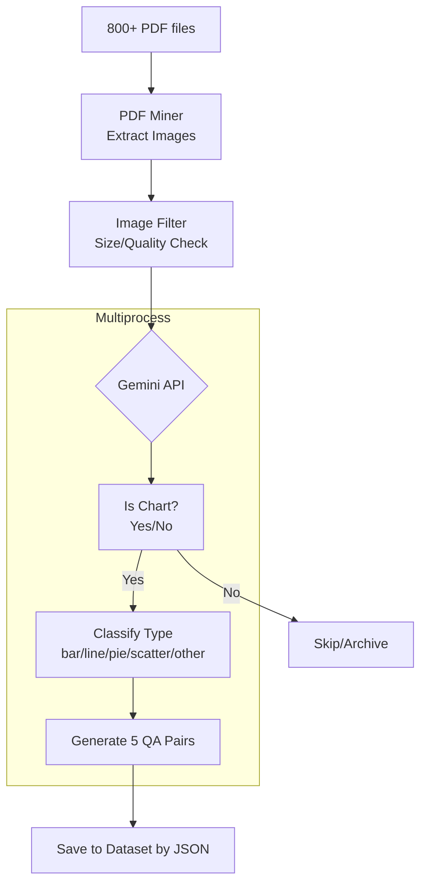

# Confirmation: Chart QA Data Generation Pipeline

| Version | Date | Author | Description |
| --- | --- | --- | --- |
| 1.0.0 | 2026-01-23 | AI Assistant | Proposal for Gemini-based Chart QA pipeline |

## 1. Executive Summary

Xay dung module **Chart QA Data Generator** de:
1. Trich xuat hinh anh tu 800+ PDF arxiv - Đổi tên lại thành PDF Chart Data Miner
2. Su dung Google Gemini API de phan loai chart va tao QA pairs - API đã có sẵn ở root, .env
3. Chay multiprocess de toi uu hoa thoi gian

## 2. Proposed Architecture

```
tools/data_factory/
|
+-- services/
|   +-- gemini_classifier.py    # [NEW] Gemini API integration
|   +-- qa_generator.py         # [NEW] QA pair generation
|   +-- miner.py                # [EXISTING] PDF image extraction
|
+-- main.py                     # [UPDATE] Add new commands

notebooks/
+-- 02_chart_qa_generation.ipynb  # [NEW] Interactive notebook
```

## 3. Pipeline Flow



## 4. Decisions Requiring Confirmation

### 4.1. Module Location

| Option | Location | Pros | Cons |
| --- | --- | --- | --- |
| **A** (Recommended) | `tools/data_factory/services/` | Consistent with existing structure | - |
| B | `src/core_engine/stages/` | Part of main pipeline | Not data collection |
| C | New `tools/qa_generator/` | Separate concern | Fragmented structure |

**[CONFIRM A?]** Yes / No

---

### 4.2. Gemini API Model Selection

| Model | Cost | Speed | Quality |
| --- | --- | --- | --- |
| **gemini-1.5-flash** (Recommended) | Thap | Nhanh | Tot cho classification |
| gemini-1.5-pro | Cao | Cham | Tot nhat cho QA generation |
| gemini-2.0-flash-exp | Mien phi (limited) | Nhanh | Experimental |

**[CONFIRM gemini-1.5-flash?]** Yes / No

**Note:** Co the dung flash cho classification, pro cho QA generation

---

### 4.3. QA Pair Format

```json
{
    "image_id": "arxiv_2601_08743_p3_img2",
    "image_path": "data/academic_dataset/images/arxiv_2601_08743_p3_img2.png",
    
    "classification": {
        "is_chart": true,
        "chart_type": "bar",
        "confidence": 0.95
    },
    
    "qa_pairs": [
        {
            "question": "What is the title of this chart?",
            "answer": "Model Performance Comparison",
            "question_type": "structural"
        },
        {
            "question": "Which model has the highest accuracy?",
            "answer": "Model B with 95.2% accuracy",
            "question_type": "reasoning"
        },
        {
            "question": "How many categories are shown in the x-axis?",
            "answer": "There are 5 categories: A, B, C, D, E",
            "question_type": "counting"
        },
        {
            "question": "What is the approximate difference between the highest and lowest values?",
            "answer": "Approximately 15 percentage points (95.2% - 80.1%)",
            "question_type": "comparison"
        },
        {
            "question": "What trend can you observe from left to right?",
            "answer": "The values generally increase from left to right, with a slight dip at category C",
            "question_type": "trend"
        }
    ],
    
    "metadata": {
        "source_pdf": "arxiv_2601_08743.pdf",
        "page_number": 3,
        "generated_at": "2026-01-23T10:30:00",
        "gemini_model": "gemini-1.5-flash",
        "tokens_used": 1250
    }
}
```

**[CONFIRM this format?]** Yes / No

---

### 4.4. Question Types Distribution

| Type | Description | Count per Image |
| --- | --- | --- |
| structural | Title, labels, legend | 1 |
| counting | Number of bars, points, etc. | 1 |
| comparison | Max/min, differences | 1 |
| reasoning | Trends, patterns | 1 |
| extraction | Specific data values | 1 |

**[CONFIRM 5 questions per image?]** Yes / No (or suggest different number)

---

### 4.5. Multiprocessing Strategy

| Strategy | Description | Recommended |
| --- | --- | --- |
| **ProcessPoolExecutor** | CPU-bound parallelism | For PDF extraction |
| **ThreadPoolExecutor** | I/O-bound parallelism | For Gemini API calls |
| **asyncio + aiohttp** | Async I/O | Alternative for API calls |

**Proposed Configuration:**
```python
# PDF Extraction: ProcessPool (CPU-bound)
MAX_PDF_WORKERS = 4

# Gemini API: ThreadPool (I/O-bound)
MAX_API_WORKERS = 8

# Rate limiting (Gemini free tier)
REQUESTS_PER_MINUTE = 60
TOKENS_PER_MINUTE = 32000
```

**[CONFIRM this config?]** Yes / No

---

### 4.6. API Key Management

| Option | Method | Security |
| --- | --- | --- |
| **A** (Recommended) | `.env` file + `python-dotenv` | Good |
| B | `config/secrets/gemini.yaml` | Consistent with project |
| C | Environment variable only | Simple |

**[CONFIRM Option A?]** Yes / No

---

### 4.7. Output Directory Structure

```
data/
+-- academic_dataset/
    +-- images/                    # [EXISTING] Extracted images
    +-- chart_qa/                  # [NEW] QA dataset
        +-- classified/            # Classification results
        |   +-- charts/            # Confirmed charts
        |   +-- non_charts/        # Non-chart images
        +-- qa_pairs/              # QA JSON files
        +-- manifests/             # Dataset manifests
        +-- stats/                 # Statistics & reports
```

**[CONFIRM this structure?]** Yes / No

---

### 4.8. Error Handling & Resume

| Feature | Implementation |
| --- | --- |
| Checkpoint | Save progress every N images |
| Resume | Skip already processed images |
| Retry | Exponential backoff for API errors |
| Logging | Detailed logs per session |

**Checkpoint frequency:** Every 100 images

**[CONFIRM?]** Yes / No

---

## 5. Implementation Plan

### Phase 1: Core Module (Day 1-2)
- [x] Create `gemini_classifier.py` with API integration
- [x] Create `qa_generator.py` with prompt templates
- [x] Add Gemini API key to `.env`

### Phase 2: Pipeline Integration (Day 2-3)
- [ ] Update `main.py` with new commands: `classify`, `generate-qa`
- [ ] Implement multiprocessing wrapper
- [ ] Add progress tracking and checkpointing

### Phase 3: Notebook Interface (Day 3-4)
- [ ] Create `02_chart_qa_generation.ipynb`
- [ ] Visual progress monitoring
- [ ] Quality inspection widgets

### Phase 4: Testing & Validation (Day 4-5)
- [ ] Run on sample (100 PDFs)
- [ ] Validate QA quality
- [ ] Tune prompts if needed
- [ ] Scale to full dataset

---

## 6. Estimated Resources

| Resource | Estimate |
| --- | --- |
| PDF files | ~800 |
| Images per PDF (avg) | ~15 |
| Total images | ~12,000 |
| Charts (estimated 30%) | ~3,600 |
| QA pairs | ~18,000 |
| Gemini API cost (flash) | ~$5-10 |
| Processing time | ~4-6 hours |

---

## 7. Your Confirmation

Please confirm the following by editing this section:

```
[x] 4.1. Module Location: A (tools/data_factory/services/)
[x] 4.2. Gemini Model: gemini-3-flash-preview
[x] 4.3. QA Format: Approved
[x] 4.4. Question Types: 5 questions
[x] 4.5. Multiprocessing: Approved
[x] 4.6. API Key: .env file (verified)
[x] 4.7. Directory Structure: Approved
[x] 4.8. Checkpointing: Every 100 images
```

**Status: IMPLEMENTED**

---

## 8. Implementation Complete

### Files Created:
1. `tools/data_factory/services/gemini_classifier.py` - Gemini API integration
2. `tools/data_factory/services/qa_generator.py` - Pipeline orchestrator
3. `notebooks/02_chart_qa_generation.ipynb` - Interactive notebook

### Files Updated:
1. `tools/data_factory/main.py` - Added CLI commands
2. `tools/data_factory/schemas.py` - Added QA schemas

### New CLI Commands:
```bash
# Classify images as charts
python -m tools.data_factory.main classify --limit 100

# Generate QA pairs
python -m tools.data_factory.main generate-qa --limit 100 --collect

# Collect existing QA into dataset
python -m tools.data_factory.main generate-qa --collect-only

# Check pipeline status
python -m tools.data_factory.main qa-status
```

### Installation Required:
```bash
pip install google-generativeai tqdm
```

### Quick Start:
```bash
# 1. Extract images from PDFs
python -m tools.data_factory.main mine

# 2. Run QA generation pipeline
python -m tools.data_factory.main generate-qa --limit 100 --workers 10 --collect

# 3. Check status
python -m tools.data_factory.main qa-status
```

### Or use Jupyter Notebook:
Open `notebooks/02_chart_qa_generation.ipynb` for interactive processing.
