# System Architecture -- Mermaid Diagrams

| Version | Date | Author | Description |
| --- | --- | --- | --- |
| 1.0.0 | 2026-03-16 | Copilot (Claude Opus 4.6) | Full system architecture diagrams |

Tai lieu nay mo ta toan bo kien truc he thong Geo-SLM Chart Analysis v3 bang cac Mermaid diagrams. Moi diagram tap trung vao mot khia canh cua he thong.

---

## 1. Tong quan Kien truc He thong

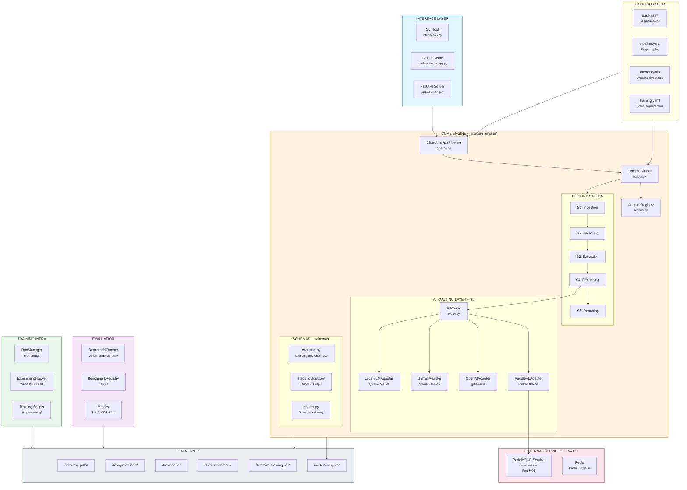

---

## 2. Pipeline Data Flow Chi tiet (S1 -> S5)

```mermaid
flowchart TD
    INPUT["User Input<br/>PDF / DOCX / MD / PNG / JPG"]

    subgraph S1["STAGE 1: INGESTION & SANITATION"]
        direction TB
        S1_DETECT["Detect File Type"]
        S1_PARSE["Parser Selection"]

        subgraph PARSERS["Parsers"]
            direction LR
            PDF_P["PDFParser<br/><small>PyMuPDF, 150 DPI</small>"]
            DOCX_P["DocxParser<br/><small>python-docx</small>"]
            IMG_P["ImageParser<br/><small>Pillow direct load</small>"]
            MD_P["MarkdownParser<br/><small>Extract local images</small>"]
        end

        S1_VALIDATE["Quality Validation<br/><small>blur, min_size, format</small>"]
        S1_NORMALIZE["Normalize<br/><small>resize, contrast, RGB</small>"]
        S1_OUT["Stage1Output<br/><small>SessionInfo + CleanImage[]</small>"]

        S1_DETECT --> S1_PARSE
        S1_PARSE --> PARSERS
        PARSERS --> S1_VALIDATE
        S1_VALIDATE --> S1_NORMALIZE
        S1_NORMALIZE --> S1_OUT
    end

    subgraph S2["STAGE 2: DETECTION & LOCALIZATION"]
        direction TB
        S2_LOAD["Load Detection Model"]

        subgraph DETECTORS["Detection Adapters"]
            direction LR
            YOLO8["YOLOv8Adapter<br/><small>chart_detector.pt</small>"]
            YOLO11["YOLOv11Adapter<br/><small>extends v8</small>"]
            MOCK_D["MockAdapter<br/><small>testing</small>"]
        end

        S2_INFER["Run Inference<br/><small>conf >= 0.5</small>"]
        S2_NMS["NMS Filter<br/><small>IoU 0.45</small>"]
        S2_CROP["Crop + Pad<br/><small>10px padding</small>"]
        S2_OUT["Stage2Output<br/><small>DetectedChart[]<br/>bbox + cropped images</small>"]

        S2_LOAD --> DETECTORS
        DETECTORS --> S2_INFER
        S2_INFER --> S2_NMS
        S2_NMS --> S2_CROP
        S2_CROP --> S2_OUT
    end

    subgraph S3["STAGE 3: EXTRACTION & CLASSIFICATION"]
        direction TB

        subgraph CLASSIFY["Chart Classification"]
            direction LR
            EFFNET["EfficientNet-B0<br/><small>97.54% acc<br/>3-class: bar/line/pie</small>"]
            ML_CLS["MLClassifier<br/><small>fallback</small>"]
        end

        subgraph VLM["VLM Extraction Backends"]
            direction LR
            DEPLOT["DeplotExtractor<br/><small>google/deplot<br/>DEFAULT</small>"]
            MATCHA["MatchaExtractor<br/><small>google/matcha-base</small>"]
            PIX2S["Pix2StructExtractor<br/><small>google/pix2struct-base</small>"]
            SVLM["SVLMExtractor<br/><small>Qwen2-VL-2B</small>"]
        end

        S3_TABLE["Pix2StructResult<br/><small>headers, rows, records<br/>raw_html, confidence</small>"]
        S3_META["RawMetadata<br/><small>chart_type + pix2struct_table<br/>+ OCR texts + elements</small>"]
        S3_OUT["Stage3Output<br/><small>List[RawMetadata]</small>"]

        CLASSIFY --> VLM
        VLM --> S3_TABLE
        S3_TABLE --> S3_META
        S3_META --> S3_OUT
    end

    subgraph S4["STAGE 4: SEMANTIC REASONING"]
        direction TB

        subgraph ENGINES["Reasoning Engines"]
            direction LR
            ROUTER_E["AIRouterEngine<br/><small>RECOMMENDED</small>"]
            GEMINI_E["GeminiEngine<br/><small>legacy</small>"]
        end

        S4_PROMPT["PromptBuilder<br/><small>Build structured prompt<br/>from RawMetadata</small>"]
        S4_VMAP["ValueMapper<br/><small>pix2struct_table -> DataSeries</small>"]
        S4_REASON["AI Reasoning<br/><small>OCR correction<br/>value refinement<br/>description gen</small>"]
        S4_OUT["Stage4Output<br/><small>RefinedChartData[]<br/>title, series, description</small>"]

        S4_PROMPT --> ENGINES
        ENGINES --> S4_REASON
        S4_REASON --> S4_VMAP
        S4_VMAP --> S4_OUT
    end

    subgraph S5["STAGE 5: REPORTING & INSIGHTS"]
        direction TB
        S5_VALIDATE["Schema Validation<br/><small>FinalChartResult</small>"]
        S5_INSIGHT["Insight Generation<br/><small>trend, comparison,<br/>anomaly (z-score > 2.0)</small>"]
        S5_FORMAT["Format Output<br/><small>JSON + Markdown + CSV</small>"]
        S5_OUT["PipelineResult<br/><small>FinalChartResult[]<br/>summary, timing, versions</small>"]

        S5_VALIDATE --> S5_INSIGHT
        S5_INSIGHT --> S5_FORMAT
        S5_FORMAT --> S5_OUT
    end

    INPUT --> S1
    S1 -->|"CleanImage[]"| S2
    S2 -->|"DetectedChart[]"| S3
    S3 -->|"RawMetadata[]"| S4
    S4 -->|"RefinedChartData[]"| S5
    S5 --> FINAL["Final JSON + Report"]

    style S1 fill:#e3f2fd,stroke:#1565c0
    style S2 fill:#e8f5e9,stroke:#2e7d32
    style S3 fill:#fff3e0,stroke:#ef6c00
    style S4 fill:#fce4ec,stroke:#c62828
    style S5 fill:#f3e5f5,stroke:#7b1fa2
    style INPUT fill:#fff9c4,stroke:#f57f17
    style FINAL fill:#c8e6c9,stroke:#388e3c
```

---

## 3. AI Router -- Fallback Chains & Provider Selection

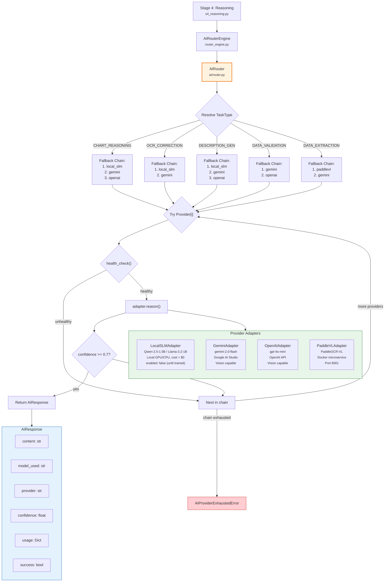

---

## 4. Stage 3 -- VLM Extraction Architecture

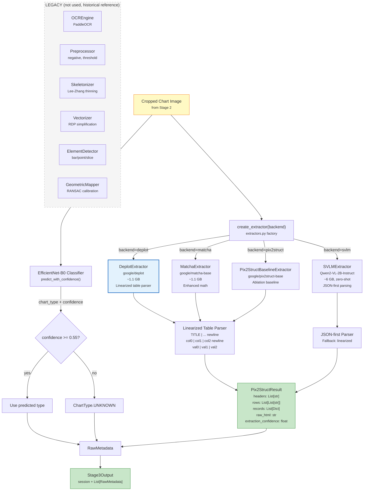

---

## 5. Serving Layer -- API, Jobs, Docker

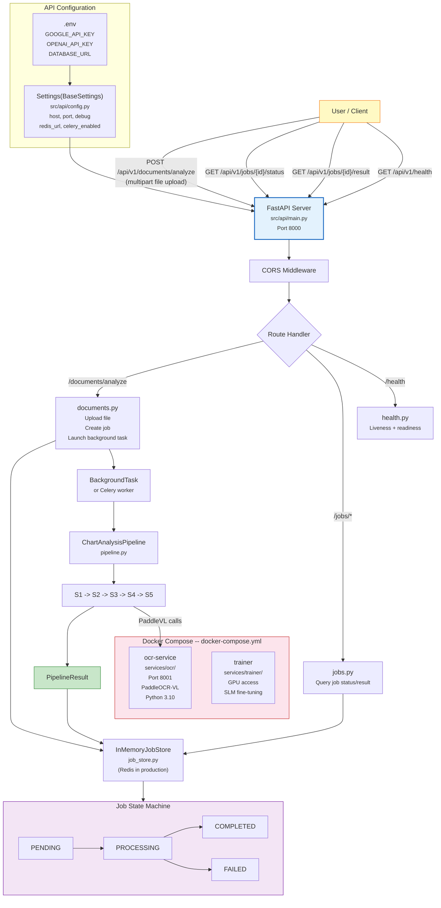

---

## 6. Pipeline Orchestration -- Builder, Registry, Config

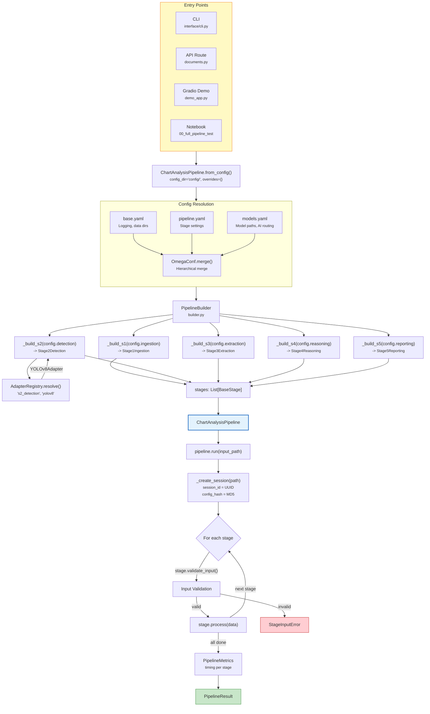

---

## 7. Error Handling -- Fail Gracefully Strategy

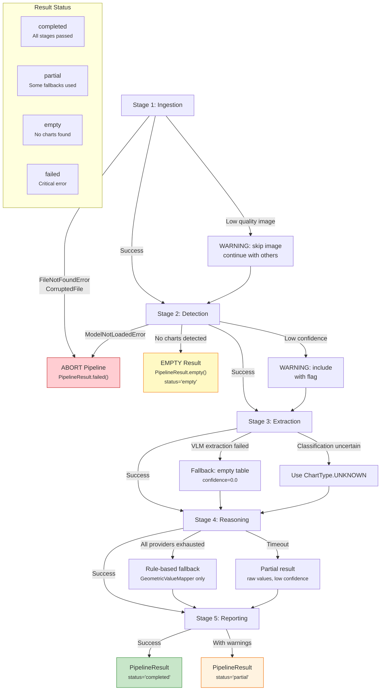

---

## 8. Training & Evaluation Infrastructure

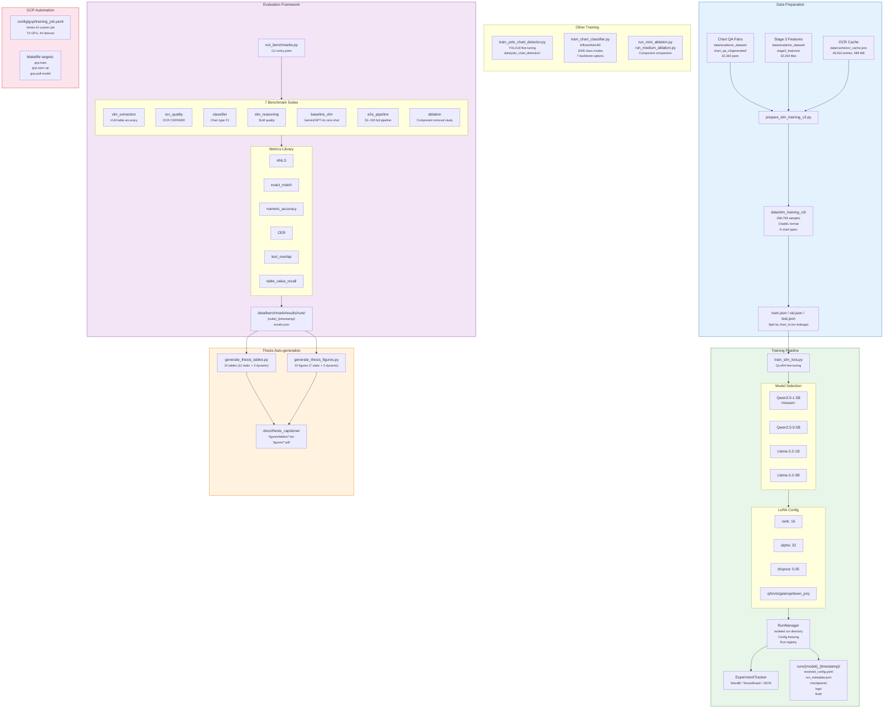

---

## 9. Data Directory & File Flow Map

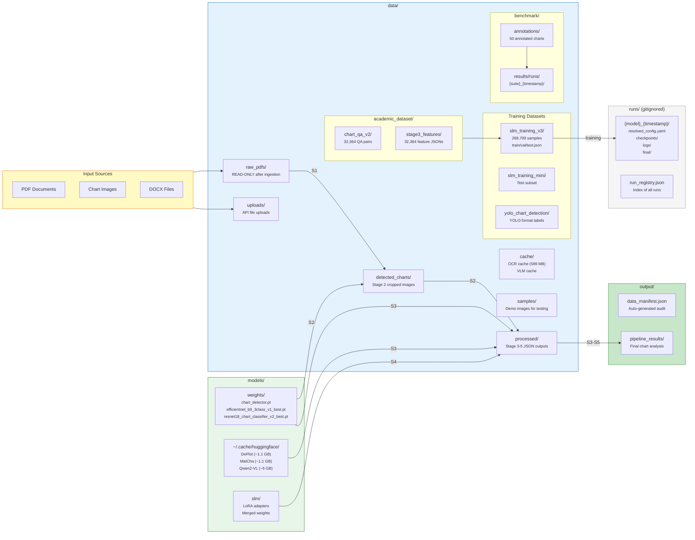

---

## 10. Schema Hierarchy -- Pydantic Models

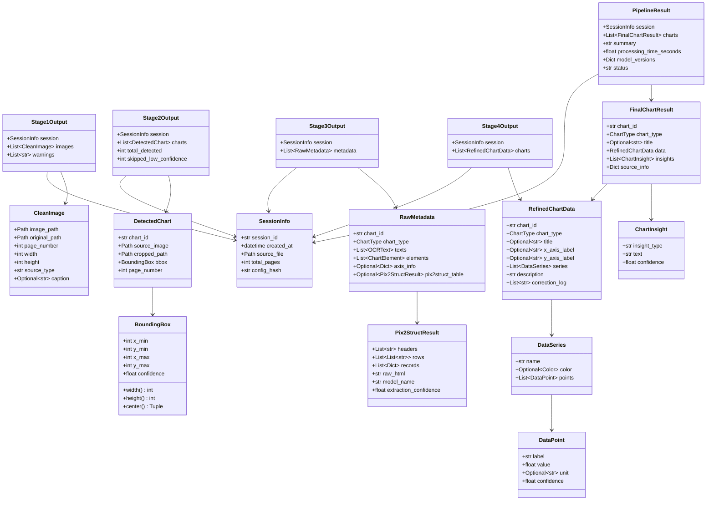

---

## 11. CI/CD & Development Workflow

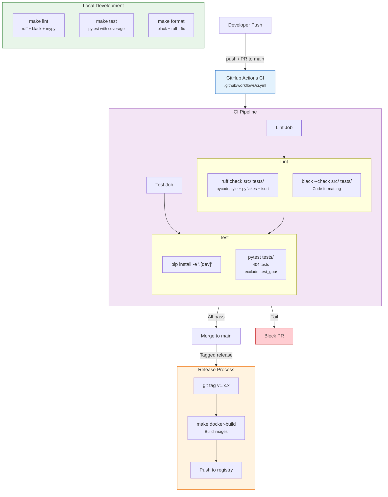

---

## 12. Makefile Command Map

```mermaid
flowchart TD
    MAKE["Makefile<br/><small>18 targets</small>"]

    subgraph DEV_CMDS["Development"]
        direction TB
        INSTALL["make install<br/><small>pip install -e '.[dev]'</small>"]
        TEST_CMD["make test<br/><small>pytest --cov</small>"]
        LINT_CMD["make lint<br/><small>ruff + black + mypy</small>"]
        FORMAT_CMD["make format<br/><small>black + ruff --fix</small>"]
    end

    subgraph DOCKER_CMDS["Docker"]
        direction TB
        OCR_BUILD["make ocr-build<br/><small>Build OCR image</small>"]
        OCR_UP["make ocr-up<br/><small>Start OCR service</small>"]
        OCR_DOWN["make ocr-down<br/><small>Stop OCR service</small>"]
        OCR_LOGS["make ocr-logs<br/><small>View OCR logs</small>"]
    end

    subgraph SERVE_CMDS["Serving"]
        direction TB
        SERVE["make serve<br/><small>uvicorn --reload</small>"]
        DEMO_CMD["make demo<br/><small>Gradio app</small>"]
    end

    subgraph DATA_CMDS["Data"]
        direction TB
        AUDIT["make data-audit<br/><small>Scan data/ dirs</small>"]
    end

    subgraph GCP_CMDS["Cloud"]
        direction TB
        GCP_TRAIN["make gcp-train<br/><small>Vertex AI job</small>"]
        GCP_SYNC["make gcp-sync-up<br/><small>Upload runs to GCS</small>"]
        GCP_PULL["make gcp-pull-model<br/><small>Download model</small>"]
    end

    subgraph THESIS_CMDS["Thesis"]
        direction TB
        THESIS_UP["make thesis-update<br/><small>Generate tables + figures</small>"]
    end

    MAKE --> DEV_CMDS
    MAKE --> DOCKER_CMDS
    MAKE --> SERVE_CMDS
    MAKE --> DATA_CMDS
    MAKE --> GCP_CMDS
    MAKE --> THESIS_CMDS

    style MAKE fill:#fff3e0,stroke:#ef6c00,stroke-width:2px
    style DEV_CMDS fill:#e3f2fd,stroke:#1565c0
    style DOCKER_CMDS fill:#fce4ec,stroke:#c62828
    style SERVE_CMDS fill:#e8f5e9,stroke:#2e7d32
    style DATA_CMDS fill:#f3e5f5,stroke:#7b1fa2
    style GCP_CMDS fill:#fff9c4,stroke:#f57f17
    style THESIS_CMDS fill:#eceff1,stroke:#546e6a
```

---

## 13. Complete End-to-End User Journey

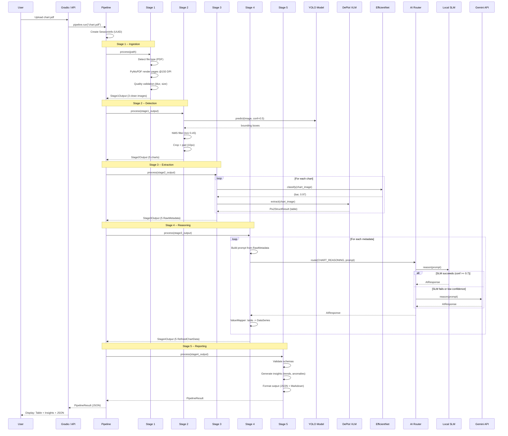

---

*Tong cong 13 diagrams bao phu toan bo kien truc he thong, tu high-level architecture cho den chi tiet tung component, data flow, error handling, CI/CD, va user journey.*
