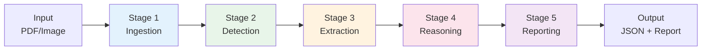
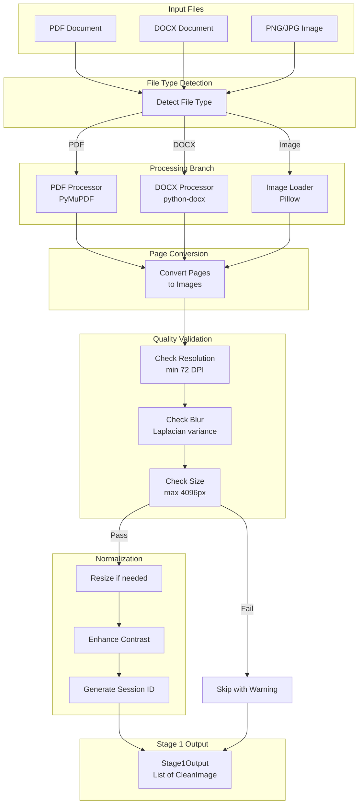
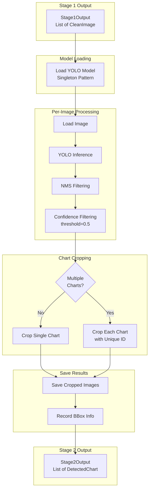
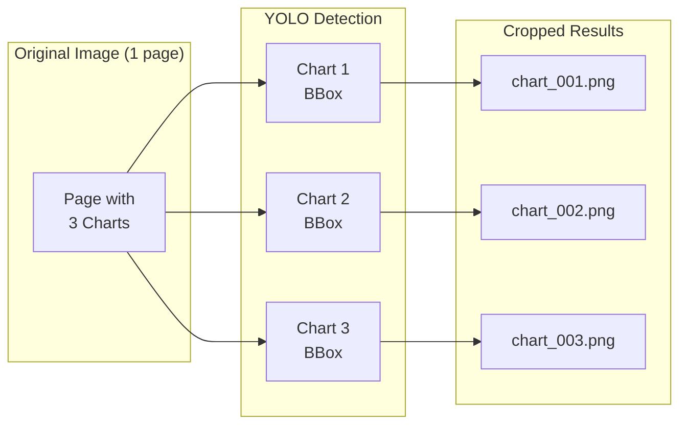
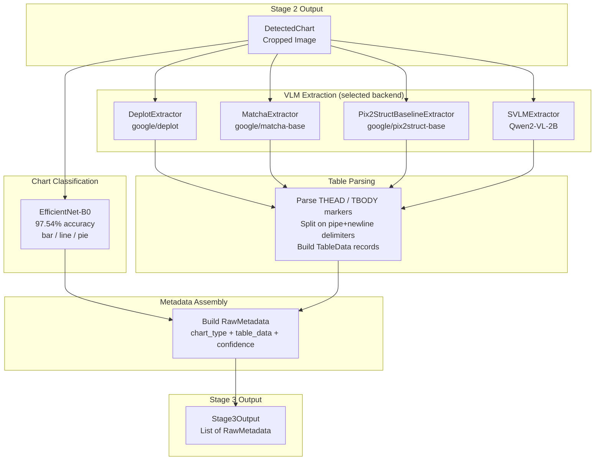
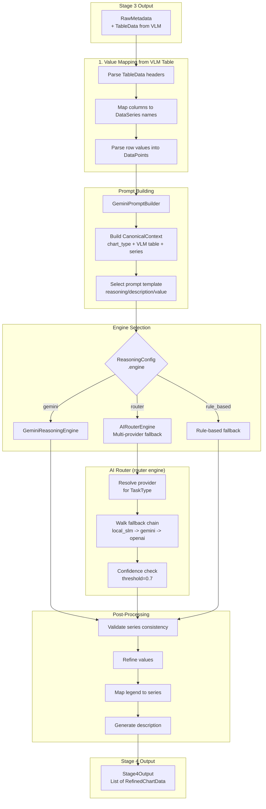
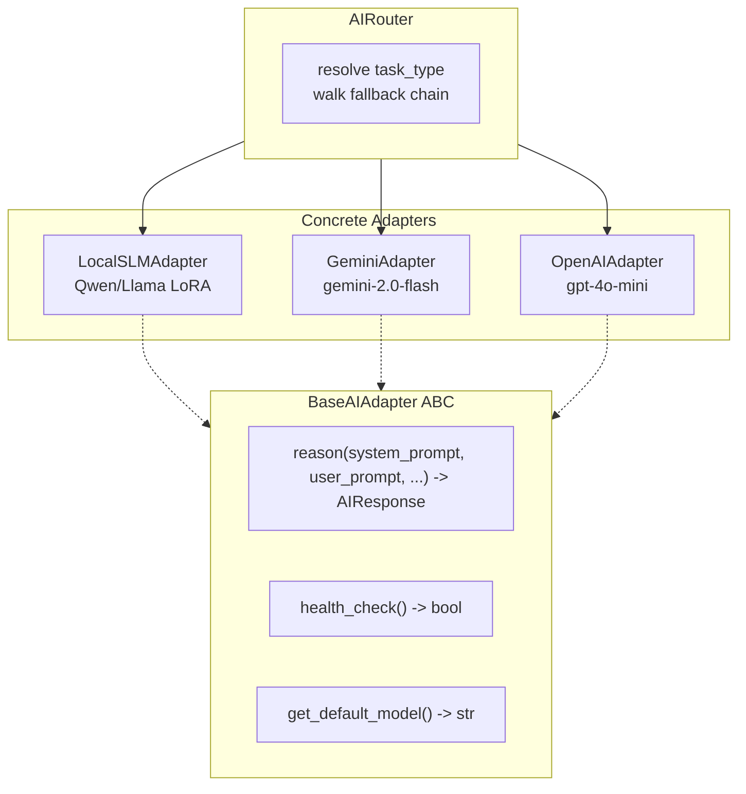
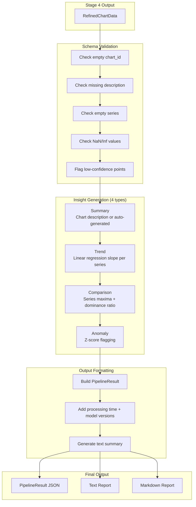
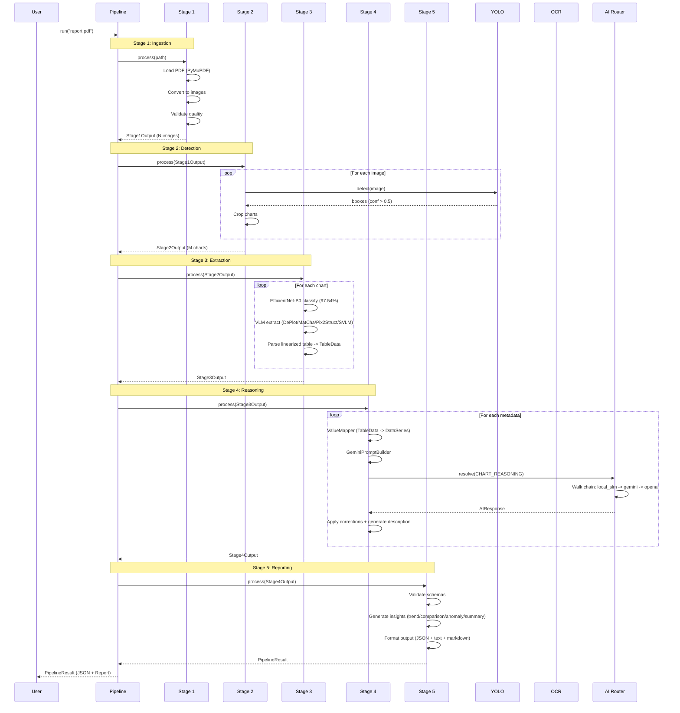
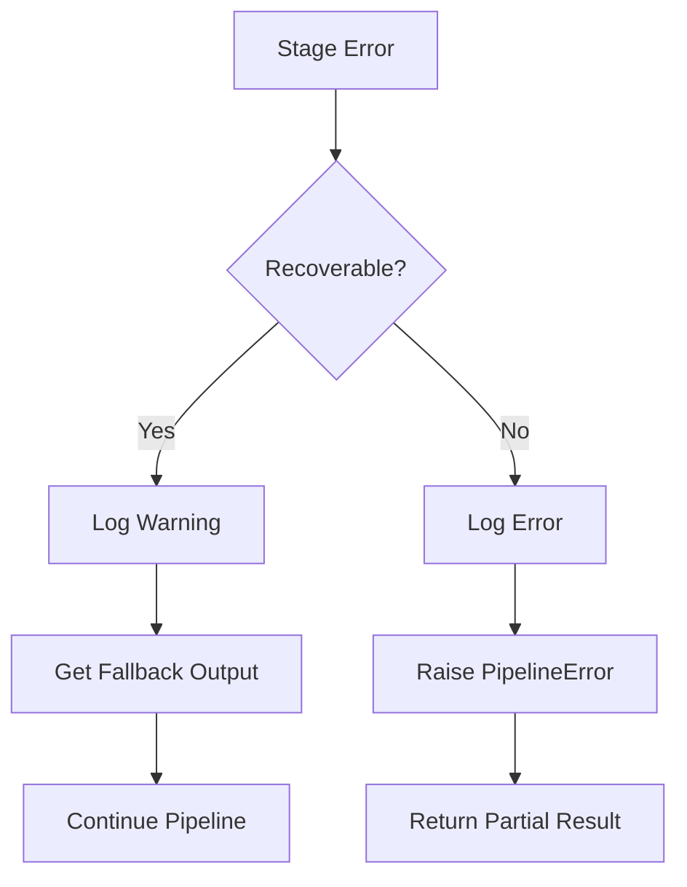

# Pipeline Flow

| Version | Date | Author | Description |
| --- | --- | --- | --- |
| 3.0.0 | 2026-03-02 | That Le | Full rewrite: all 5 stages complete, AI Router, actual schemas |
| 2.0.0 | 2026-02-04 | That Le | Updated pipeline status |

## Implementation Status

| Stage | Status | Key Class | Notes |
| --- | --- | --- | --- |
| Stage 1 | **Complete** | `Stage1Ingestion` | PDF/Image ingestion |
| Stage 2 | **Complete** | `Stage2Detection` | YOLO 93.5% mAP@50 |
| Stage 3 | **Complete** | `Stage3Extraction` (VLM + EfficientNet-B0) | VLM extraction (DePlot/MatCha/Pix2Struct/SVLM) |
| Stage 4 | **Complete** | `Stage4Reasoning` (6 submodules) | AI Router + 3 adapters |
| Stage 5 | **Complete** | `Stage5Reporting` | Insights, validation, reports |
| AI Router | **Complete** | `AIRouter` (8 files, 55 tests) | Multi-provider fallback |
| Pipeline | **Complete** | `ChartAnalysisPipeline` | All 5 stages wired |

---

## 1. Pipeline Overview

The Geo-SLM Chart Analysis pipeline processes input documents through 5 sequential stages, orchestrated by `ChartAnalysisPipeline` in `src/core_engine/pipeline.py`:



**Orchestration:**
```python
from core_engine import ChartAnalysisPipeline

pipeline = ChartAnalysisPipeline.from_config()  # Loads base.yaml + models.yaml + pipeline.yaml
result = pipeline.run("report.pdf")              # Returns PipelineResult
```

Each stage is a `BaseStage[InputT, OutputT]` subclass with typed I/O schemas enforced by Pydantic v2.

---

## 2. Stage 1: Ingestion & Sanitation

### 2.1. Purpose

Transform diverse input formats into normalized images ready for processing.

### 2.2. Flow Diagram



### 2.3. Input/Output Schema

```python
# Input
input_path: Path  # Path to PDF, DOCX, or image file

# Output (src/core_engine/schemas/stage_outputs.py)
class Stage1Output(BaseModel):
    session: SessionInfo
    images: List[CleanImage]
    warnings: List[str]

class CleanImage(BaseModel):
    image_path: Path
    original_path: Path
    page_number: int
    width: int
    height: int
    is_grayscale: bool
```

---

## 3. Stage 2: Detection & Localization

### 3.1. Purpose

Detect and crop chart regions from document images using YOLO.

### 3.2. Flow Diagram



### 3.3. Multi-Chart Handling



### 3.4. Input/Output Schema

```python
# Output (src/core_engine/schemas/stage_outputs.py)
class Stage2Output(BaseModel):
    session: SessionInfo
    charts: List[DetectedChart]
    total_detected: int
    skipped_low_confidence: int

class DetectedChart(BaseModel):
    chart_id: str
    source_image: Path
    cropped_path: Path
    bbox: BoundingBox
    page_number: int
```

---

## 4. Stage 3: Structural Analysis (VLM Extraction)

### 4.1. Purpose

Convert cropped chart images directly to structured data tables using Vision-Language Models (VLMs). This is a 2-component design: EfficientNet-B0 for chart-type classification, and a pluggable VLM extractor with 4 interchangeable backends.

### 4.2. Backend Architecture

| Backend | File | Model | Purpose |
| --- | --- | --- | --- |
| `Stage3Extraction` | `s3_extraction.py` | Orchestrator | Config loading + EfficientNet + VLM |
| `DeplotExtractor` | `extractors.py` | google/deplot | Primary: chart-to-table (Pix2Struct fine-tuned) |
| `MatchaExtractor` | `extractors.py` | google/matcha-base | Ablation: math+chart reasoning |
| `Pix2StructBaselineExtractor` | `extractors.py` | google/pix2struct-base | Ablation baseline: no chart fine-tuning |
| `SVLMExtractor` | `extractors.py` | Qwen/Qwen2-VL-2B-Instruct | Zero-shot visual SLM baseline |
| `EfficientNet-B0 Classifier` | `s3_extraction.py` | models/weights/ | Chart type classification (97.54%) |

### 4.3. Flow Diagram



### 4.4. Extraction Backend Selection

The active backend is set via `pipeline.yaml`:

```yaml
extraction:
  extractor_backend: "deplot"   # options: deplot | matcha | pix2struct | svlm
  extractor_model: null         # null = use default hub model for each backend
  extractor_device: "cuda"      # cuda | cpu | mps
  max_new_tokens: 512
  max_patches: 512
```

All backends share the `BaseChartExtractor` interface and return the same `TableData` schema, making backend switching transparent to downstream stages.

### 4.5. Input/Output Schema

```python
# Output (src/core_engine/schemas/stage_outputs.py)
class Stage3Output(BaseModel):
    session: SessionInfo
    metadata: List[RawMetadata]

class RawMetadata(BaseModel):
    chart_id: str
    chart_type: ChartType        # 3-class from EfficientNet-B0
    table_data: Optional[TableData]   # VLM-extracted table
    texts: List[OCRText]         # empty [] in VLM pipeline
    elements: List[ChartElement] # empty [] in VLM pipeline
    axis_info: Optional[AxisInfo]    # None in VLM pipeline
    confidence: ExtractionConfidence

class TableData(BaseModel):
    headers: List[str]           # Column headers from THEAD
    rows: List[List[str]]        # Data rows from TBODY
    records: List[Dict[str, str]] # headers zipped with each row
    model_name: str              # e.g. "google/deplot"
    raw_output: str              # Full linearized VLM output
```

---

## 5. Stage 4: Semantic Reasoning (AI Router)

### 5.1. Purpose

Apply AI reasoning to correct OCR errors, map geometric values, and generate descriptions. Uses multi-provider routing with automatic fallback.

### 5.2. Submodule Architecture

| Component | File | Purpose |
| --- | --- | --- |
| `Stage4Reasoning` | `s4_reasoning.py` (479 lines) | Orchestrator |
| `ValueMapper` | `value_mapper.py` (764 lines) | TableData -> DataSeries |
| `GeminiPromptBuilder` | `prompt_builder.py` (833 lines) | Structured prompt construction |
| `ReasoningEngine` | `reasoning_engine.py` (185 lines) | Abstract base for engines |
| `GeminiReasoningEngine` | `gemini_engine.py` (626 lines) | Direct Gemini API engine |
| `AIRouterEngine` | `router_engine.py` (410 lines) | Multi-provider via AIRouter |
| Prompt templates | `prompts/*.txt, *.md` | 5 template files |

### 5.3. Flow Diagram



### 5.4. AI Router Task Types and Fallback Chains

```python
class TaskType(str, Enum):
    CHART_REASONING = "chart_reasoning"     # Full analysis: VLM table + description
    OCR_CORRECTION = "ocr_correction"       # Fix VLM table misreads
    DESCRIPTION_GEN = "description_gen"     # Academic-style description
    DATA_VALIDATION = "data_validation"     # Validate extracted data
```

| Task Type | Default Fallback Chain |
| --- | --- |
| `CHART_REASONING` | local_slm -> gemini -> openai |
| `OCR_CORRECTION` | local_slm -> gemini |
| `DESCRIPTION_GEN` | local_slm -> gemini -> openai |
| `DATA_VALIDATION` | gemini -> openai |

### 5.5. Adapter Architecture



### 5.6. Input/Output Schema

```python
# Output (src/core_engine/schemas/stage_outputs.py)
class Stage4Output(BaseModel):
    session: SessionInfo
    charts: List[RefinedChartData]

class RefinedChartData(BaseModel):
    chart_id: str
    chart_type: ChartType
    title: Optional[str]
    x_axis_label: Optional[str]
    y_axis_label: Optional[str]
    series: List[DataSeries]
    description: str
    correction_log: List[str]

class DataSeries(BaseModel):
    name: str
    color: Optional[Color]
    points: List[DataPoint]

class DataPoint(BaseModel):
    label: str
    value: float
    unit: Optional[str]
    confidence: float
```

---

## 6. Stage 5: Insight & Reporting

### 6.1. Purpose

Validate refined data, generate insights (trend, comparison, anomaly, summary), and produce final structured output in multiple formats.

### 6.2. Flow Diagram



### 6.3. Insight Types

| Type | Detection Method | Example |
| --- | --- | --- |
| `summary` | Chart description or auto-generated from metadata | "Bar chart showing quarterly revenue for 2025" |
| `trend` | Linear regression slope per data series | "Values show increasing trend from Q1 to Q4" |
| `comparison` | Compare series maxima, find dominant series + ratio | "Product A leads with 45% market share" |
| `anomaly` | Z-score method, flag |z| > threshold | "Q3 shows unusual spike of 150% vs average" |

```python
class InsightType(str, Enum):
    TREND = "trend"
    COMPARISON = "comparison"
    ANOMALY = "anomaly"
    SUMMARY = "summary"
    CORRELATION = "correlation"  # Future use
```

### 6.4. Final Output Schema

```python
# Output (src/core_engine/schemas/stage_outputs.py)
class PipelineResult(BaseModel):
    session: SessionInfo
    charts: List[FinalChartResult]
    summary: str
    processing_time_seconds: float
    model_versions: Dict[str, str]
    warnings: List[str]

class FinalChartResult(BaseModel):
    chart_id: str
    chart_type: ChartType
    title: Optional[str]
    data: RefinedChartData
    insights: List[ChartInsight]
    source_info: Dict[str, Any]

class ChartInsight(BaseModel):
    insight_type: str      # InsightType value
    text: str
    confidence: float
```

---

## 7. Full Pipeline Sequence



---

## 8. Error Recovery

### 8.1. Exception Hierarchy

```
ChartAnalysisError (base)
    PipelineError (stage, recoverable, original_error)
        StageInputError (expected_type, received_type)
        StageProcessingError (fallback_available)
    ConfigurationError (config_key)
    ModelError

AIProviderError (AI-specific base)
    AIRateLimitError (retry_after)
    AIAuthenticationError
    AITimeoutError (timeout_seconds)
    AIInvalidResponseError (raw_response)
AIProviderExhaustedError (all providers failed)
```

### 8.2. Recovery Flow



### 8.3. Error Types by Stage

| Stage | Error Type | Recovery Strategy |
| --- | --- | --- |
| S1 | File not found | Abort |
| S1 | Low quality image | Skip with warning |
| S2 | No detections | Return empty list |
| S2 | Model load failure | Abort |
| S3 | OCR failure | Use empty text |
| S3 | Classification uncertain | Fallback to SimpleClassifier |
| S4 | Primary AI provider fails | Auto-fallback via AIRouter chain |
| S4 | All providers exhausted | AIProviderExhaustedError -> rule-based fallback |
| S4 | SLM timeout | Try next provider in chain |
| S5 | Validation failure | Return without insights |

---

## 9. Key Enums

All enums live in `src/core_engine/schemas/enums.py` (single source of truth):

| Enum | Values |
| --- | --- |
| `ChartType` | BAR, LINE, PIE, SCATTER, AREA, HISTOGRAM, HEATMAP, BOX, STACKED_BAR, GROUPED_BAR, DONUT, UNKNOWN |
| `InsightType` | TREND, COMPARISON, ANOMALY, SUMMARY, CORRELATION |
| `TextRole` | TITLE, SUBTITLE, X_AXIS_LABEL, Y_AXIS_LABEL, X_TICK, Y_TICK, LEGEND, DATA_LABEL, ANNOTATION, UNKNOWN |
| `ElementType` | BAR, LINE, POINT, SLICE, AREA, GRID_LINE, AXIS, LEGEND_ITEM |
| `StageStatus` | PENDING, PROCESSING, COMPLETED, FAILED, SKIPPED |
| `PipelineStatus` | IDLE, RUNNING, COMPLETED, PARTIAL, FAILED, CANCELLED |
| `ErrorCode` | 15 codes across S1-S5 + general |
| `ConfidenceThreshold` | DETECTION_MIN=0.5, OCR_MIN=0.6, VALUE_EXTRACTION=0.7 |
