# Pipeline Flow

| Version | Date | Author | Description |
| --- | --- | --- | --- |
| 2.0.0 | 2026-02-04 | That Le | Updated pipeline status |

## Implementation Status

| Stage | Status | Notes |
|-------|--------|-------|
| Stage 1 | ✅ Complete | PDF/Image ingestion |
| Stage 2 | ✅ Complete | YOLO 93.5% mAP@50 |
| Stage 3 | ✅ Complete | 139/140 tests pass |
| Stage 4 | 🔄 In Progress | SLM integration |
| Stage 5 | ⏳ Planned | Reporting |

## 1. Pipeline Overview

The Geo-SLM Chart Analysis pipeline processes input documents through 5 sequential stages:

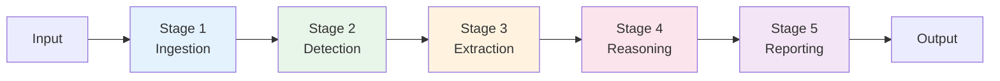

## 2. Stage 1: Ingestion & Sanitation

### 2.1. Purpose

Transform diverse input formats into normalized images ready for processing.

### 2.2. Flow Diagram

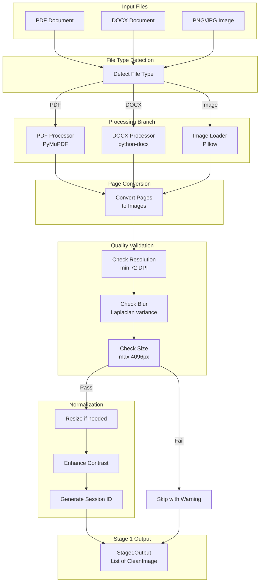

### 2.3. Input/Output Schema

```python
# Input
input_path: Path  # Path to PDF, DOCX, or image file

# Output
class Stage1Output(BaseModel):
    session: SessionInfo
    images: List[CleanImage]
    warnings: List[str]

class CleanImage(BaseModel):
    image_path: Path      # Path to normalized image
    original_path: Path   # Source file reference
    page_number: int      # Page number (1 for images)
    width: int
    height: int
    is_grayscale: bool
```

## 3. Stage 2: Detection & Localization

### 3.1. Purpose

Detect and crop chart regions from document images using YOLO.

### 3.2. Flow Diagram

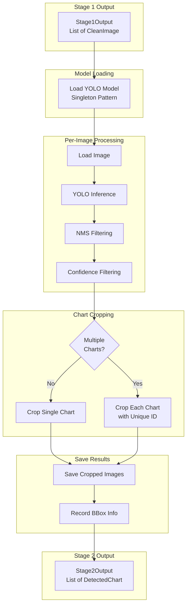

### 3.3. Multi-Chart Handling

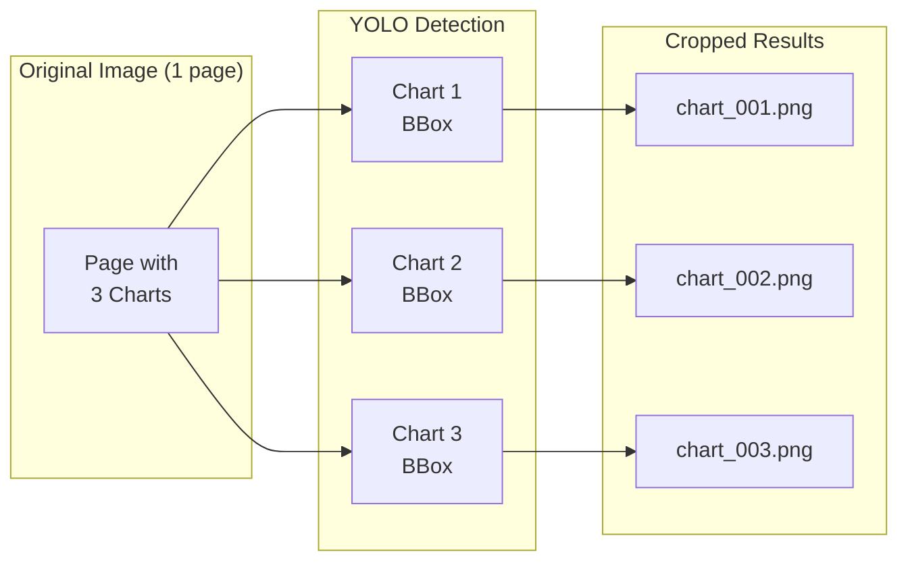

### 3.4. Input/Output Schema

```python
# Input
Stage1Output

# Output
class Stage2Output(BaseModel):
    session: SessionInfo
    charts: List[DetectedChart]
    total_detected: int
    skipped_low_confidence: int

class DetectedChart(BaseModel):
    chart_id: str           # Unique identifier
    source_image: Path      # Original image path
    cropped_path: Path      # Cropped chart path
    bbox: BoundingBox       # Detection coordinates
    page_number: int        # Source page
```

## 4. Stage 3: Structural Analysis (Hybrid)

### 4.1. Purpose

Extract raw metadata through OCR, element detection, and geometric analysis.

### 4.2. Flow Diagram

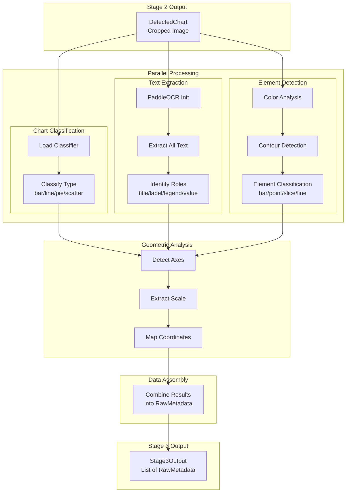

### 4.3. OCR Text Role Detection

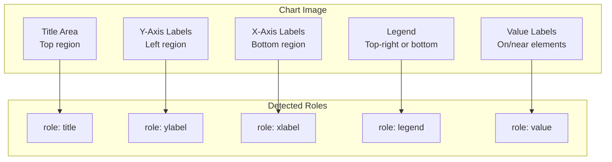

### 4.4. Input/Output Schema

```python
# Input
Stage2Output

# Output
class Stage3Output(BaseModel):
    session: SessionInfo
    metadata: List[RawMetadata]

class RawMetadata(BaseModel):
    chart_id: str
    chart_type: ChartType
    texts: List[OCRText]
    elements: List[ChartElement]
    axis_info: Optional[AxisInfo]

class OCRText(BaseModel):
    text: str
    bbox: BoundingBox
    confidence: float
    role: Optional[str]  # title, xlabel, ylabel, legend, value

class ChartElement(BaseModel):
    element_type: str    # bar, point, slice, line
    bbox: BoundingBox
    center: Point
    color: Optional[Color]
    area_pixels: Optional[int]
```

## 5. Stage 4: Semantic Reasoning (SLM)

### 5.1. Purpose

Apply SLM to correct OCR errors, map values, and generate descriptions.

### 5.2. Flow Diagram

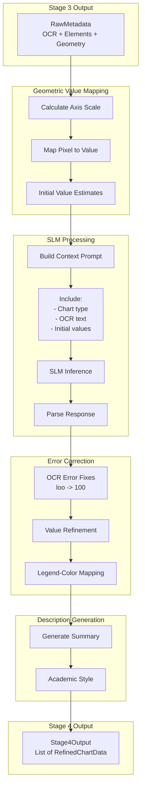

### 5.3. SLM Prompt Structure

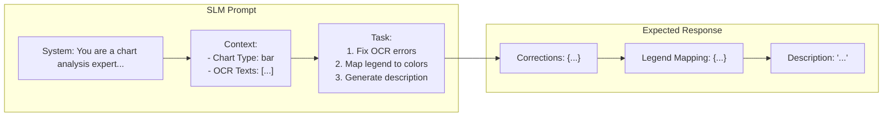

### 5.4. Input/Output Schema

```python
# Input
Stage3Output

# Output
class Stage4Output(BaseModel):
    session: SessionInfo
    charts: List[RefinedChartData]

class RefinedChartData(BaseModel):
    chart_id: str
    chart_type: ChartType
    title: Optional[str]
    x_axis_label: Optional[str]
    y_axis_label: Optional[str]
    series: List[DataSeries]
    description: str
    correction_log: List[str]

class DataSeries(BaseModel):
    name: str
    color: Optional[Color]
    points: List[DataPoint]

class DataPoint(BaseModel):
    label: str
    value: float
    unit: Optional[str]
    confidence: float
```

## 6. Stage 5: Insight & Reporting

### 6.1. Purpose

Generate final output with insights and formatted report.

### 6.2. Flow Diagram

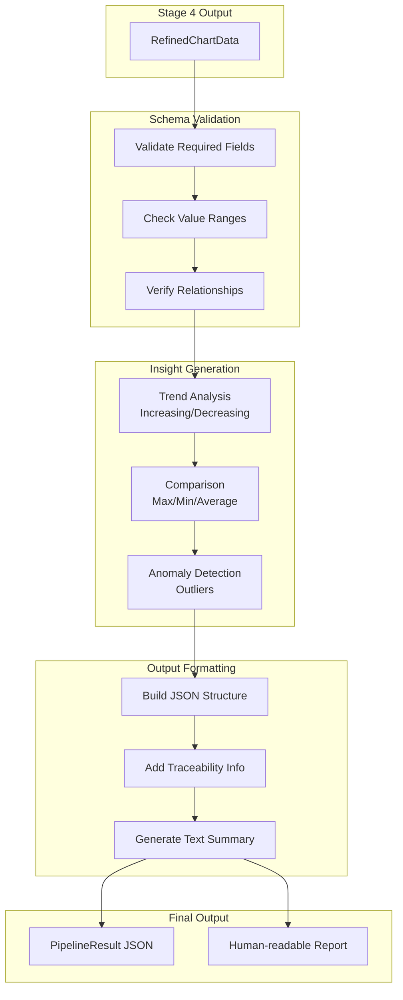

### 6.3. Insight Types

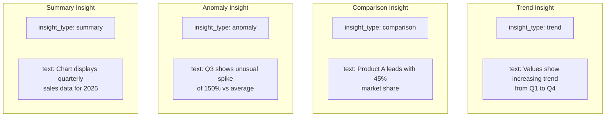

### 6.4. Final Output Schema

```python
class PipelineResult(BaseModel):
    session: SessionInfo
    charts: List[FinalChartResult]
    summary: str
    processing_time_seconds: float
    model_versions: Dict[str, str]

class FinalChartResult(BaseModel):
    chart_id: str
    chart_type: ChartType
    title: Optional[str]
    data: RefinedChartData
    insights: List[ChartInsight]
    source_info: Dict[str, Any]

class ChartInsight(BaseModel):
    insight_type: str  # trend, comparison, anomaly, summary
    text: str
    confidence: float
```

## 7. Full Pipeline Sequence

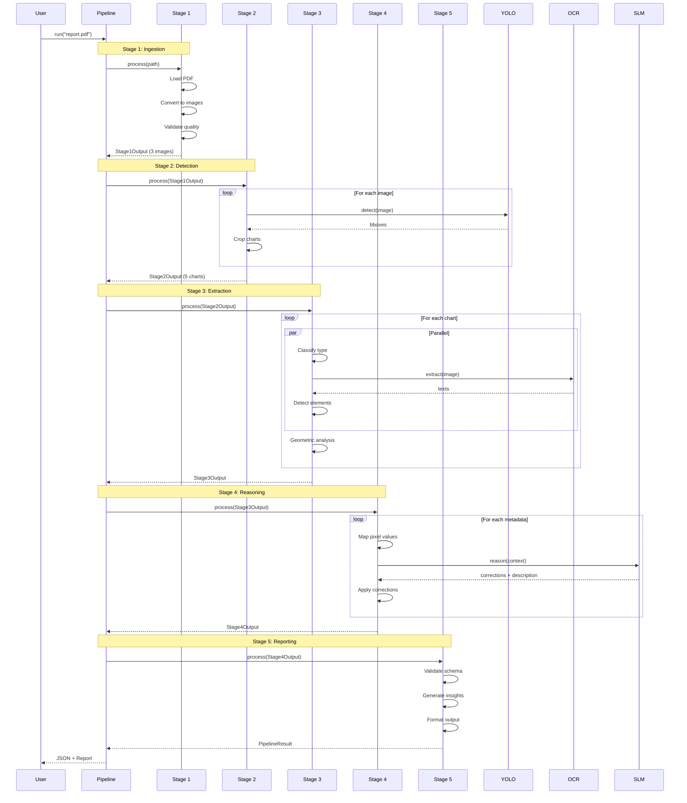

## 8. Error Recovery Flows

### 8.1. Recoverable Errors

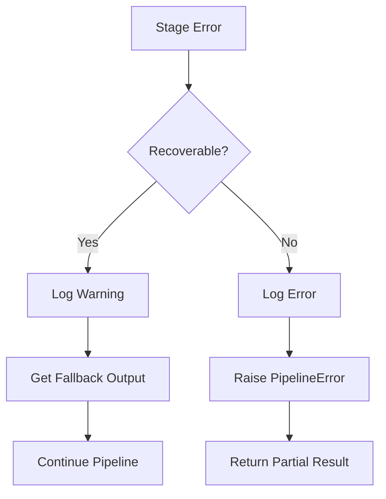

### 8.2. Error Types by Stage

| Stage | Error Type | Recovery Strategy |
| --- | --- | --- |
| S1 | File not found | Abort |
| S1 | Low quality image | Skip with warning |
| S2 | No detections | Return empty list |
| S2 | Model load failure | Abort |
| S3 | OCR failure | Use empty text |
| S3 | Classification uncertain | Default to "unknown" |
| S4 | SLM timeout | Use rule-based fallback |
| S5 | Validation failure | Return without insights |
