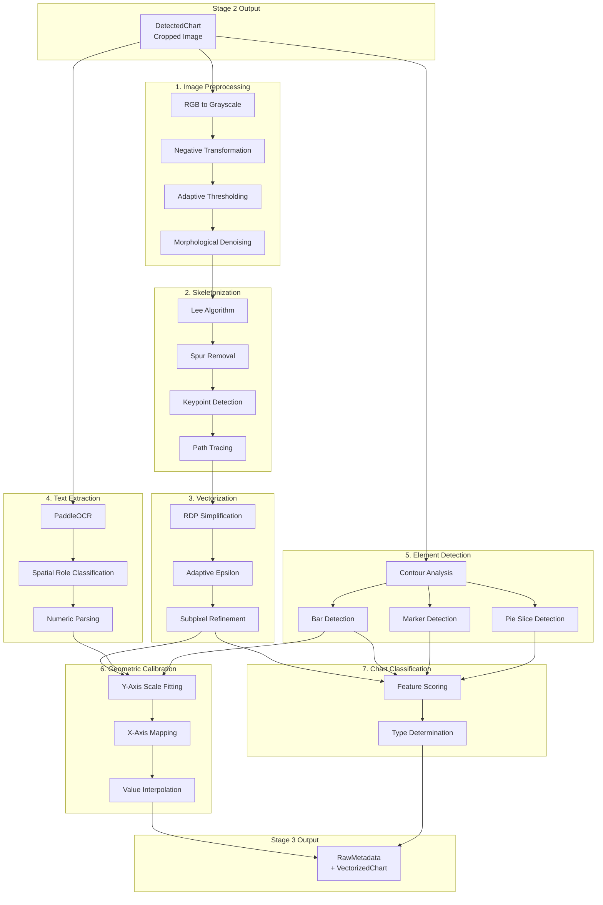
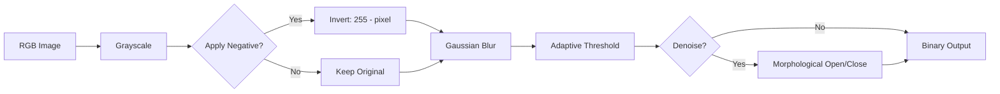
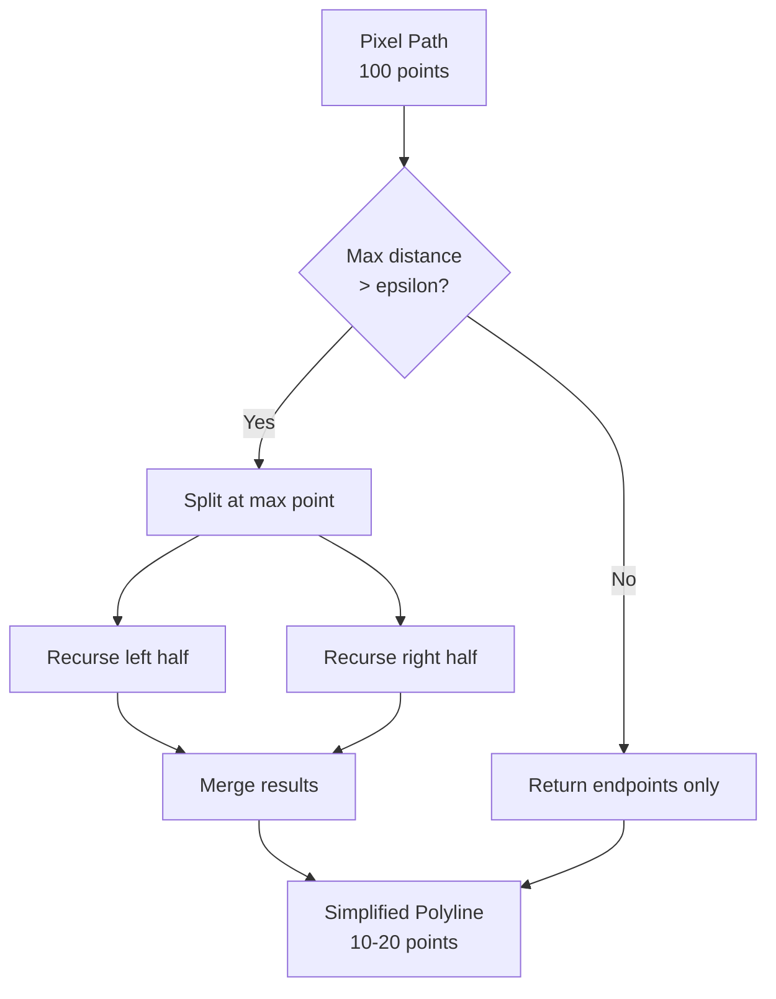
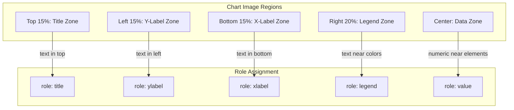
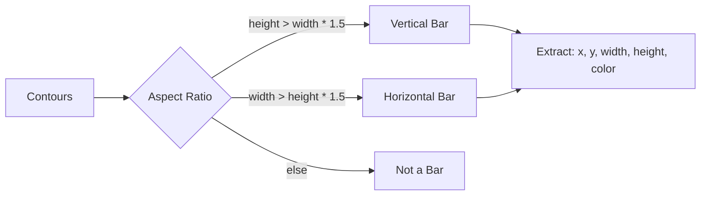
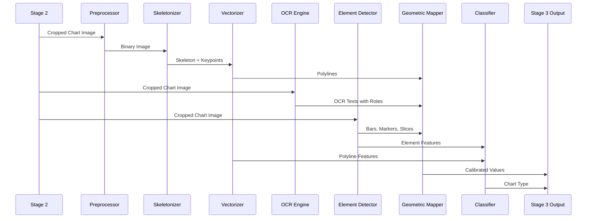

# Stage 3: Extraction - Geo-SLM Approach

| Version | Date | Author | Description |
| --- | --- | --- | --- |
| 1.0.0 | 2026-01-20 | That Le | Detailed Stage 3 implementation with Geo-SLM methodology |

## 1. Overview

Stage 3 implements a hybrid extraction approach combining:
- **Negative Image Processing**: Enhanced structural visibility
- **Topology-Preserving Skeletonization**: Lee algorithm for line thinning
- **RDP Vectorization**: Ramer-Douglas-Peucker for piecewise linear approximation
- **OCR with Spatial Context**: PaddleOCR with role classification
- **Geometric Axis Calibration**: Pixel-to-value mapping

## 2. Architecture



## 3. Submodule Details

### 3.1. Image Preprocessor

**Purpose**: Transform chart image to binary form optimized for skeleton extraction.

**Key Technique**: Negative Image Transformation

```
Original: Dark lines on light background
    |
    v
Negative: Light lines on dark background (object = white)
    |
    v
Binary: Clean skeleton-ready image
```

**Configuration**:

| Parameter | Default | Description |
| --- | --- | --- |
| apply_negative | True | Apply negative transformation |
| denoise | True | Apply morphological denoising |
| block_size | 35 | Adaptive threshold block size |
| c_constant | 10 | Adaptive threshold constant |
| gaussian_blur_size | 5 | Pre-blur kernel size |

**Flow**:



### 3.2. Skeletonizer

**Purpose**: Reduce thick lines to 1-pixel skeleton while preserving topology.

**Algorithm**: Lee (1994) - Topology-preserving thinning

**Key Features**:
- Preserves connectivity (no breaks)
- Maintains endpoints and junctions
- Optional spur removal

**Keypoint Types**:

| Type | Neighbors | Description |
| --- | --- | --- |
| ENDPOINT | 1 | Line termination (data point candidate) |
| JUNCTION | 3+ | Intersection point |
| CORNER | 2 (angle) | Direction change |

**Configuration**:

| Parameter | Default | Description |
| --- | --- | --- |
| method | "lee" | Skeletonization algorithm |
| remove_spurs | True | Remove short spurious branches |
| min_spur_length | 5 | Minimum spur length to keep |
| detect_junctions | True | Identify junction points |

### 3.3. Vectorizer (RDP Algorithm)

**Purpose**: Convert pixel paths to piecewise linear segments.

**Algorithm**: Ramer-Douglas-Peucker (1973)

**Principle**:
1. Connect first and last points with line
2. Find point with maximum perpendicular distance
3. If distance > epsilon: recursively subdivide
4. If distance <= epsilon: approximate with line



**Adaptive Epsilon**:

```python
epsilon = base_epsilon * sqrt(path_length / reference_length)
```

**Configuration**:

| Parameter | Default | Description |
| --- | --- | --- |
| epsilon | 2.0 | Base simplification threshold (pixels) |
| adaptive_epsilon | True | Scale epsilon by path length |
| subpixel_refinement | True | Compute subpixel coordinates |
| min_segment_length | 3 | Minimum segment to keep |

### 3.4. OCR Engine

**Purpose**: Extract text with spatial role classification.

**Backend**: PaddleOCR (supports multiple languages)

**Role Classification**:

| Role | Location Heuristic | Content Pattern |
| --- | --- | --- |
| title | Top 15% of image, centered | Any text |
| ylabel | Left 15%, vertically oriented | Numeric or category |
| xlabel | Bottom 15%, horizontally aligned | Numeric or category |
| legend | Top-right or bottom, near color blocks | Labels |
| value | Near chart elements | Numeric only |



### 3.5. Geometric Mapper

**Purpose**: Calibrate pixel coordinates to actual data values.

**Y-Axis Calibration**:

1. Parse numeric labels from OCR (role=ylabel)
2. Get pixel Y-coordinates of labels
3. Fit linear/logarithmic model:

```
value = slope * pixel_y + intercept
```

**Scale Detection**:

| Pattern | Detection | Model |
| --- | --- | --- |
| Linear | Equal spacing in pixels | y = mx + b |
| Logarithmic | 1, 10, 100, 1000... pattern | y = a * log(x) + b |
| Percentage | 0%, 25%, 50%, 75%, 100% | Normalized linear |

**X-Axis Mapping**:
- Categorical: Map pixel ranges to labels
- Numeric: Same as Y-axis calibration

### 3.6. Element Detector

**Purpose**: Identify discrete chart elements (bars, markers, pie slices).

**Bar Detection**:



**Marker Detection (Hough Transform)**:

```python
circles = cv2.HoughCircles(
    gray,
    cv2.HOUGH_GRADIENT,
    dp=1.2,
    minDist=20,
    param1=50,
    param2=30,
    minRadius=3,
    maxRadius=20
)
```

**Pie Slice Detection**:

1. Detect large circular region
2. Analyze color sectors
3. Calculate angle spans

### 3.7. Chart Classifier

**Purpose**: Determine chart type from structural features.

**Scoring Algorithm**:

```python
scores = {
    "bar": score_bar(bars, polylines),
    "line": score_line(polylines, markers),
    "pie": score_pie(slices, image_shape),
    "scatter": score_scatter(markers, polylines),
}
chart_type = max(scores, key=scores.get)
```

**Feature Weights**:

| Feature | Bar | Line | Pie | Scatter |
| --- | --- | --- | --- | --- |
| Bar count >= 2 | +0.8 | - | - | - |
| Continuous polyline | - | +0.7 | - | - |
| Circular region | - | - | +0.9 | - |
| Markers without lines | - | - | - | +0.6 |
| Aligned bars | +0.2 | - | - | - |
| Line with markers | - | +0.3 | - | - |

## 4. Data Flow



## 5. Output Schema

```python
class Stage3Output(BaseModel):
    """Stage 3 extraction results."""
    session: SessionInfo
    metadata: List[RawMetadata]

class RawMetadata(BaseModel):
    """Extracted metadata for single chart."""
    chart_id: str
    chart_type: ChartType
    classification_confidence: float
    texts: List[OCRText]
    elements: List[ChartElement]
    polylines: List[Polyline]
    axis_info: Optional[AxisInfo]

class VectorizedChart(BaseModel):
    """Vectorized representation (optional)."""
    chart_id: str
    skeleton_graph: SkeletonGraph
    polylines: List[Polyline]
    keypoints: List[KeyPoint]
    scale_mapping: Optional[ScaleMapping]
```

## 6. Error Handling

| Error | Severity | Recovery |
| --- | --- | --- |
| Image load failure | CRITICAL | Skip chart, log error |
| OCR timeout | WARNING | Continue with empty texts |
| Skeletonization empty | WARNING | Use element detection only |
| Calibration failed | WARNING | Return raw pixel coordinates |
| Classification uncertain | INFO | Return UNKNOWN type |

## 7. Performance Considerations

| Operation | Complexity | Optimization |
| --- | --- | --- |
| Preprocessing | O(n) pixels | Resize large images first |
| Skeletonization | O(n) iterations | Use OpenCV optimized version |
| RDP | O(n log n) | Early termination |
| OCR | ~500ms/image | Batch if multiple charts |
| Contour detection | O(n) | Filter by area threshold |

## 8. Configuration Reference

```yaml
extraction:
  preprocess:
    apply_negative: true
    block_size: 35
    c_constant: 10
    
  skeleton:
    method: "lee"
    remove_spurs: true
    min_spur_length: 5
    
  vectorize:
    epsilon: 2.0
    adaptive_epsilon: true
    subpixel_refinement: true
    
  ocr:
    engine: "paddleocr"
    languages: ["en"]
    min_confidence: 0.6
    
  element_detector:
    detect_bars: true
    detect_markers: true
    detect_pie_slices: true
    min_bar_area: 100
    
  mapper:
    min_calibration_points: 2
    auto_detect_scale: true
    
  classifier:
    min_bars_for_bar_chart: 2
    min_markers_for_scatter: 5
    min_confidence: 0.5
```

## 9. Testing Strategy

### Unit Tests

| Module | Test Focus |
| --- | --- |
| Preprocessor | Negative transform, threshold output |
| Skeletonizer | Topology preservation, keypoint detection |
| Vectorizer | RDP correctness, endpoint preservation |
| OCR Engine | Role classification accuracy |
| GeometricMapper | Calibration accuracy, interpolation |
| ElementDetector | Bar/marker/slice detection |
| Classifier | Type determination accuracy |

### Integration Tests

- Full pipeline: Stage2Output -> Stage3Output
- Multiple chart types: bar, line, pie, scatter
- Edge cases: empty charts, noisy images
- Error recovery: missing files, OCR failures

## 10. References

- Ramer, U. (1972). "An iterative procedure for the polygonal approximation of plane curves"
- Douglas, D.; Peucker, T. (1973). "Algorithms for the reduction of the number of points"
- Lee, T.C.; Kashyap, R.L. (1994). "Building skeleton models via 3-D medial surface/axis thinning algorithms"
- PaddleOCR: https://github.com/PaddlePaddle/PaddleOCR
## 11. ML-Based Chart Classifier

### 11.1. Overview

In addition to rule-based classification, Stage 3 supports an ML-based classifier using Random Forest for improved accuracy.

**Model:** Random Forest Classifier
- **Classes:** bar, line, pie, other
- **Test Accuracy:** ~70%
- **Model Path:** `models/weights/chart_classifier_rf.pkl`

### 11.2. Feature Engineering (11 Features)

| Feature | Description | Bar | Line | Pie |
| --- | --- | --- | --- | --- |
| `aspect_ratio` | Width / Height | ~1.2 | ~1.5 | ~1.0 |
| `mean_brightness` | Average pixel intensity | Med | Med | Med |
| `std_brightness` | Brightness std dev | High | Low | Med |
| `edge_density` | Edge pixels ratio | High | Med | Med |
| `horizontal_line_ratio` | Horizontal line pixels | High | Med | Low |
| `vertical_line_ratio` | Vertical line pixels | High | Low | Low |
| `color_diversity` | Unique colors count | Med | Low | High |
| `dominant_color_ratio` | Largest color cluster | Med | High | Med |
| `circular_shape_ratio` | Circular contour area | Low | Low | High |
| `grid_pattern_strength` | Hough intersections | High | High | Low |
| `symmetry_score` | Vertical symmetry | Med | Med | High |

### 11.3. Training

```bash
python scripts/train_classifier.py \
    --data-dir data/academic_dataset/images \
    --manifest-dir data/academic_dataset/manifests \
    --output-dir models/weights
```

### 11.4. Configuration

```python
config = ExtractionConfig(
    use_ml_classifier=True,
    classifier_model_path=Path("models/weights/chart_classifier_rf.pkl"),
)
```

## 12. OCR Engine Options

### 12.1. Supported Engines

| Engine | Platform | Speed | Accuracy | Installation |
| --- | --- | --- | --- | --- |
| **EasyOCR** | All | Slow (~6s) | Good | `pip install easyocr` |
| **PaddleOCR** | Linux/Mac | Fast (~1s) | Best | `pip install paddleocr` |
| **Tesseract** | All | Fast (~0.5s) | Medium | System install required |

### 12.2. Platform Recommendations

| Platform | Recommended Engine | Notes |
| --- | --- | --- |
| Windows | EasyOCR | PaddleOCR has OneDNN issues |
| Linux | PaddleOCR | Best accuracy, GPU support |
| macOS | EasyOCR or PaddleOCR | Both work well |

### 12.3. Configuration

```yaml
# config/pipeline.yaml
extraction:
  ocr_engine: "easyocr"  # "easyocr", "paddleocr", or "tesseract"
  ocr:
    languages: ["en"]
    min_confidence: 0.5
    classify_roles: true
```