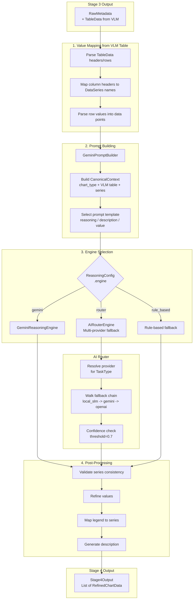

# Stage 4: Reasoning - SLM Integration

| Version | Date | Author | Description |
| --- | --- | --- | --- |
| 3.0.0 | 2026-03-12 | That Le | Updated for VLM-based Stage 3 (TableData input, no geometry) |
| 2.0.0 | 2026-02-04 | That Le | Updated status, SLM plan |

## Status: IN PROGRESS

Stage 4 reasoning implemented with Gemini API and AI Router (multi-provider). Planning Qwen 2.5-1.5B LoRA local integration.

## 1. Overview

Stage 4 receives `RawMetadata` (with `table_data` from VLM extraction) from Stage 3 and applies AI reasoning to:
- Parse and validate the VLM-linearized table output into structured `DataSeries`
- Correct any VLM misreads or inconsistent labels using semantic context
- Associate legend items with data series
- Generate human-readable chart descriptions

**Key change (v6.0.0)**: Stage 3 no longer produces OCR texts or geometric pixel coordinates.
`RawMetadata.texts` and `RawMetadata.elements` are empty; `RawMetadata.table_data` holds a
`TableData` object with `headers`, `rows`, and `records` from the VLM extractor.

## 2. Architecture



## 3. Key Components

### 3.1. Value Mapper from VLM Table

**Purpose**: Convert `TableData` (VLM linearized output) into structured `DataSeries`.

**Algorithm**:
1. Read `table_data.headers` as series names
2. Iterate `table_data.rows` as data points (first column = x-axis category or label)
3. Parse numeric strings into float values (handle `%`, `,`, missing cells)
4. Build `DataSeries(name=header, points=[DataPoint(x, y), ...])`

This replaces the old pixel-to-value geometric calibration entirely.

### 3.2. SLM Engine

**Purpose**: Apply small language model for semantic reasoning.

**Model Options**:

| Model | Size | Pros | Cons |
| --- | --- | --- | --- |
| Qwen-2.5-1.5B | 1.5B | Good Vietnamese support | Slower |
| Llama-3.2-1B | 1B | Fast inference | Limited languages |
| Phi-3-mini | 3.8B | Strong reasoning | Large memory |

**Prompt Structure**:
```
System: You are a chart analysis expert. Given a structured table extracted
        from a chart by a vision-language model, parse it into data series
        and generate a structured JSON output.

Context:
- Chart Type: {type}
- VLM Extracted Table:
  Headers: {table_data.headers}
  Rows:
    {table_data.rows}

Task:
1. Parse each header as a data series name
2. Parse each row's values as data points
3. Verify value consistency (numeric types, units)
4. Generate description
```

### 3.3. Value Validator

**Purpose**: Apply SLM corrections to VLM-extracted table data.

**Common VLM Output Issues**:

| Issue | Fix | Rule |
| --- | --- | --- |
| Merged cell values | Split on `\|` | Table parse |
| Percentage without `%` | Add `%` | Context from header |
| Numeric string with comma | Strip `,` | `float(v.replace(',', ''))` |
| Missing value cell | `None` | Empty string detection |

### 3.4. Description Generator

**Purpose**: Create academic-style chart descriptions.

**Template**:
```
This {chart_type} chart shows {title description}. 
The x-axis represents {x_label} ranging from {x_min} to {x_max}.
The y-axis represents {y_label} with values from {y_min} to {y_max}.
{series_descriptions}
Key observations: {insights}
```

## 4. Input/Output Schema

### 4.1. Input (from Stage 3)

```python
class Stage3Output(BaseModel):
    session: SessionInfo
    metadata: List[RawMetadata]

class RawMetadata(BaseModel):
    chart_id: str
    chart_type: ChartType
    table_data: Optional[TableData]   # VLM extraction output (primary)
    texts: List[OCRText]              # Always empty in v6.0.0+
    elements: List[ChartElement]      # Always empty in v6.0.0+
    axis_info: Optional[AxisInfo]     # Always None in v6.0.0+
    vlm_model: Optional[str]          # e.g. "google/deplot"
    vlm_raw_output: Optional[str]     # Raw linearized VLM string

class TableData(BaseModel):
    headers: List[str]                # Column names (= series names)
    rows: List[List[str]]             # Data rows
    records: List[Dict[str, str]]     # Dict view: {header: value}
    model_name: str                   # e.g. "google/deplot"
    raw_output: str                   # Full linearized string
```

### 4.2. Output

```python
class Stage4Output(BaseModel):
    session: SessionInfo
    charts: List[RefinedChartData]

class RefinedChartData(BaseModel):
    chart_id: str
    chart_type: ChartType
    title: Optional[str]
    x_axis_label: Optional[str]
    y_axis_label: Optional[str]
    series: List[DataSeries]
    description: str
    correction_log: List[str]
    confidence: float
```

## 5. Implementation Status

| Task | Status | Notes |
| --- | --- | --- |
| Design document | DONE | v3.0.0 updated for VLM input |
| Gemini API integration | DONE | GeminiReasoningEngine |
| VLM table value mapping | DONE | value_mapper.py — TableData path |
| Description generator | DONE | prompt_builder.py + templates |
| Rule-based fallback | DONE | router_engine.py |
| AI Router integration | DONE | AIRouterEngine (multi-provider) |
| Local SLM integration | TODO | Qwen-2.5-1.5B LoRA (Phase 3) |
| Unit tests | PARTIAL | tests/test_s4_reasoning/ (~40 tests) |

## 6. Implementation Details

### 6.1. File Structure

```
src/core_engine/stages/s4_reasoning/
    __init__.py
    s4_reasoning.py          # Main orchestrator (479 lines)
    value_mapper.py          # ValueMapper: TableData -> DataSeries (764 lines)
    prompt_builder.py        # GeminiPromptBuilder (833 lines)
    reasoning_engine.py      # ReasoningEngine ABC (185 lines)
    gemini_engine.py         # Direct Gemini API engine (626 lines)
    router_engine.py         # AIRouterEngine - multi-provider (410 lines)
    prompts/
        description.txt      # Description generation prompt
        value_mapping.txt    # Value extraction prompt (VLM table input)
        chart_reasoning.txt  # Full chart reasoning prompt
        data_validation.txt  # Data validation prompt
        system.md            # System prompt template
```

### 6.2. Usage Example

```python
from src.core_engine.stages.s4_reasoning import (
    Stage4Reasoning,
    ReasoningConfig,
    GeminiConfig,
)

# Initialize with Gemini
config = ReasoningConfig(
    engine="gemini",
    gemini=GeminiConfig(
        model_name="gemini-3.0-flash-preview",
        temperature=0.3,
    ),
)
stage4 = Stage4Reasoning(config)

# Process Stage 3 output
result = stage4.process(stage3_output)
```

### 6.3. API Key Configuration

Set environment variable:
```bash
export GOOGLE_API_KEY="your-api-key-here"
```

Or create `config/secrets/.env`:
```
GOOGLE_API_KEY=your-api-key-here
```

## 7. Dependencies

```toml
# Required packages (in pyproject.toml)
transformers = ">=4.36.0"
torch = ">=2.0.0"
accelerate = ">=0.25.0"
google-generativeai = ">=0.3.0"  # NEW: Gemini API
```

## 7. References

- [Qwen-2.5 Documentation](https://github.com/QwenLM/Qwen2.5)
- [Knowledge Distillation Survey](https://arxiv.org/abs/2006.05525)
- Stage 3 Output Schema: [STAGE3_EXTRACTION.md](STAGE3_EXTRACTION.md)
