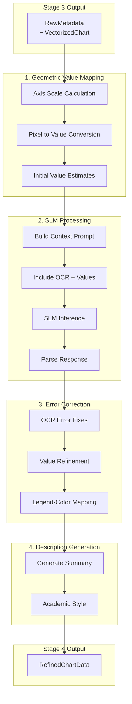

# Stage 4: Reasoning - SLM Integration

| Version | Date | Author | Description |
| --- | --- | --- | --- |
| 1.0.0 | 2026-01-25 | That Le | Stage 4 architecture documentation (PLANNED) |
| 1.1.0 | 2026-01-26 | That Le | Implemented Gemini API integration |

## Status: IN PROGRESS

Stage 4 reasoning is now implemented with Gemini API support.

## 1. Overview

Stage 4 receives raw metadata from Stage 3 and applies SLM-based reasoning to:
- Correct OCR errors using semantic context
- Map geometric values to actual data points
- Associate legend items with chart elements
- Generate human-readable descriptions

## 2. Architecture (Planned)



## 3. Key Components (Planned)

### 3.1. Geometric Value Mapper

**Purpose**: Convert pixel coordinates to actual data values using axis calibration.

**Algorithm**:
1. Extract Y-axis tick values from OCR
2. Fit linear regression: `pixel_y = a * value + b`
3. Invert to get: `value = (pixel_y - b) / a`
4. Apply to all detected data points

### 3.2. SLM Engine

**Purpose**: Apply small language model for semantic reasoning.

**Model Options**:

| Model | Size | Pros | Cons |
| --- | --- | --- | --- |
| Qwen-2.5-1.5B | 1.5B | Good Vietnamese support | Slower |
| Llama-3.2-1B | 1B | Fast inference | Limited languages |
| Phi-3-mini | 3.8B | Strong reasoning | Large memory |

**Prompt Structure**:
```
System: You are a chart analysis expert. Given raw OCR text and detected 
        values, correct errors and generate structured output.

Context:
- Chart Type: {type}
- OCR Texts: {texts with bboxes}
- Detected Values: {pixel coordinates and estimated values}
- Legend Items: {colors and labels}

Task:
1. Fix OCR errors (e.g., "loo" -> "100", "O" -> "0")
2. Map legend colors to data series
3. Verify value consistency
4. Generate description
```

### 3.3. Error Corrector

**Purpose**: Apply SLM corrections to raw metadata.

**Common OCR Errors**:

| Error | Correction | Rule |
| --- | --- | --- |
| `loo` | `100` | Pattern match |
| `O` | `0` | Numeric context |
| `l` | `1` | Numeric context |
| `S` | `5` | Numeric context |
| `%` missing | Add `%` | Context from axis label |

### 3.4. Description Generator

**Purpose**: Create academic-style chart descriptions.

**Template**:
```
This {chart_type} chart shows {title description}. 
The x-axis represents {x_label} ranging from {x_min} to {x_max}.
The y-axis represents {y_label} with values from {y_min} to {y_max}.
{series_descriptions}
Key observations: {insights}
```

## 4. Input/Output Schema

### 4.1. Input (from Stage 3)

```python
class Stage3Output(BaseModel):
    session: SessionInfo
    metadata: List[RawMetadata]

class RawMetadata(BaseModel):
    chart_id: str
    chart_type: ChartType
    texts: List[OCRText]
    elements: List[ChartElement]
    axis_info: Optional[AxisInfo]
    vectorized: Optional[VectorizedChart]
```

### 4.2. Output

```python
class Stage4Output(BaseModel):
    session: SessionInfo
    charts: List[RefinedChartData]

class RefinedChartData(BaseModel):
    chart_id: str
    chart_type: ChartType
    title: Optional[str]
    x_axis_label: Optional[str]
    y_axis_label: Optional[str]
    series: List[DataSeries]
    description: str
    correction_log: List[str]
    confidence: float
```

## 5. Implementation Status

| Task | Status | Target |
| --- | --- | --- |
| Design document | DONE | Week 3 |
| Gemini API integration | DONE | Week 3 |
| OCR error correction | DONE | Week 3 |
| Description generator | DONE | Week 3 |
| Rule-based fallback | DONE | Week 3 |
| Local SLM integration | TODO | Week 4 |
| Geometric value mapping | TODO | Week 4 |
| Unit tests | PARTIAL | Week 4 |

## 6. Implementation Details

### 6.1. File Structure

```
src/core_engine/stages/s4_reasoning/
    __init__.py
    s4_reasoning.py          # Main orchestrator
    reasoning_engine.py      # Abstract interface
    gemini_engine.py         # Gemini API implementation
    prompts/
        ocr_correction.txt   # OCR error correction prompt
        description.txt      # Description generation prompt
        value_mapping.txt    # Value extraction prompt
```

### 6.2. Usage Example

```python
from src.core_engine.stages.s4_reasoning import (
    Stage4Reasoning,
    ReasoningConfig,
    GeminiConfig,
)

# Initialize with Gemini
config = ReasoningConfig(
    engine="gemini",
    gemini=GeminiConfig(
        model_name="gemini-2.0-flash-exp",
        temperature=0.3,
    ),
)
stage4 = Stage4Reasoning(config)

# Process Stage 3 output
result = stage4.process(stage3_output)
```

### 6.3. API Key Configuration

Set environment variable:
```bash
export GOOGLE_API_KEY="your-api-key-here"
```

Or create `config/secrets/.env`:
```
GOOGLE_API_KEY=your-api-key-here
```

## 7. Dependencies

```toml
# Required packages (in pyproject.toml)
transformers = ">=4.36.0"
torch = ">=2.0.0"
accelerate = ">=0.25.0"
google-generativeai = ">=0.3.0"  # NEW: Gemini API
```

## 7. References

- [Qwen-2.5 Documentation](https://github.com/QwenLM/Qwen2.5)
- [Knowledge Distillation Survey](https://arxiv.org/abs/2006.05525)
- Stage 3 Output Schema: [STAGE3_EXTRACTION.md](STAGE3_EXTRACTION.md)
