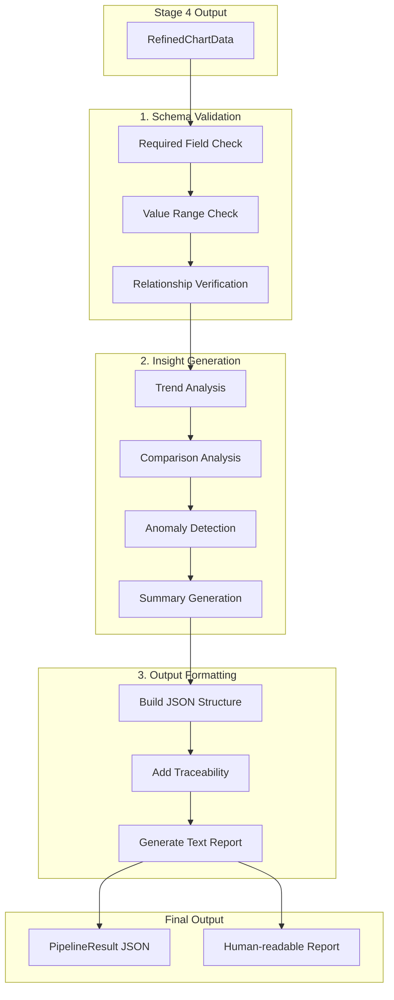

# Stage 5: Reporting - Output Generation

| Version | Date | Author | Description |
| --- | --- | --- | --- |
| 3.0.0 | 2026-03-02 | That Le | Fully implemented with tests |
| 2.0.0 | 2026-02-04 | That Le | Updated planned architecture |

## Status: IMPLEMENTED

Fully implemented (~940 lines). 62 unit tests passing. Output formats: JSON, TXT, Markdown, CSV.

## 1. Overview

Stage 5 is the final stage that:
- Validates refined data against schema
- Generates automated insights (trends, comparisons)
- Formats output as JSON and human-readable report
- Provides traceability information

## 2. Architecture (Planned)



## 3. Key Components (Planned)

### 3.1. Schema Validator

**Purpose**: Ensure output data integrity.

**Validation Rules**:

| Rule | Description | Action on Fail |
| --- | --- | --- |
| Required fields | chart_id, chart_type must exist | Error |
| Value ranges | Values within axis bounds | Warning |
| Series consistency | Points count matches across series | Warning |
| Type consistency | Data matches chart_type | Error |

### 3.2. Insight Generator

**Purpose**: Automatically derive insights from chart data.

**Insight Types**:

#### Trend Insight
```python
class TrendInsight(BaseModel):
    insight_type: Literal["trend"] = "trend"
    direction: Literal["increasing", "decreasing", "stable"]
    magnitude: float  # Percentage change
    text: str  # "Values show increasing trend from Q1 to Q4"
```

#### Comparison Insight
```python
class ComparisonInsight(BaseModel):
    insight_type: Literal["comparison"] = "comparison"
    max_item: str
    min_item: str
    ratio: float
    text: str  # "Product A leads with 45% market share"
```

#### Anomaly Insight
```python
class AnomalyInsight(BaseModel):
    insight_type: Literal["anomaly"] = "anomaly"
    point: str
    deviation: float  # Standard deviations from mean
    text: str  # "Q3 shows unusual spike of 150% vs average"
```

### 3.3. Report Formatter

**Purpose**: Generate final outputs in multiple formats.

**JSON Output Structure**:
```json
{
  "session": {
    "session_id": "abc123",
    "created_at": "2026-01-25T10:30:00",
    "source_file": "report.pdf"
  },
  "charts": [
    {
      "chart_id": "chart_001",
      "chart_type": "line",
      "title": "Revenue Growth 2025",
      "data": { ... },
      "insights": [ ... ],
      "source_info": {
        "page": 1,
        "bbox": [100, 200, 500, 400]
      }
    }
  ],
  "summary": "Processed 3 charts from report.pdf",
  "processing_time_seconds": 12.5,
  "model_versions": {
    "yolo": "v8n-chart-1.0",
    "ocr": "paddleocr-2.7",
    "slm": "qwen2.5-1.5b"
  }
}
```

**Text Report Template**:
```
# Chart Analysis Report
Generated: 2026-01-25 10:30:00
Source: report.pdf

## Summary
- Total charts detected: 3
- Chart types: 2 line, 1 bar
- Processing time: 12.5 seconds

## Chart 1: Revenue Growth 2025
Type: Line Chart
Data Series: 2

### Data
| Quarter | Revenue (M$) | Expenses (M$) |
| ------- | ------------ | ------------- |
| Q1      | 10.5         | 8.2           |
| Q2      | 12.3         | 8.8           |
| Q3      | 15.1         | 9.5           |
| Q4      | 18.2         | 10.1          |

### Insights
- Revenue shows increasing trend (+73% from Q1 to Q4)
- Profit margin improved from 22% to 44%

---
[Additional charts...]
```

## 4. Input/Output Schema

### 4.1. Input (from Stage 4)

```python
class Stage4Output(BaseModel):
    session: SessionInfo
    charts: List[RefinedChartData]
```

### 4.2. Output

```python
class PipelineResult(BaseModel):
    session: SessionInfo
    charts: List[FinalChartResult]
    summary: str
    processing_time_seconds: float
    model_versions: Dict[str, str]
    warnings: List[str] = []
    
class FinalChartResult(BaseModel):
    chart_id: str
    chart_type: ChartType
    title: Optional[str]
    data: RefinedChartData
    insights: List[ChartInsight]
    source_info: Dict[str, Any]

class ChartInsight(BaseModel):
    insight_type: str  # trend, comparison, anomaly, summary
    text: str
    confidence: float
```

## 5. Implementation Timeline

| Task | Status | Target |
| --- | --- | --- |
| Design document | [DONE] | Week 3 |
| Schema validator | [DONE] | Week 4 |
| Insight generator | [DONE] | Week 4 |
| JSON formatter | [DONE] | Week 4 |
| Text report generator | [DONE] | Week 5 |
| Markdown report generator | [DONE] | Week 5 |
| CSV data export | [DONE] | Week 5 |
| Data validation (warnings) | [DONE] | Week 5 |
| Unit tests (62 tests) | [DONE] | Week 5 |

## 6. Export Formats (Future)

| Format | Use Case | Priority |
| --- | --- | --- |
| JSON | API response, data storage | P0 [DONE] |
| TXT | Quick readable summary | P0 [DONE] |
| Markdown | Documentation, reports | P0 [DONE] |
| CSV | Spreadsheet export | P1 [DONE] |
| LaTeX | Academic papers | P2 |
| Excel | Business users | P2 |

## 7. References

- Pipeline Schema: [../pipeline.instructions.md](../../.github/instructions/pipeline.instructions.md)
- Stage 4 Output: [STAGE4_REASONING.md](STAGE4_REASONING.md)
