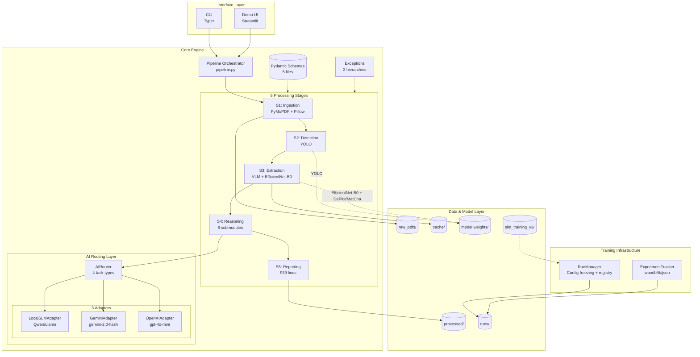
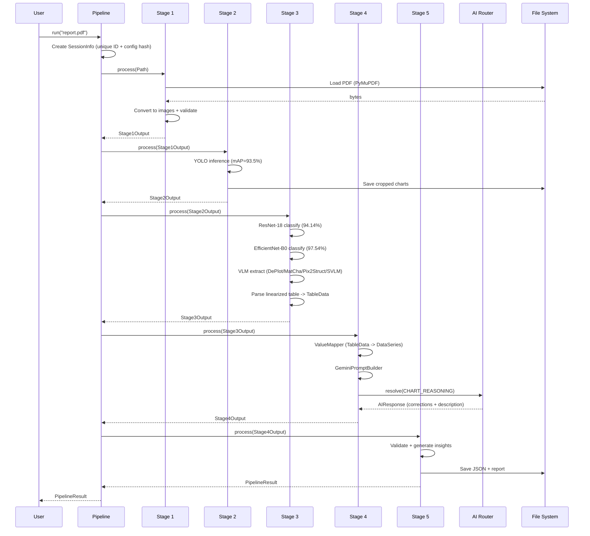
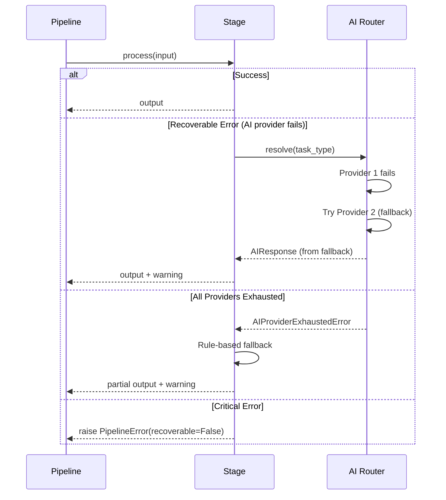
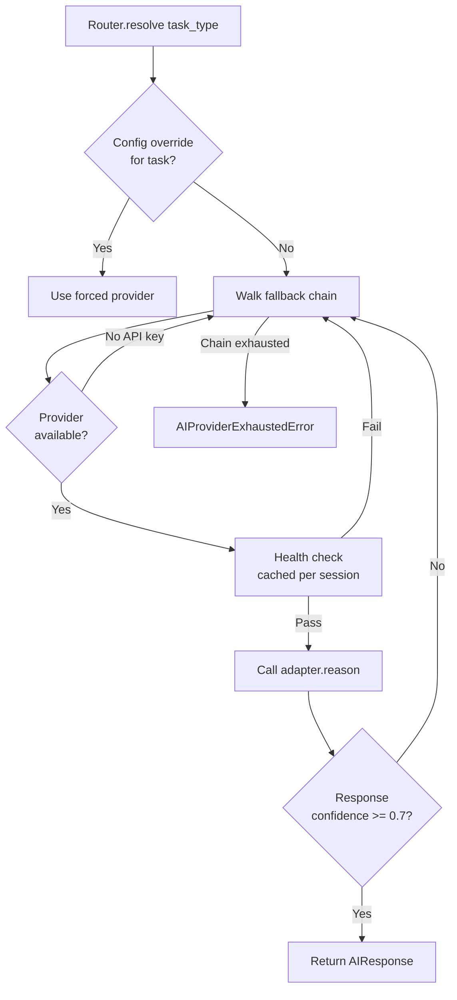

# System Overview

| Version | Date | Author | Description |
| --- | --- | --- | --- |
| 3.0.0 | 2026-03-02 | That Le | Full rewrite: AI Router, training infra, actual code structure |
| 2.0.0 | 2026-02-04 | That Le | Updated with current architecture |

---

## 1. Architecture Philosophy

### 1.1. Core-First Design

The system follows a **Core-First Architecture** where the AI engine is completely independent of any interface layer:

```
+------------------------------------------------------------------+
|                        INTERFACE LAYER                            |
|                   (CLI, Demo - currently active)                  |
+------------------------------------------------------------------+
                              |
                              | (Simple function calls)
                              v
+------------------------------------------------------------------+
|                        CORE ENGINE                                |
|                   (Pure Python, No web deps)                      |
|                                                                   |
|   from core_engine import ChartAnalysisPipeline                  |
|   pipeline = ChartAnalysisPipeline.from_config()                 |
|   result = pipeline.run("chart.pdf")                             |
+------------------------------------------------------------------+
                              |
                              v
+------------------------------------------------------------------+
|                        DATA & MODEL LAYER                         |
|     (Files, Cache, Model Weights, Training Data - Configurable)  |
+------------------------------------------------------------------+
```

### 1.2. Design Principles

| Principle | Description | Implementation |
| --- | --- | --- |
| **Decoupling** | Layers don't know about each other | Interface imports Core, not vice versa |
| **Testability** | Each component testable in isolation | DI, no global state; 295 test functions |
| **Configurability** | Behavior controlled by config | YAML files (OmegaConf), environment variables |
| **Reproducibility** | Same input = same output | Seeded random, versioned models, session IDs |
| **Multi-Provider AI** | No single-vendor lock-in | AIRouter with fallback chains |
| **Graceful Degradation** | Always produce partial results | Recoverable errors, fallback providers |

---

## 2. Layer Descriptions

### 2.1. Interface Layer

| Interface | Purpose | Dependencies | Status |
| --- | --- | --- | --- |
| **CLI** | Developer testing, scripting | Typer | Active |
| **Demo** | Visual demonstration | Streamlit | Active |
| **API** | Production integration | FastAPI + Celery | Planned (Phase 3) |

**Key Rule:** Interface layer ONLY imports from core_engine. It never contains business logic.

```python
# interface/cli.py - CORRECT
from core_engine import ChartAnalysisPipeline

def analyze(input_path: str):
    pipeline = ChartAnalysisPipeline.from_config()
    return pipeline.run(input_path)

# WRONG (business logic in interface)
def analyze(input_path: str):
    image = load_image(input_path)  # NO!
    boxes = yolo_detect(image)       # NO!
```

### 2.2. Core Engine Layer

The heart of the system. Contains all AI logic organized into stages and an AI routing layer:

```
src/core_engine/
    __init__.py                     # Public API
    pipeline.py                     # ChartAnalysisPipeline orchestrator (313 lines)
    exceptions.py                   # Exception hierarchy (192 lines)

    schemas/                        # Pydantic v2 data structures
        common.py                   # BoundingBox, Point, Color, SessionInfo
        enums.py                    # All enums (single source of truth, 12+ enums)
        stage_outputs.py            # Stage I/O schemas (Stage1Output -> PipelineResult)
        extraction.py               # Extraction-specific schemas
        qa_schemas.py               # QA dataset schemas

    stages/                         # 5 processing stages
        base.py                     # BaseStage[InputT, OutputT] ABC
        s1_ingestion.py             # PDF/DOCX/Image -> CleanImage
        s2_detection.py             # YOLO detection -> DetectedChart
        s3_extraction/              # VLM extraction (4 backends: deplot/matcha/pix2struct/svlm)
            s3_extraction.py        # Stage orchestrator (309 lines) + ExtractionConfig
            extractors.py           # BaseChartExtractor ABC + 4 backends (430+ lines)
            pix2struct_extractor.py # Backward-compat re-export (DeplotExtractor alias)
        s4_reasoning/               # 6 submodules (AI reasoning)
            s4_reasoning.py         # Stage orchestrator (479 lines)
            value_mapper.py          # ValueMapper: TableData -> DataSeries (764 lines)
            prompt_builder.py       # GeminiPromptBuilder (833 lines)
            reasoning_engine.py     # ReasoningEngine ABC (185 lines)
            gemini_engine.py        # Direct Gemini API engine (626 lines)
            router_engine.py        # AIRouterEngine - multi-provider (410 lines)
            prompts/                # 5 template files (.txt, .md)
        s5_reporting.py             # Insights + validation + reports (939 lines)

    ai/                             # AI provider routing system
        router.py                   # AIRouter - fallback chains (425 lines)
        task_types.py               # TaskType enum (4 types)
        prompts.py                  # System prompt templates (181 lines)
        exceptions.py               # AI exception hierarchy (116 lines)
        adapters/                   # Provider implementations
            base.py                 # BaseAIAdapter ABC + AIResponse
            gemini_adapter.py       # GeminiAdapter
            openai_adapter.py       # OpenAIAdapter
            local_slm_adapter.py    # LocalSLMAdapter (Qwen/Llama)

    validators/
        gemini_validator.py         # Response validation

    data_factory/
        qa_generator.py             # QA pair generation
```

### 2.3. Training Infrastructure

```
src/training/
    __init__.py
    run_manager.py              # RunManager: isolated runs, config freezing (478 lines)
    experiment_tracker.py       # ExperimentTracker: wandb/tb/json/none (385 lines)
```

### 2.4. Data Layer

| Directory | Content | Lifecycle |
| --- | --- | --- |
| `data/raw_pdfs/` | Input files | Read-only after ingestion |
| `data/processed/` | Pipeline outputs | Per-session directories |
| `data/cache/` | OCR cache (589MB), intermediate results | Can be cleared |
| `data/samples/` | Demo/test samples | Read-only |
| `data/output/` | Final results | Per-run |
| `data/slm_training_v3/` | SLM training data (268k samples) | Versioned |
| `data/academic_dataset/` | Source charts + QA + features | Read-only |
| `models/weights/` | YOLO, ResNet-18 weights | Versioned, read-only |
| `models/slm/` | LoRA adapters | Per-training-run |
| `runs/` | Isolated training run directories | Gitignored |

---

## 3. Component Diagram



---

## 4. Data Flow

### 4.1. Happy Path



### 4.2. Error Handling Path



---

## 5. AI Routing Architecture

### 5.1. Overview

The AI routing system enables multi-provider reasoning with automatic fallback. It lives in `src/core_engine/ai/` (8 files, 55 tests).

### 5.2. Task Types and Chains

| Task Type | Default Chain | Local-Only Chain |
| --- | --- | --- |
| `CHART_REASONING` | local_slm -> gemini -> openai | local_slm |
| `OCR_CORRECTION` | local_slm -> gemini | local_slm |
| `DESCRIPTION_GEN` | local_slm -> gemini -> openai | local_slm |
| `DATA_VALIDATION` | gemini -> openai | local_slm |

### 5.3. Routing Algorithm



### 5.4. Adapter Interface

```python
class BaseAIAdapter(ABC):
    """Base for all AI provider adapters."""

    @abstractmethod
    async def reason(
        self,
        system_prompt: str,
        user_prompt: str,
        model_id: Optional[str] = None,
        image_path: Optional[Path] = None,
        **kwargs,
    ) -> AIResponse: ...

    @abstractmethod
    async def health_check(self) -> bool: ...

    @abstractmethod
    def get_default_model(self) -> str: ...

@dataclass
class AIResponse:
    content: str
    model_used: str
    provider: str
    confidence: float
    usage: Optional[Dict]
    raw_response: Optional[Any]
    success: bool
    error_message: Optional[str]
```

---

## 6. Configuration Architecture

### 6.1. Configuration Hierarchy

```yaml
# config/base.yaml - Shared defaults
logging:
  level: INFO
  format: "%(asctime)s | %(levelname)s | %(message)s"
data:
  raw_dir: "data/raw_pdfs"
  processed_dir: "data/processed"
  cache_dir: "data/cache"

# config/models.yaml - Model paths and thresholds
yolo:
  path: "models/weights/chart_detector.pt"
  device: "auto"
  confidence: 0.5
ai_routing:
  local_only: false
  confidence_threshold: 0.7

# config/pipeline.yaml - Stage parameters
stages:
  ingestion:
    max_image_size: 4096
    dpi: 150
  detection:
    confidence_threshold: 0.5

# config/training.yaml - Training hyperparameters + run management
slm_training:
  base_model: "meta-llama/Llama-3.2-1B-Instruct"
  lora:
    rank: 16
    alpha: 32
  training:
    num_train_epochs: 3
    learning_rate: 2e-4
run_management:
  tracking_backend: "json"
```

### 6.2. Configuration Loading

```python
from omegaconf import OmegaConf

# Pipeline config (in pipeline.py)
def from_config(config_dir: Path = Path("config")) -> "ChartAnalysisPipeline":
    base = OmegaConf.load(config_dir / "base.yaml")
    models = OmegaConf.load(config_dir / "models.yaml")
    pipeline = OmegaConf.load(config_dir / "pipeline.yaml")
    config = OmegaConf.merge(base, models, pipeline)
    OmegaConf.resolve(config)
    return ChartAnalysisPipeline(config)

# Training config (in RunManager)
# base.yaml + training.yaml + --override CLI args -> resolved_config.yaml
```

---

## 7. Testing Architecture

| Directory | Tests | Coverage |
| --- | --- | --- |
| `tests/test_ai/` | 55 functions (5 files) | AIRouter, adapters, task_types, prompts, exceptions |
| `tests/test_s3_extraction/` | ~174 functions (8 files) | VLM extractors, orchestrator |
| `tests/test_s4_reasoning/` | ~40 functions (2 files) | PromptBuilder, ValueMapper |
| `tests/test_s5_reporting/` | ~20 functions (1 file) | Stage5Reporting |
| `tests/test_schemas.py` | ~10 functions | Schema validation |
| **Total** | **299 test functions** | **17 test files** |

---

## 8. Extensibility Points

### 8.1. Adding a New AI Provider

1. Create `src/core_engine/ai/adapters/new_provider_adapter.py` implementing `BaseAIAdapter`
2. Register in `AIRouter.from_config()` with new provider key
3. Add to fallback chains in `config/models.yaml`
4. Add tests in `tests/test_ai/`

### 8.2. Adding New Chart Types

1. Create `src/core_engine/stages/s3_extraction/extractors.py` subclass implementing `BaseChartExtractor`
2. Register in `ExtractionConfig.backend` choices
3. Add config toggle in `config/pipeline.yaml`
4. Add tests in `tests/test_s3_extraction/`

### 8.3. Adding New Output Formats

1. Add formatter method in `stages/s5_reporting.py`
2. Register output format in `ReportingConfig`
3. Add config option in `config/pipeline.yaml`

### 8.4. Adding New Insight Types

1. Add to `InsightType` enum in `src/core_engine/schemas/enums.py`
2. Add detection method in `stages/s5_reporting.py`
3. Add tests in `tests/test_s5_reporting/`

---

## 9. Performance Considerations

### 9.1. Memory Management

| Component | Strategy |
| --- | --- |
| Large images | Process in chunks, stream to disk |
| Model loading | Singleton pattern, lazy loading |
| YOLO inference | GPU with fallback to CPU |
| OCR cache | N/A (removed in v6.0.0, was 589MB; geometry pipeline removed) |
| SLM inference | 4-bit quantization (NF4), ~2GB VRAM |

### 9.2. Caching Strategy

| Cache Level | Content | TTL |
| --- | --- | --- |
| L1: Memory | Loaded models (YOLO, ResNet-18, OCR) | Session lifetime |
| L2: Disk | VLM model weights (loaded on first use) | Session lifetime |
| L3: File | Pipeline session outputs | Permanent |

---

## 10. Security Considerations

| Concern | Mitigation |
| --- | --- |
| Malicious PDFs | PyMuPDF sandboxing, size limits |
| Path traversal | Validate all paths against allowed directories |
| Model injection | Verify model checksums |
| Secrets exposure | Never log API keys; use `.env` + `config/secrets/` (gitignored) |
| AI provider keys | Loaded via `python-dotenv`, never in config YAML |

---

## 11. Planned Additions (Phase 3)

| Component | Technology | Status |
| --- | --- | --- |
| API Server | FastAPI | Planned |
| Task Queue | Celery + Redis | Planned |
| Database | PostgreSQL + SQLAlchemy | Planned |
| State Management | Repository pattern (`JobRepository`) | Planned |
| Migrations | Alembic | Planned |
| Containerization | Docker + docker-compose | Planned |
