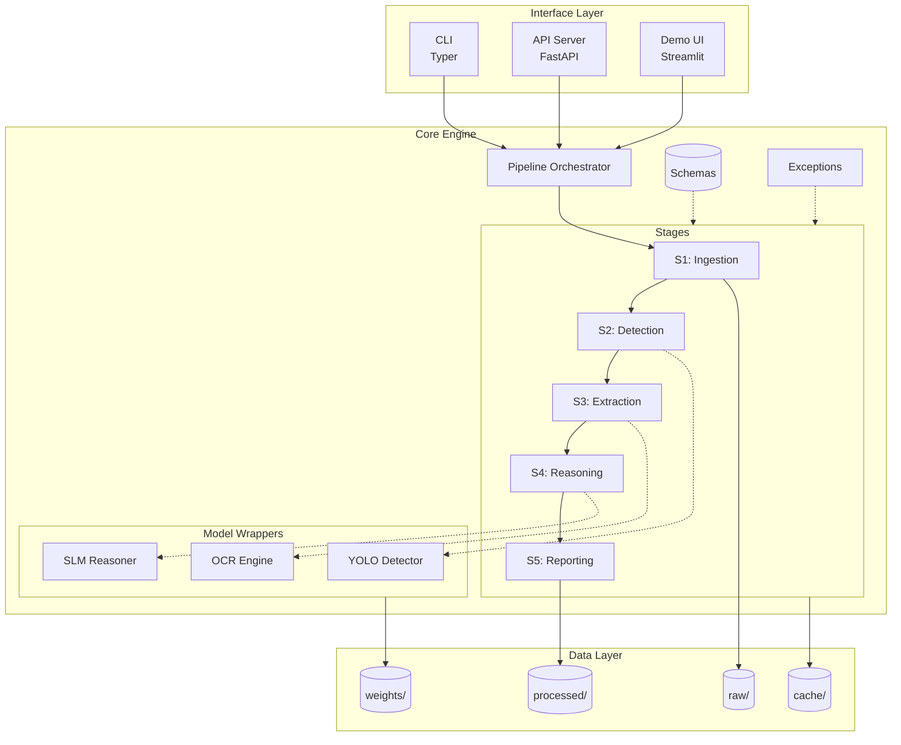
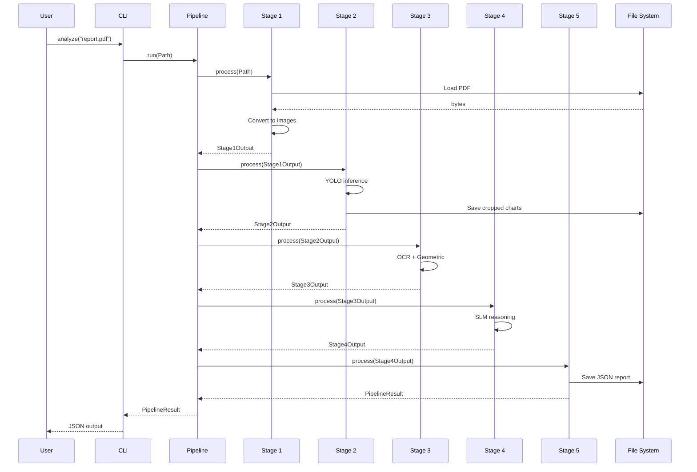
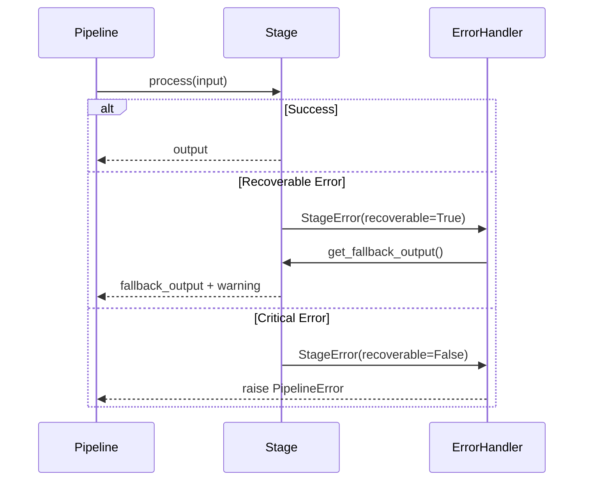

# System Overview

| Version | Date | Author | Description |
| --- | --- | --- | --- |
| 1.0.0 | 2026-01-19 | That Le | High-level system architecture |

## 1. Architecture Philosophy

### 1.1. Core-First Design

The system follows a **Core-First Architecture** where the AI engine is completely independent of any interface layer:

```
+------------------------------------------------------------------+
|                        INTERFACE LAYER                            |
|                   (CLI, API, Demo - OPTIONAL)                     |
+------------------------------------------------------------------+
                              |
                              | (Simple function calls)
                              v
+------------------------------------------------------------------+
|                        CORE ENGINE                                |
|                   (Pure Python, No web deps)                      |
|                                                                   |
|   from core_engine import ChartAnalysisPipeline                  |
|   pipeline = ChartAnalysisPipeline(config)                       |
|   result = pipeline.run("chart.pdf")                             |
+------------------------------------------------------------------+
                              |
                              v
+------------------------------------------------------------------+
|                        DATA LAYER                                 |
|              (Files, Cache, Models - Configurable)                |
+------------------------------------------------------------------+
```

### 1.2. Design Principles

| Principle | Description | Implementation |
| --- | --- | --- |
| **Decoupling** | Layers don't know about each other | Interface imports Core, not vice versa |
| **Testability** | Each component testable in isolation | Dependency injection, no global state |
| **Configurability** | Behavior controlled by config | YAML files, environment variables |
| **Reproducibility** | Same input = same output | Seeded random, versioned models |

## 2. Layer Descriptions

### 2.1. Interface Layer

The interface layer provides different ways to interact with the core engine:

| Interface | Purpose | Dependencies |
| --- | --- | --- |
| **CLI** | Developer testing, scripting | Typer |
| **API** | Production integration | FastAPI |
| **Demo** | Visual demonstration | Streamlit |

**Key Rule:** Interface layer ONLY imports from core_engine. It never contains business logic.

```python
# interface/cli.py - Correct
from core_engine import ChartAnalysisPipeline

def analyze(input_path: str):
    pipeline = ChartAnalysisPipeline.from_config()
    return pipeline.run(input_path)

# interface/cli.py - WRONG (business logic in interface)
def analyze(input_path: str):
    image = load_image(input_path)  # NO!
    boxes = yolo_detect(image)       # NO!
```

### 2.2. Core Engine Layer

The heart of the system. Contains all AI logic, organized into stages:

```
core_engine/
|
+-- __init__.py             # Public API
+-- pipeline.py             # Orchestrator
+-- exceptions.py           # Custom errors
|
+-- schemas/                # Data structures
|   +-- common.py           # Shared types
|   +-- stage_outputs.py    # Stage I/O schemas
|
+-- stages/                 # Processing stages
|   +-- base.py             # Base class
|   +-- s1_ingestion.py
|   +-- s2_detection.py
|   +-- s3_extraction/      # Complex stage (sub-modules)
|   +-- s4_reasoning.py
|   +-- s5_reporting.py
|
+-- utils/                  # Helpers
    +-- image.py
    +-- logging.py
```

### 2.3. Data Layer

Configurable storage locations:

| Directory | Content | Lifecycle |
| --- | --- | --- |
| `data/raw/` | Input files | Read-only after ingestion |
| `data/processed/` | Pipeline outputs | Per-session directories |
| `data/cache/` | Intermediate results | Can be cleared |
| `models/weights/` | Model files | Versioned, read-only |

## 3. Component Diagram



## 4. Data Flow

### 4.1. Happy Path



### 4.2. Error Handling Path



## 5. Configuration Architecture

### 5.1. Configuration Hierarchy

```yaml
# config/base.yaml (defaults)
logging:
  level: INFO
  format: "%(asctime)s | %(levelname)s | %(message)s"

data:
  raw_dir: "data/raw"
  processed_dir: "data/processed"
  cache_dir: "data/cache"

# config/models.yaml (model-specific)
yolo:
  path: "models/weights/chart_detector.pt"
  device: "auto"
  confidence: 0.5

# config/pipeline.yaml (stage-specific)
stages:
  ingestion:
    max_image_size: 4096
    dpi: 150
  detection:
    confidence_threshold: 0.5
```

### 5.2. Configuration Loading

```python
from omegaconf import OmegaConf

def load_config(config_dir: Path = Path("config")) -> DictConfig:
    """Load and merge configuration files."""
    base = OmegaConf.load(config_dir / "base.yaml")
    models = OmegaConf.load(config_dir / "models.yaml")
    pipeline = OmegaConf.load(config_dir / "pipeline.yaml")
    
    # Merge with environment overrides
    config = OmegaConf.merge(base, models, pipeline)
    
    # Apply environment variables (e.g., CHART_YOLO_PATH)
    OmegaConf.resolve(config)
    
    return config
```

## 6. Extensibility Points

### 6.1. Adding New Chart Types

1. Add to `ChartType` enum in `schemas/common.py`
2. Add classifier logic in `stages/s3_extraction/classifier.py`
3. Add element detector in `stages/s3_extraction/element_detector.py`
4. Add tests in `tests/test_stages/test_s3_extraction.py`

### 6.2. Adding New Output Formats

1. Create formatter class in `stages/s5_reporting/formatters/`
2. Register in `stages/s5_reporting/__init__.py`
3. Add config option in `config/pipeline.yaml`

### 6.3. Swapping Models

Models are loaded via factory pattern:

```python
# core_engine/models/factory.py
def create_detector(config: DetectorConfig) -> BaseDetector:
    if config.type == "yolo":
        return YOLODetector(config)
    elif config.type == "faster_rcnn":
        return FasterRCNNDetector(config)
    else:
        raise ValueError(f"Unknown detector: {config.type}")
```

## 7. Performance Considerations

### 7.1. Memory Management

| Component | Strategy |
| --- | --- |
| Large images | Process in chunks, stream to disk |
| Model loading | Singleton pattern, lazy loading |
| Batch processing | Generator-based, configurable batch size |

### 7.2. Caching Strategy

| Cache Level | Content | TTL |
| --- | --- | --- |
| L1: Memory | Loaded models | Session lifetime |
| L2: Disk | OCR results, detections | Configurable (24h default) |
| L3: Database | Historical results | Permanent |

## 8. Security Considerations

| Concern | Mitigation |
| --- | --- |
| Malicious PDFs | PyMuPDF sandboxing, size limits |
| Path traversal | Validate all paths against allowed directories |
| Model injection | Verify model checksums |
| Secrets exposure | Never log API keys, use .env files |
