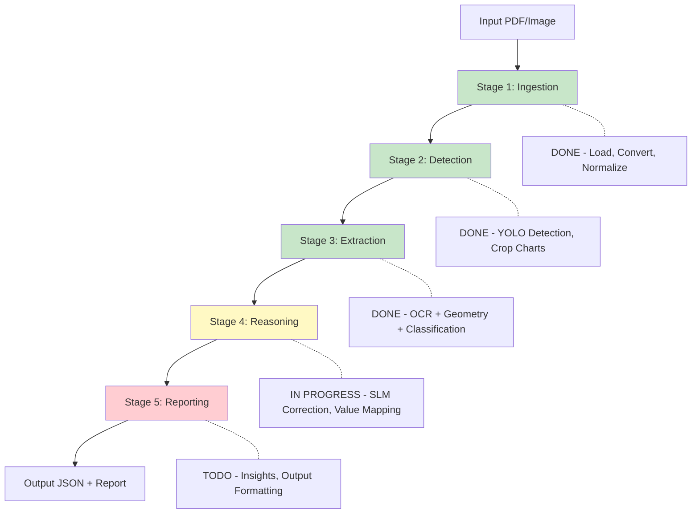
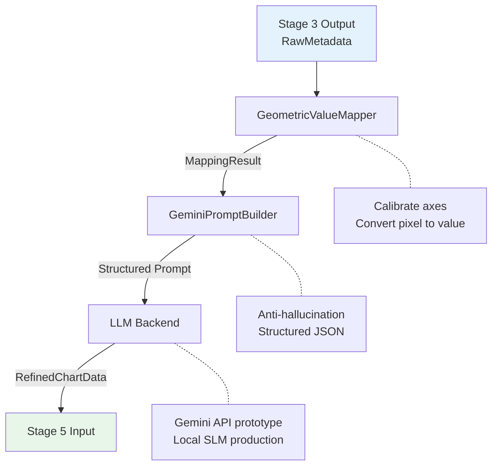

# Weekly Progress Report - Geo-SLM Chart Analysis

| Report Date | 2026-01-29 |
| ----- | ------- |
| Author | That Le |
| Project | Geo-SLM Chart Analysis V3 |
| Current Phase | Phase 2 - Core Engine |

---

## 1. Executive Summary

**Geo-SLM Chart Analysis** project now in phase 2, focusing on building the core engine for structured data extraction from chart images. The system employs a hybrid AI approach combining:
- **Computer Vision** (YOLO) for chart detection and localization
- **Geometric Analysis** (OpenCV + NumPy) for precise value extraction
- **Small Language Model** (SLM) for OCR correction and reasoning

**Key Achievements This Week:**

| Phase | Status | Complete percent |
| --- | --- | --- |
| Phase 1: Foundation | DONE | 100% |
| Phase 2: Core Engine | IN PROGRESS | ~70% |
| Phase 3: Optimization | TODO | 0% |
| Phase 4: Presentation | TODO | 0% |

---

## 2. Data Collection Status

### 2.1. Academic Chart QA Dataset

| Metric | Value |
| --- | --- |
| **Total Chart Images** | 2,852 |
| **Total QA Pairs** | 13,297 |
| **Avg QA per Chart** | 4.66 |
| **Source PDFs** | 800+ papers (arXiv) |
| **Generation Date** | 2026-01-24 |

### 2.2. Chart Type Distribution

| Chart Type | Count | Percentage |
| --- | --- | --- |
| Line | 904 | 31.7% |
| Bar | 598 | 21.0% |
| Scatter | 409 | 14.3% |
| Other | 271 | 9.5% |
| Heatmap | 209 | 7.3% |
| Area | 187 | 6.6% |
| Histogram | 102 | 3.6% |
| Pie | 96 | 3.4% |
| Box | 76 | 2.7% |

### 2.3. QA Type Distribution

| Question Type | Count | Description |
| --- | --- | --- |
| Structural | 2,852 (21.4%) | Title, labels, legend, axes |
| Counting | 2,833 (21.3%) | Counting elements |
| Comparison | 2,558 (19.2%) | Highest, lowest, differences |
| Reasoning | 2,534 (19.1%) | Trends, patterns, insights |
| Extraction | 2,520 (19.0%) | Specific data values |

### 2.4. Data Quality Notes

**Hiện trạng:** Đang tiến hành lọc lại dữ liệu do khối lượng lớn và cần đảm bảo chất lượng cho training:
- Loại bỏ ảnh nhiễu (diagrams, photos, logos đã bị lọc nhầm)
- Kiểm tra lại classification accuracy
- Chuẩn hóa format QA pairs

---

## 3. Pipeline Implementation Status

### 3.1. Overall Pipeline Architecture (5-Stage Model)



### 3.2. Stage-by-Stage Status

#### Stage 1: Ingestion DONE

| Component | Status | Description |
| --- | --- | --- |
| PDF Processor | Done | PyMuPDF (fitz) integration |
| Image Loader | Done | PNG/JPG support |
| Quality Validation | Done | Resolution, blur detection |
| Normalization | Done | Resize, contrast enhancement |

**File:** [s1_ingestion.py](../../src/core_engine/stages/s1_ingestion.py)

---

#### Stage 2: Detection DONE

| Component | Status | Description |
| --- | --- | --- |
| YOLO Integration | Done | Ultralytics YOLOv8/v11 |
| Confidence Filtering | Done | Threshold-based filtering |
| Multi-chart Handling | Done | Crop multiple charts per image |
| BBox Storage | Done | Save coordinates for traceability |

**File:** [s2_detection.py](../../src/core_engine/stages/s2_detection.py)

---

#### Stage 3: Extraction DONE (Week 1 Focus)

**Submodules implemented:**

| Submodule | File | Status | Description |
| --- | --- | --- | --- |
| Preprocessor | `preprocessor.py` | Done | Negative image + adaptive threshold |
| Skeletonizer | `skeletonizer.py` | Done | Lee algorithm, keypoint detection |
| Vectorizer | `vectorizer.py` | Done | RDP algorithm, subpixel refinement |
| OCR Engine | `ocr_engine.py` | Done | EasyOCR with role classification |
| Geometric Mapper | `geometric_mapper.py` | Done | Axis calibration, pixel-to-value |
| Element Detector | `element_detector.py` | Done | Bars, markers, pie slices |
| ResNet Classifier | `resnet_classifier.py` | Done | 94.66% accuracy |
| ML Classifier | `ml_classifier.py` | Done | Production wrapper |
| Simple Classifier | `simple_classifier.py` | Done | Baseline fallback |

**Test Results (2026-01-29):**

| Metric | Value |
| --- | --- |
| Total Images Tested | 800+ (100 per type) |
| Classification Accuracy | **100%** (all 8 types) |
| OCR Confidence | **91.5%** (EasyOCR) |
| Overall Confidence | **92.6%** |
| Avg Processing Time | ~7.6s per image |

**ResNet-18 Classifier Highlights:**

| Metric | Value |
| --- | --- |
| Test Accuracy | 94.66% |
| Integration Test | 93.75% (15/16 samples) |
| Training Time | 27 minutes (NVIDIA GPU) |
| ONNX Inference | 6.90ms (CPU), 144.9 img/sec |
| Model Size | 42.64 MB (ONNX) |
| Classes | 8 types |
| Explainability | Grad-CAM visualizations |

---

#### Stage 4: Reasoning IN PROGRESS (Current Week)

**Implemented Components:**

| Component | File | Status | Description |
| --- | --- | --- | --- |
| GeometricValueMapper | `value_mapper.py` | Done | Pixel-to-value conversion |
| GeminiPromptBuilder | `prompt_builder.py` | Done | Canonical Format prompts |
| ReasoningEngine | `reasoning_engine.py` | Done | Orchestrator class |
| GeminiEngine | `gemini_engine.py` | Done | Gemini API integration |
| Prompt Templates | `prompts/` | Done | reasoning.txt, canonical_format.md |
| Unit Tests | `test_s4_reasoning/` | Done | 36 test cases |
| Stage4Reasoning | `s4_reasoning.py` | Done | Main orchestrator |
| Local SLM | - | TODO | Qwen-2.5 / Llama-3.2 |

**Architecture:**



**Gemini API Configuration:**
- Model: `gemini-3.0-flash-preview`
- Temperature: 0.3 (deterministic)
- Max tokens: 2048

**Known Issues:**
- PaddleOCR 3.3.x has compatibility issues on Windows → Switched to EasyOCR
- Gemini API occasionally returns unparseable JSON → Fallback mechanism works

---

#### Stage 5: Reporting TODO

**Planned Components:**

| Component | Description |
| --- | --- |
| Parallel Processing | ThreadPoolExecutor for batch processing |
| Insight Generation | Trend, comparison, anomaly, summary |
| JSON Validator | Schema validation (Pydantic) |
| Report Generator | Markdown + JSON output |
| Traceability Info | Source tracking |

---

## 4. Code Structure Overview

```
src/core_engine/
├── __init__.py
├── pipeline.py              # Main orchestrator
├── exceptions.py            # Custom exceptions
├── schemas/
│   ├── common.py           # BoundingBox, Color, SessionInfo
│   ├── enums.py            # ChartType enum
│   ├── extraction.py       # Extraction-specific schemas
│   ├── qa_schemas.py       # QA pair schemas
│   └── stage_outputs.py    # Stage1-5 Output schemas
├── stages/
│   ├── base.py             # BaseStage abstract class
│   ├── s1_ingestion.py     # Stage 1 implementation
│   ├── s2_detection.py     # Stage 2 implementation
│   ├── s3_extraction/      # Stage 3 (12 files)
│   │   ├── s3_extraction.py
│   │   ├── preprocessor.py
│   │   ├── skeletonizer.py
│   │   ├── vectorizer.py
│   │   ├── ocr_engine.py
│   │   ├── geometric_mapper.py
│   │   ├── element_detector.py
│   │   ├── resnet_classifier.py
│   │   ├── ml_classifier.py
│   │   ├── simple_classifier.py
│   │   └── classifier.py
│   └── s4_reasoning/       # Stage 4 (7 files)
│       ├── s4_reasoning.py
│       ├── gemini_engine.py
│       ├── reasoning_engine.py
│       ├── prompt_builder.py
│       ├── value_mapper.py
│       └── prompts/
└── validators/              # Input validators
```

---

## 5. Testing Status

| Test Suite | Files | Cases | Status |
| --- | --- | --- | --- |
| Schema Tests | `test_schemas.py` | ~20 | Pass |
| Stage 3 Tests | `test_s3_extraction/` | 129 | Pass |
| Stage 4 Tests | `test_s4_reasoning/` | 36 | Pass |
| Integration Tests | `scripts/test_*.py` | ~10 | Pass |

---

## 6. Next Steps (Định hướng)

### Immediate (This Week)

1. **Complete Stage 4 Integration Testing**
   - Test full pipeline Stage 3 → Stage 4
   - Validate Gemini API output quality
   - Document edge cases

2. **Begin Stage 5 Implementation**
   - Design parallel processing architecture
   - Implement insight generation module
   - Setup JSON schema validation

### Short-term (Next 2 Weeks)

1. **Local SLM Training**
   - Prepare training data from Gemini outputs
   - Fine-tune Qwen-2.5-1.5B or Llama-3.2-1B
   - Compare with Gemini baseline

2. **Performance Optimization**
   - Batch processing implementation
   - Caching mechanism for repeated queries
   - Memory optimization for large documents

### Medium-term (Month 2)

1. **Benchmarking**
   - Compare with GPT-4V baseline
   - Evaluate on public chart datasets
   - Document accuracy metrics

2. **Demo & Documentation**
   - Streamlit demo interface
   - API documentation (FastAPI)
   - Thesis chapter drafts

---

## 7. Technical Decisions Made

| Decision | Rationale | Date |
| --- | --- | --- |
| ResNet-18 over SimpleClassifier | 94.66% vs 37.5% accuracy | 2026-01-25 |
| EasyOCR over PaddleOCR | Windows compatibility | 2026-01-26 |
| Gemini API for prototyping | Fast iteration before local SLM | 2026-01-26 |
| Canonical Format prompts | Anti-hallucination, structured | 2026-01-30 |
| Stage 3 = Pure Geometry | No LLM dependency, reproducible | 2026-01-29 |

---

## 8. Risks & Mitigations

| Risk | Impact | Mitigation |
| --- | --- | --- |
| Gemini API rate limits | Slow development | Local SLM fallback |
| OCR accuracy on complex charts | Poor value extraction | Multi-engine fallback |
| Dataset bias (academic only) | Limited generalization | Plan diverse data collection |
| Training time for local SLM | Delay in production | Use distillation techniques |

---

## 9. Resources

### Documentation
- [MASTER_CONTEXT.md](../MASTER_CONTEXT.md) - Project overview
- [PIPELINE_FLOW.md](../architecture/PIPELINE_FLOW.md) - Pipeline architecture
- [STAGE3_EXTRACTION.md](../architecture/STAGE3_EXTRACTION.md) - Stage 3 details
- [STAGE4_REASONING.md](../architecture/STAGE4_REASONING.md) - Stage 4 details

### Models
- ResNet-18 Weights: `models/weights/resnet18_chart_classifier_best.pt`
- ONNX Export: `models/onnx/resnet18_chart_classifier.onnx`
- Grad-CAM: `models/explainability/gradcam_*.png`

### Notebooks
- [00_quick_start.ipynb](../../notebooks/00_quick_start.ipynb) - Quick demo
- [03_stage3_extraction.ipynb](../../notebooks/03_stage3_extraction.ipynb) - Stage 3 exploration
- [04_stage4_reasoning.ipynb](../../notebooks/04_stage4_reasoning.ipynb) - Stage 4 demo

---

## 10. Summary

**What's DONE:**
- Phase 1 complete với 2,852 classified charts và 13,297 QA pairs
- Stage 1-3 fully implemented và tested (100% classification accuracy)
- ResNet-18 classifier với 94.66% accuracy
- Stage 4 core components implemented (ValueMapper, PromptBuilder, GeminiEngine)

**What's IN PROGRESS:**
- Stage 4 integration testing
- Data quality refinement (lọc lại dataset)
- Local SLM preparation

**What's PLANNED:**
- Stage 5: Reporting implementation
- Local SLM training (Qwen-2.5 / Llama-3.2)
- Benchmarking và optimization

---

*Report created by That Le on 2026-01-29*
