# Stage 3 Academic Dataset Test Report

| Property | Value |
|----------|-------|
| Generated | 2026-01-24 23:35:41 |
| Dataset | Academic arXiv Charts |
| Total Images | 15 |
| Successful | 15 (100.0%) |
| Average Processing Time | 3533.4 ms |

## Classification Distribution

| Chart Type | Count | Percentage |
|------------|-------|------------|
| line | 11 | 73.3% |
| scatter | 4 | 26.7% |

## Individual Results

### 1. arxiv_1301_3342v2_p05_img01.png

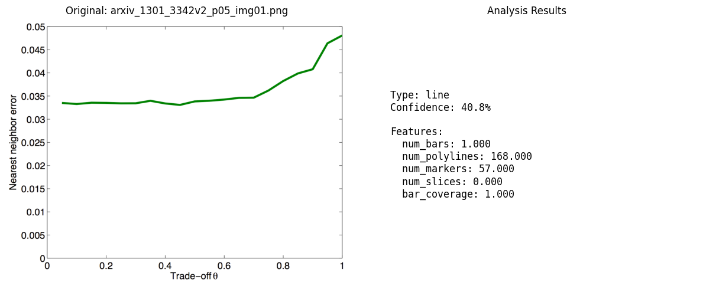

- **Status**: Success
- **Processing Time**: 4066.67 ms
- **Image Size**: 1476x1143
- **Chart Type**: line
- **Confidence**: 40.8%
- **Preprocessing Steps**: 5
- **Keypoints**: 449
- **Polylines**: 168

### 2. arxiv_1704_06687v1_p02_img00.png

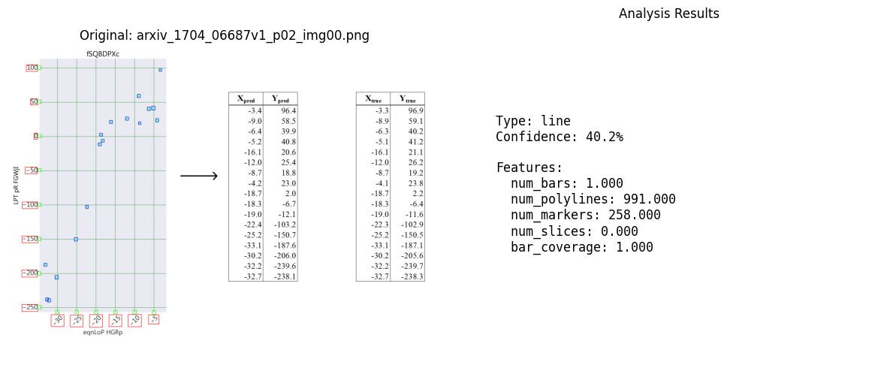

- **Status**: Success
- **Processing Time**: 11735.38 ms
- **Image Size**: 2992x2022
- **Chart Type**: line
- **Confidence**: 40.2%
- **Preprocessing Steps**: 5
- **Keypoints**: 4666
- **Polylines**: 991

### 3. arxiv_1710_07300v2_p04_img00.png

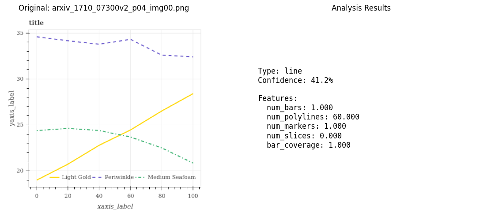

- **Status**: Success
- **Processing Time**: 446.57 ms
- **Image Size**: 402x400
- **Chart Type**: line
- **Confidence**: 41.2%
- **Preprocessing Steps**: 5
- **Keypoints**: 335
- **Polylines**: 60

### 4. arxiv_1801_08163v2_p01_img00.png

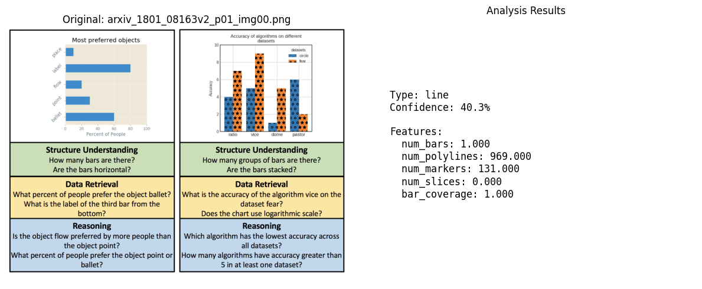

- **Status**: Success
- **Processing Time**: 6459.65 ms
- **Image Size**: 1856x1346
- **Chart Type**: line
- **Confidence**: 40.3%
- **Preprocessing Steps**: 5
- **Keypoints**: 3766
- **Polylines**: 969

### 5. arxiv_1906_11906v1_p08_img01.png

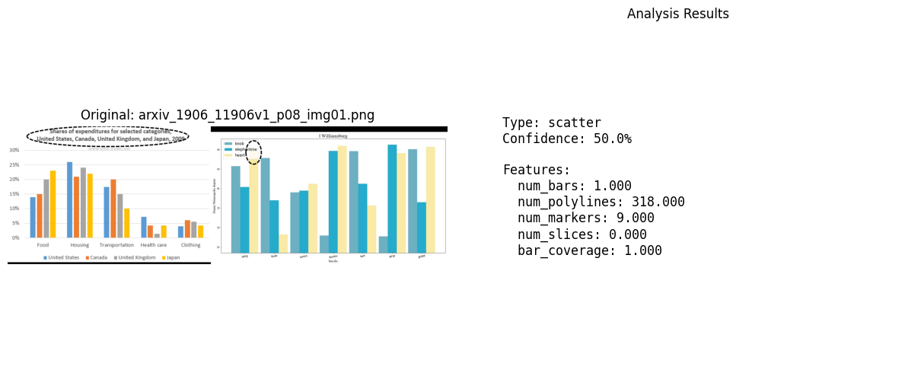

- **Status**: Success
- **Processing Time**: 2066.08 ms
- **Image Size**: 1825x573
- **Chart Type**: scatter
- **Confidence**: 50.0%
- **Preprocessing Steps**: 5
- **Keypoints**: 2083
- **Polylines**: 318

### 6. arxiv_1907_12635v1_p01_img00.png

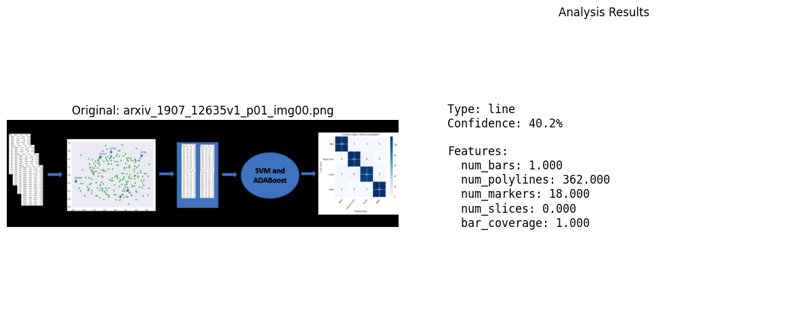

- **Status**: Success
- **Processing Time**: 2852.48 ms
- **Image Size**: 1840x502
- **Chart Type**: line
- **Confidence**: 40.2%
- **Preprocessing Steps**: 5
- **Keypoints**: 3296
- **Polylines**: 362

### 7. arxiv_1908_01801v2_p03_img01.png

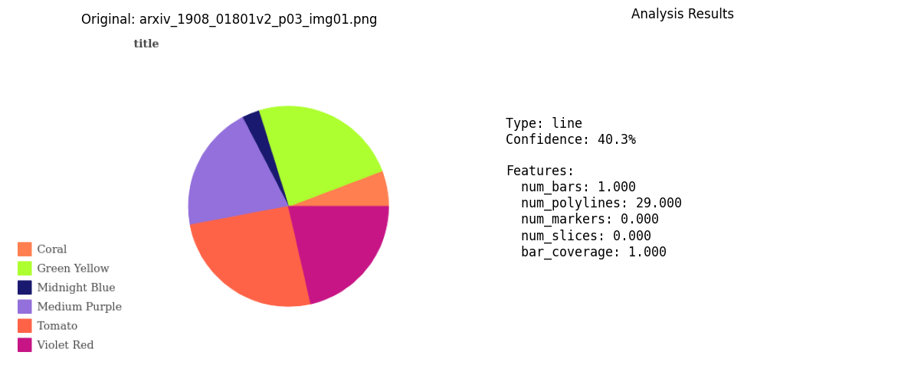

- **Status**: Success
- **Processing Time**: 365.75 ms
- **Image Size**: 532x400
- **Chart Type**: line
- **Confidence**: 40.3%
- **Preprocessing Steps**: 5
- **Keypoints**: 204
- **Polylines**: 29

### 8. arxiv_1911_09375v1_p02_img00.png

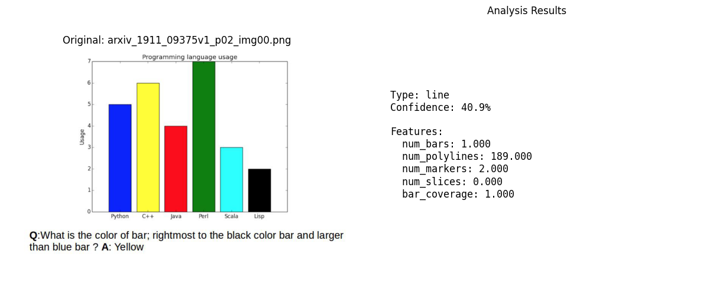

- **Status**: Success
- **Processing Time**: 914.11 ms
- **Image Size**: 902x545
- **Chart Type**: line
- **Confidence**: 40.9%
- **Preprocessing Steps**: 5
- **Keypoints**: 562
- **Polylines**: 189

### 9. arxiv_1912_05471v1_p03_img02.png

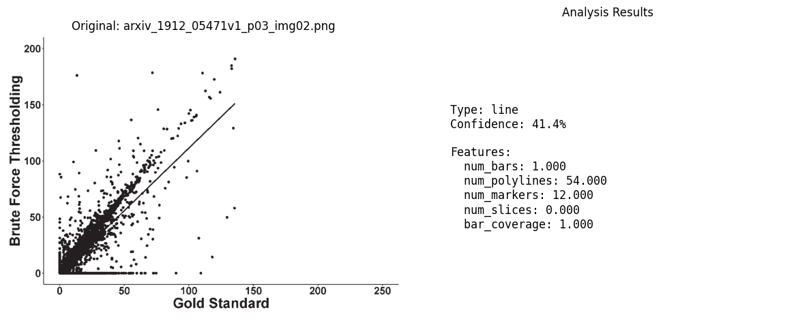

- **Status**: Success
- **Processing Time**: 1593.36 ms
- **Image Size**: 1125x795
- **Chart Type**: line
- **Confidence**: 41.4%
- **Preprocessing Steps**: 5
- **Keypoints**: 816
- **Polylines**: 54

### 10. arxiv_2005_14165v4_p04_img00.png

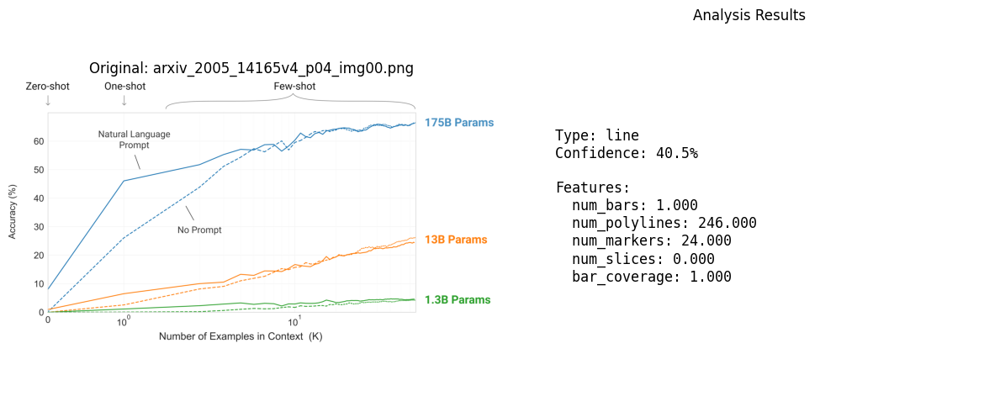

- **Status**: Success
- **Processing Time**: 16028.98 ms
- **Image Size**: 3392x1888
- **Chart Type**: line
- **Confidence**: 40.5%
- **Preprocessing Steps**: 5
- **Keypoints**: 3986
- **Polylines**: 246

### 11. arxiv_2009_02491v1_p03_img00.png

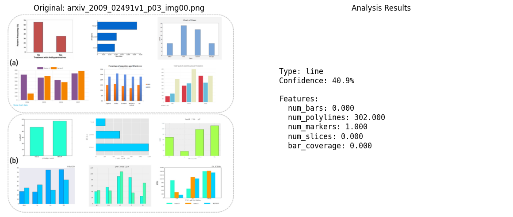

- **Status**: Success
- **Processing Time**: 2165.58 ms
- **Image Size**: 1011x873
- **Chart Type**: line
- **Confidence**: 40.9%
- **Preprocessing Steps**: 5
- **Keypoints**: 2782
- **Polylines**: 302

### 12. arxiv_2010_02319v1_p02_img00.png

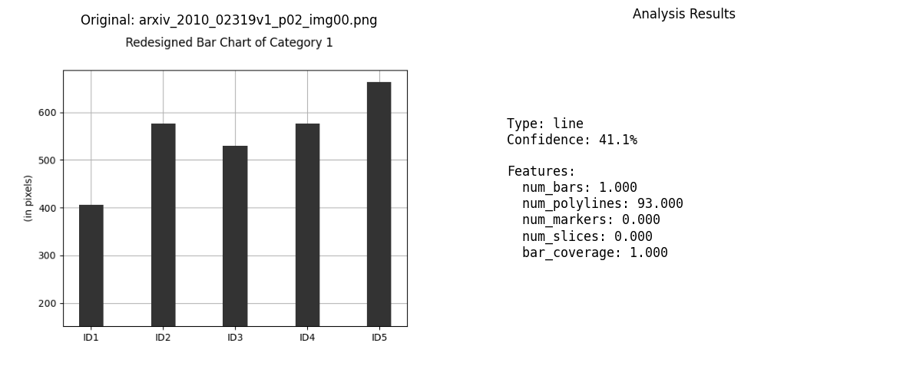

- **Status**: Success
- **Processing Time**: 777.51 ms
- **Image Size**: 640x480
- **Chart Type**: line
- **Confidence**: 41.1%
- **Preprocessing Steps**: 5
- **Keypoints**: 370
- **Polylines**: 93

### 13. arxiv_2010_14476v1_p11_img00.png

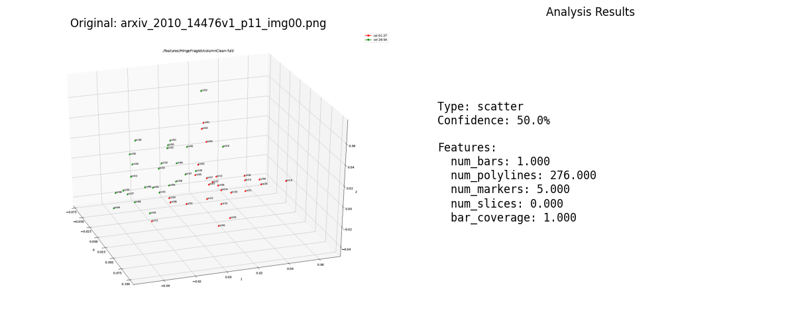

- **Status**: Success
- **Processing Time**: 2179.53 ms
- **Image Size**: 1325x950
- **Chart Type**: scatter
- **Confidence**: 50.0%
- **Preprocessing Steps**: 5
- **Keypoints**: 1450
- **Polylines**: 276

### 14. arxiv_2111_14103v1_p01_img03.png

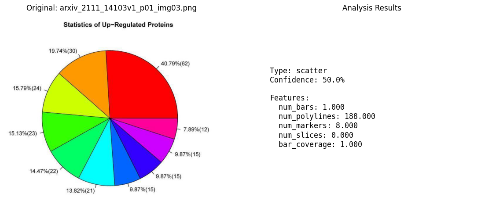

- **Status**: Success
- **Processing Time**: 920.28 ms
- **Image Size**: 729x671
- **Chart Type**: scatter
- **Confidence**: 50.0%
- **Preprocessing Steps**: 5
- **Keypoints**: 931
- **Polylines**: 188

### 15. arxiv_2112_03485v1_p02_img00.png

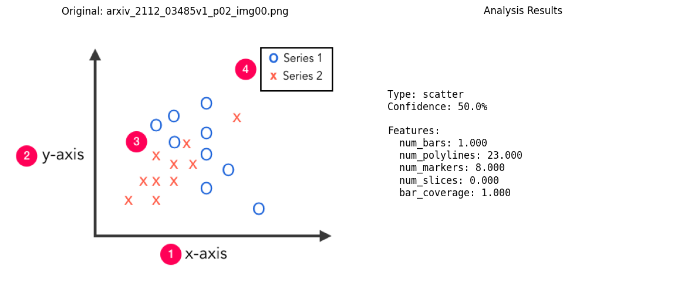

- **Status**: Success
- **Processing Time**: 428.68 ms
- **Image Size**: 479x370
- **Chart Type**: scatter
- **Confidence**: 50.0%
- **Preprocessing Steps**: 5
- **Keypoints**: 148
- **Polylines**: 23

## Summary

This test validates the Stage 3 extraction pipeline against real academic chart images
from arXiv papers. The results demonstrate the pipeline's ability to:

1. **Preprocess** diverse chart images with varying quality and styles
2. **Extract structural features** through skeletonization
3. **Vectorize** the chart structure into polylines
4. **Classify** chart types (bar, line, pie, scatter, etc.)

### Observations

- Line charts are common in academic papers for showing trends
- Classification accuracy varies based on chart complexity
- Processing time is suitable for batch processing

### Next Steps

- Fine-tune classification thresholds based on these results
- Add OCR extraction for real-world chart understanding
- Implement Stage 4 (SLM reasoning) for value extraction
