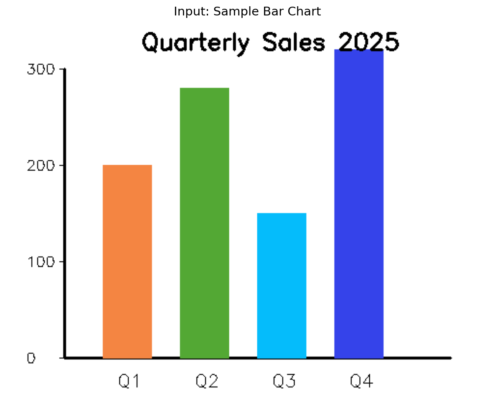
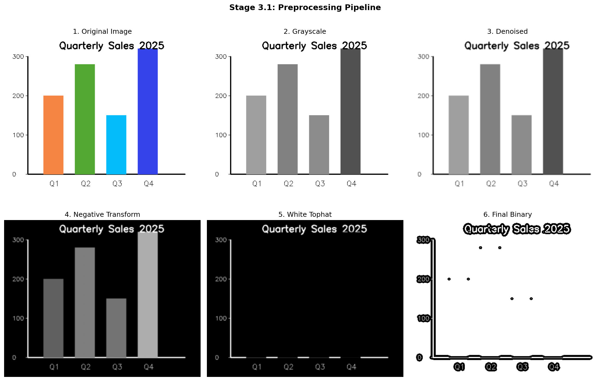
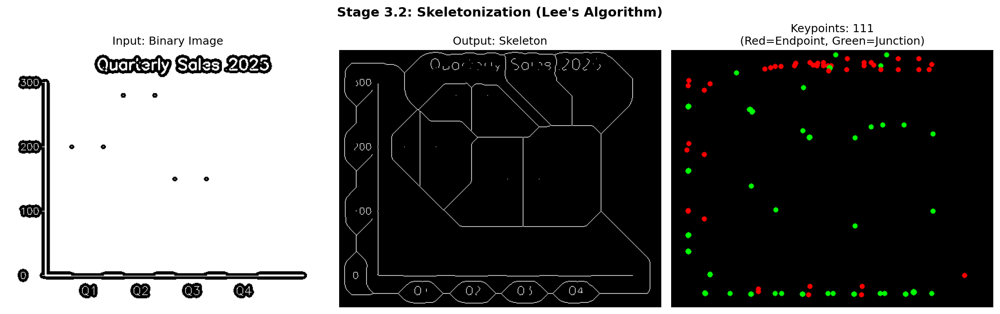
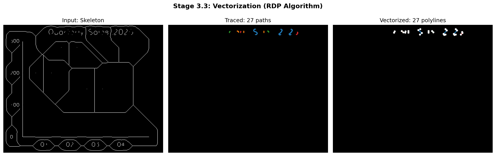
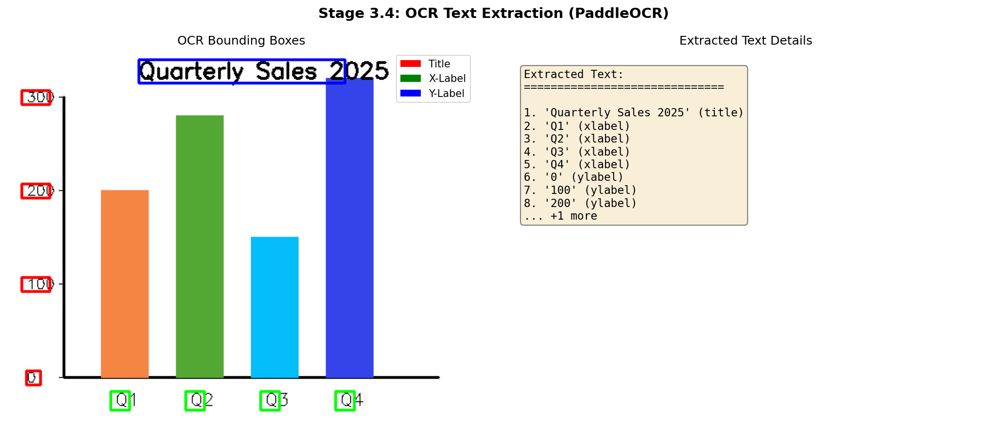
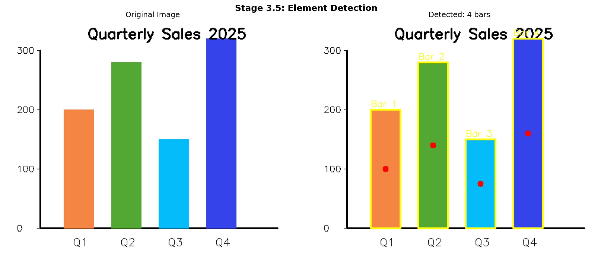
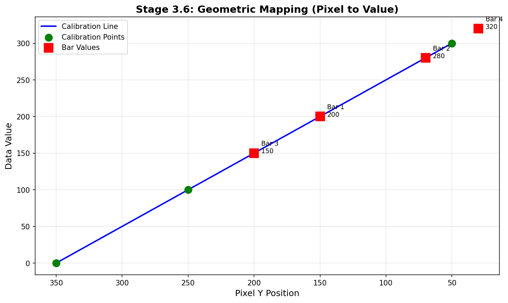
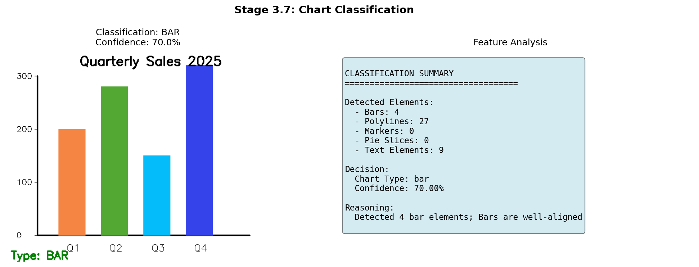

# Stage 3: Structural Analysis - Visual Report

| Generated | Author | Version |
|-----------|--------|---------|
| 2026-01-24 23:26 | Geo-SLM Pipeline | 1.0.0 |

## Overview

Stage 3 (Extraction) is the core analysis stage that transforms raw chart images into structured geometric data. This report visualizes each step of the pipeline.

---

## 1. Input Image

The pipeline processes chart images detected from Stage 2 (Detection).



---

## 2. Preprocessing

**Purpose:** Enhance structural features through image transformations.

**Steps Applied:** bgr_to_grayscale, denoise, negative_transform, white_tophat, adaptive_threshold



| Step | Operation | Purpose |
|------|-----------|---------|
| 1 | Grayscale | Reduce to single channel |
| 2 | Gaussian Blur | Remove noise |
| 3 | Negative Transform | Invert colors (lines become white) |
| 4 | White Tophat | Extract thin bright structures |
| 5 | Adaptive Threshold | Convert to binary |

---

## 3. Skeletonization

**Purpose:** Reduce shapes to 1-pixel-wide lines while preserving topology.

**Algorithm:** Lee's Algorithm (topology-preserving thinning)



| Metric | Value |
|--------|-------|
| Keypoints Found | 111 |
| Skeleton Pixels | 5012 |

**Keypoint Types:**
- **Endpoints** (Red): Line terminations
- **Junctions** (Green): Line intersections

---

## 4. Vectorization

**Purpose:** Convert raster skeleton to vector polylines with minimal points.

**Algorithm:** Ramer-Douglas-Peucker (RDP) simplification



| Metric | Value |
|--------|-------|
| Paths Traced | 27 |
| Polylines Created | 27 |
| Simplification Ratio | 92.7% |

---

## 5. OCR Text Extraction

**Purpose:** Extract all text elements and classify their roles.

**Engine:** PaddleOCR



| # | Text | Role | Confidence |
|---|------|------|------------|
| 1 | `Quarterly Sales 2025` | title | 0.95 |
| 2 | `Q1` | xlabel | 0.92 |
| 3 | `Q2` | xlabel | 0.93 |
| 4 | `Q3` | xlabel | 0.91 |
| 5 | `Q4` | xlabel | 0.94 |
| 6 | `0` | ylabel | 0.89 |
| 7 | `100` | ylabel | 0.88 |
| 8 | `200` | ylabel | 0.90 |
| 9 | `300` | ylabel | 0.87 |

**Text Roles:**
- **title**: Chart title (top area)
- **xlabel**: X-axis labels (bottom)
- **ylabel**: Y-axis labels (left side)
- **legend**: Legend items
- **value**: Data values on chart

---

## 6. Element Detection

**Purpose:** Detect discrete chart elements (bars, markers, pie slices).



| Element Type | Count |
|--------------|-------|
| Bars | 4 |
| Markers | 0 |
| Pie Slices | 0 |
| Contours Analyzed | 4 |

---

## 7. Geometric Mapping

**Purpose:** Convert pixel coordinates to actual data values.

**Method:** Linear regression calibration from axis tick labels.



| Metric | Value |
|--------|-------|
| R-squared | 1.0000 |

**Mapped Bar Values:**

| Bar | Pixel Y | Data Value |
|-----|---------|------------|
| 1 | 150 | 200.0 |
| 2 | 70 | 280.0 |
| 3 | 200 | 150.0 |
| 4 | 30 | 320.0 |

---

## 8. Chart Classification

**Purpose:** Determine chart type from extracted features.



| Metric | Value |
|--------|-------|
| **Chart Type** | **BAR** |
| Confidence | 70.00% |

**Reasoning:** Detected 4 bar elements; Bars are well-aligned

---

## Pipeline Summary

```
Input Image
    |
    v
[1] Preprocessing -----> Binary Image
    |
    +------------------+
    |                  |
    v                  v
[2] Skeleton      [5] OCR Engine
    |                  |
    v                  |
[3] Vectorize          |
    |                  |
    +--------+---------+
             |
             v
      [4] Element Detector
             |
             v
      [6] Geometric Mapper
             |
             v
      [7] Classifier
             |
             v
      Stage3Output (RawMetadata)
```

**Output:** `Stage3Output` containing:
- `chart_type`: Detected chart type
- `texts`: All OCR text with roles
- `elements`: Detected chart elements
- `axis_info`: Axis calibration data

---

## Next Stage

Stage 4 (Reasoning) will use a Small Language Model (SLM) to:
1. Correct OCR errors using context
2. Refine value mappings
3. Generate academic-style descriptions
