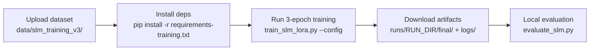

# SLM Fine-tuning Plan: Multi-Model Chart Analysis

| Version | Date | Author | Description |
| --- | --- | --- | --- |
| 3.0.0 | 2026-03-02 | That Le | Rewrite: multi-model, actual infra, current status |
| 2.0.0 | 2026-02-04 | That Le | Updated with data preparation status |

## Status: TRAINING IN PROGRESS

**Completed Prerequisites:**
- 32,364 classified charts (academic dataset)
- OCR cache (46,910 entries, 589MB)
- ResNet-18 classifier (94.14% accuracy)
- Stage 3 batch extraction (100% success)
- SLM training dataset v3 (268,799 samples, 8 chart types)
- Training infrastructure (RunManager + ExperimentTracker)
- LoRA training script with QLoRA support
- First training run completed (Llama-3.2-1B, cloud GPU)

**Current:**
- Model comparison experiments (multi-model evaluation)
- Hyperparameter tuning based on first-run observations

---

## 1. Model Selection

### 1.1. Candidate Models

| Model | Alias | Params | VRAM (4-bit) | Status |
| --- | --- | --- | --- | --- |
| `meta-llama/Llama-3.2-1B-Instruct` | `llama-1b` | 1B | ~1.5GB | PRIMARY (first run complete) |
| `Qwen/Qwen2.5-1.5B-Instruct` | `qwen-1.5b` | 1.5B | ~2GB | CANDIDATE |
| `Qwen/Qwen2.5-0.5B-Instruct` | `qwen-0.5b` | 0.5B | ~1GB | CANDIDATE (smallest) |
| `meta-llama/Llama-3.2-3B-Instruct` | `llama-3b` | 3B | ~3GB | CANDIDATE (needs >24GB) |

### 1.2. Selection Criteria

| Criterion | Weight | Rationale |
| --- | --- | --- |
| JSON output quality | CRITICAL | Pipeline requires structured output |
| VRAM fit (<=6GB inference) | HIGH | RTX 3060 deployment constraint |
| Fine-tuning stability | HIGH | LoRA must converge on chart-specific data |
| Inference speed (<2s) | MEDIUM | Per-chart latency target |
| Multilingual (EN + VI) | MEDIUM | Some charts have Vietnamese text |

### 1.3. Why Multi-Model?

The original plan targeted Qwen-2.5-1.5B only. The updated approach trains multiple models to:
1. **Comparative thesis contribution** -- showing how model size/family affects chart analysis
2. **Find optimal size/quality tradeoff** for edge deployment
3. **Validate that fine-tuning beats zero-shot** on domain-specific tasks

---

## 2. Task Definition

### 2.1. Tasks (Mapped to AIRouter TaskTypes)

| Task | AIRouter `TaskType` | Input | Output | Priority |
| --- | --- | --- | --- | --- |
| Chart Reasoning | `CHART_REASONING` | Stage 3 metadata + image | Refined chart data (JSON) | HIGH |
| OCR Correction | `OCR_CORRECTION` | Raw OCR text + chart context | Corrected text | HIGH |
| Value Extraction | `VALUE_MAPPING` | Geometric hints + OCR | Structured data points | HIGH |
| Description Gen | `DESCRIPTION_GEN` | Chart data | Academic text | MEDIUM |

### 2.2. Integration Point

After training, the best model integrates via `LocalSLMAdapter` in the AI Router:

```
Stage 4 -> AIRouter.resolve(CHART_REASONING)
   -> LocalSLMAdapter (local_slm) [PRIMARY]
   -> GeminiAdapter (fallback 1)
   -> OpenAIAdapter (fallback 2)
```

---

## 3. Training Dataset (v3)

### 3.1. Dataset Summary

| Property | Value |
| --- | --- |
| Version | v3 (2026-03-01) |
| Total Samples | 268,799 |
| Format | ChatML conversations |
| Source | 32,364 charts x 8+ QA/chart |
| Generator | `scripts/prepare_slm_training_v3.py` |
| Location | `data/slm_training_v3/` |

### 3.2. Split Distribution

| Split | Count | Usage |
| --- | --- | --- |
| Train | 228,494 | Model training |
| Validation | 26,888 | Checkpointing, early stopping |
| Test | 13,417 | Final evaluation (NEVER during training) |

### 3.3. Chart Type Distribution

| Chart Type | Samples | % of Total | Axis Info% |
| --- | --- | --- | --- |
| line | 108,419 | 40.3% | 66% |
| scatter | 52,163 | 19.4% | 62% |
| bar | 47,330 | 17.6% | 31% |
| heatmap | 33,373 | 12.4% | 51% |
| histogram | 8,438 | 3.1% | 72% |
| box | 7,362 | 2.7% | 45% |
| pie | 6,607 | 2.5% | 14% |
| area | 5,107 | 1.9% | 0% |
| **Total** | **268,799** | **100%** | **69.9%** |

### 3.4. Curriculum Stages

| Curriculum Stage | Samples | Focus |
| --- | --- | --- |
| Stage 1 (Easy) | 47,314 | Chart type + axis labels |
| Stage 2 (Medium) | 55,836 | Value extraction + OCR correction |
| Stage 3 (Hard) | 165,649 | Trends + comparisons |

### 3.5. Data Format (ChatML)

```json
{
  "conversations": [
    {
      "role": "system",
      "content": "You are a chart analysis expert. Given raw chart metadata, correct OCR errors and extract structured data."
    },
    {
      "role": "user",
      "content": "[CHART_TYPE]: bar\n[OCR_TEXTS]:\n  [TITLE]: Reverue 2021-2023\n  [AXIS]: Year | Revenue ($M)\n  [LEGEND]: Revenue\n  [DATA]: 2021, 2022, 2023, $10M, $15M, $20M\n[ELEMENTS]: bar=3, text=7\n[AXIS_INFO]: x=['2021','2022','2023'], y_range=[0, 25]\n\nExtract the structured data as JSON."
    },
    {
      "role": "assistant",
      "content": "{\"title\": \"Revenue 2021-2023\", ...}"
    }
  ],
  "metadata": {
    "chart_type": "bar",
    "curriculum_stage": 1
  }
}
```

### 3.6. Key v3 Improvements (vs. v2)

| Aspect | v2 (27k) | v3 (268k) |
| --- | --- | --- |
| Total samples | 27,200 | 268,799 (+9.9x) |
| Chart types | 7 | 8 (added area) |
| Line chart samples | 0 | 108,419 |
| Axis info in prompts | ~4% (bugged) | 69.9% (fixed) |
| OCR text grouping | Flat string | Grouped by role ([TITLE], [LEGEND], etc.) |
| Element breakdown | None | `[ELEMENTS]: bar=24, point=0` |
| Split method | Random | By chart_id (no data leakage) |
| Zero-text marker | Silent | `[OCR_QUALITY]: low` |

---

## 4. Training Configuration

### 4.1. LoRA Parameters

```yaml
lora:
  rank: 16
  alpha: 32
  dropout: 0.05
  target_modules: [q_proj, k_proj, v_proj, o_proj, gate_proj, up_proj, down_proj]
  bias: "none"
  task_type: "CAUSAL_LM"

# Trainable params (Llama-1B): 11.27M / 1,236M total (0.91%)
```

### 4.2. Training Hyperparameters

```yaml
training:
  num_train_epochs: 3
  per_device_train_batch_size: 2
  gradient_accumulation_steps: 8    # effective batch = 16
  learning_rate: 2.0e-4
  lr_scheduler_type: "cosine"
  warmup_ratio: 0.05
  weight_decay: 0.01
  max_seq_length: 4096              # CRITICAL: full conversation coverage
  bf16: true
  gradient_checkpointing: true
  optim: "paged_adamw_32bit"

quantization:
  use_4bit: true
  bnb_4bit_quant_type: "nf4"
  bnb_4bit_compute_dtype: "bfloat16"
  bnb_4bit_use_double_quant: true
```

### 4.3. Hardware Profiles

| Environment | GPU | VRAM | Estimated Time (3 epochs, 268k) | bf16 |
| --- | --- | --- | --- | --- |
| Local (RTX 3060) | 6GB | ~5GB used | ~24h | No (fp16) |
| Cloud (A100 40GB) | 40GB | ~8GB used | ~4h | Yes |
| Cloud (RTX 4090) | 24GB | ~6GB used | ~8h | Yes |

### 4.4. Run Management

Every training run is isolated via `RunManager`:

```
runs/
    slm_lora_llama-1b_20260302_153022/
        resolved_config.yaml    # Frozen config (YAML + CLI overrides)
        run_metadata.json       # Run ID, git commit, timestamps
        training_info.json      # Model params, dataset stats
        checkpoints/            # HuggingFace checkpoints
        logs/                   # TensorBoard / JSON metrics
        artifacts/              # Evaluation outputs
        final/                  # Final adapter weights
```

---

## 5. Training Commands

### 5.1. Config-Driven (Recommended)

```bash
# Full training with run isolation:
.venv/Scripts/python.exe scripts/training/train_slm_lora.py \
    --config config/training.yaml

# Ablation (override single parameter):
.venv/Scripts/python.exe scripts/training/train_slm_lora.py \
    --config config/training.yaml \
    --override slm_training.training.learning_rate=1e-5

# Different model:
.venv/Scripts/python.exe scripts/training/train_slm_lora.py \
    --config config/training.yaml \
    --model qwen-1.5b
```

### 5.2. Legacy CLI (Quick Tests)

```bash
# Quick test on mini dataset:
.venv/Scripts/python.exe scripts/training/train_slm_lora.py \
    --model llama-1b \
    --data-dir data/slm_training_mini \
    --epochs 1 \
    --batch-size 2
```

### 5.3. Cloud Training Strategy

For large-scale runs on cloud GPUs (Colab Pro, RunPod, Lambda):



### 5.4. Resume from Checkpoint

```bash
.venv/Scripts/python.exe scripts/training/train_slm_lora.py \
    --config config/training.yaml \
    --resume runs/slm_lora_llama-1b_20260302_153022/checkpoints/checkpoint-600
```

---

## 6. Evaluation Framework

### 6.1. Metrics

| Metric | Description | Target |
| --- | --- | --- |
| JSON Valid Rate | % of outputs that parse as valid JSON | >95% |
| Field Accuracy | Correct chart_type, title, axis labels | >90% |
| Numeric Accuracy | Values within 5% tolerance | >85% |
| OCR Correction Rate | % of OCR errors successfully fixed | >80% |
| Inference Latency | Time per chart (4-bit, single GPU) | <2s |
| VRAM Usage | Peak memory during inference | <4GB |

### 6.2. Evaluation Commands

```bash
# Evaluate on test set:
.venv/Scripts/python.exe scripts/evaluation/evaluate_slm.py \
    --model-path models/slm/llama-3.2-1b-chart-lora-v3/final \
    --test-data data/slm_training_v3/test.json \
    --output models/evaluation/slm_eval_llama1b_v3.json

# Compare multiple models:
.venv/Scripts/python.exe scripts/evaluation/evaluate_slm.py \
    --compare \
    --models llama-1b:models/slm/llama-3.2-1b-chart-lora-v3/final \
              qwen-1.5b:models/slm/qwen2.5-1.5b-chart-lora-v3/final
```

---

## 7. Model Comparison Experiment

### 7.1. Experiment Design

**Thesis contribution:** Demonstrating that a fine-tuned 1B-3B model can approach cloud LLM quality for domain-specific chart analysis tasks.

| Model | Size | Method | Dataset |
| --- | --- | --- | --- |
| Llama-3.2-1B (base) | 1B | Zero-shot 4-bit | test.json (13,417) |
| Llama-3.2-1B (LoRA) | 1B + 11MB | Fine-tuned QLoRA | test.json |
| Qwen-2.5-1.5B (base) | 1.5B | Zero-shot 4-bit | test.json |
| Qwen-2.5-1.5B (LoRA) | 1.5B + ~15MB | Fine-tuned QLoRA | test.json |
| Qwen-2.5-0.5B (LoRA) | 0.5B + ~8MB | Fine-tuned QLoRA | test.json |
| Gemini 2.0 Flash | Cloud | Zero-shot API | test.json |
| GPT-4o-mini | Cloud | Zero-shot API | test.json |

### 7.2. Results Matrix (To Be Filled)

| Metric | Llama-1B base | Llama-1B LoRA | Qwen-1.5B base | Qwen-1.5B LoRA | Gemini | GPT-4o-mini |
| --- | --- | --- | --- | --- | --- | --- |
| JSON Valid Rate | ? | ? | ? | ? | ? | ? |
| Field Accuracy | ? | ? | ? | ? | ? | ? |
| Numeric Accuracy | ? | ? | ? | ? | ? | ? |
| Latency (per chart) | ? | ? | ? | ? | ? | ? |
| Cost per 1K charts | $0 | $0 | $0 | $0 | ~$X | ~$Y |

---

## 8. Prompt Templates

### 8.1. Chart Reasoning (Primary Task)

**System:**
```
You are a chart analysis expert. Given raw chart metadata including OCR-extracted text,
geometric elements, and axis information, you must:
1. Correct any OCR errors in the text
2. Extract structured data as valid JSON
3. Identify key trends and patterns
Always respond with ONLY valid JSON. No markdown, no explanations.
```

**User (v3 format with OCR roles + axis info):**
```
[CHART_TYPE]: bar
[OCR_TEXTS]:
  [TITLE]: Quarterty Reverue
  [AXIS]: Q1 | Q2 | Q3 | Q4
  [LEGEND]: 2024, 2025
  [DATA]: 10, 15, 12, 18, 14, 20, 16, 22
[ELEMENTS]: bar=8, text=12, line=0
[AXIS_INFO]: x=['Q1','Q2','Q3','Q4'], y_range=[0,25]

Extract the structured data as JSON.
```

**Expected Output:**
```json
{
  "title": "Quarterly Revenue",
  "chart_type": "bar",
  "x_axis": "Quarter",
  "y_axis": "Revenue",
  "series": [
    {"name": "2024", "data": [{"x": "Q1", "y": 10}, {"x": "Q2", "y": 15}, {"x": "Q3", "y": 12}, {"x": "Q4", "y": 18}]},
    {"name": "2025", "data": [{"x": "Q1", "y": 14}, {"x": "Q2", "y": 20}, {"x": "Q3", "y": 16}, {"x": "Q4", "y": 22}]}
  ]
}
```

### 8.2. OCR Correction Template

**System:**
```
You are an OCR error correction specialist for chart text.
Common errors: 'l' -> '1', 'O' -> '0', 'S' -> '5', missing spaces, merged words.
Return corrected text as JSON array.
```

### 8.3. Value Extraction Template

**System:**
```
You are a data extraction specialist. Given geometric measurements and OCR text from a chart,
map pixel-space values to data-space values. Return structured JSON with data points.
```

---

## 9. Implementation Timeline

### Phase 1: Data Preparation [DONE]
- [x] Stage 3 batch extraction (32,364 charts, 100% success)
- [x] Chart QA generation (v2, 32,364 files)
- [x] Training data pipeline v3 (268,799 samples)
- [x] Train/val/test split by chart_id (no leakage)

### Phase 2: Infrastructure [DONE]
- [x] RunManager (config freezing, run isolation, registry)
- [x] ExperimentTracker (json/wandb/tensorboard/none backends)
- [x] Training script refactor (config-driven, --override support)
- [x] Mini dataset for quick iterations (slm_training_mini/)

### Phase 3: First Training Run [DONE]
- [x] Llama-3.2-1B-Instruct with QLoRA on cloud GPU
- [x] Training completed (outputs in models/slm/llama-3.2-1b-chart-lora-v3/)

### Phase 4: Evaluation and Iteration [IN PROGRESS]
- [ ] Evaluate first-run model on test set
- [ ] Analyze failure cases by chart type
- [ ] Identify hyperparameter improvements
- [ ] Document findings in failure analysis report

### Phase 5: Multi-Model Comparison [TODO]
- [ ] Train Qwen-2.5-1.5B-Instruct
- [ ] Train Qwen-2.5-0.5B-Instruct
- [ ] Run zero-shot baselines (all models + cloud APIs)
- [ ] Generate comparison table for thesis

### Phase 6: Integration [TODO]
- [ ] Select best model for LocalSLMAdapter
- [ ] Merge LoRA into base model (scripts/merge_slm_lora.py)
- [ ] End-to-end pipeline test with local SLM
- [ ] Benchmark latency and VRAM on RTX 3060

---

## 10. File Inventory

### 10.1. Scripts

| File | Purpose | Status |
| --- | --- | --- |
| `scripts/training/train_slm_lora.py` | QLoRA fine-tuning with RunManager | EXISTS |
| `scripts/training/prepare_slm_training_v3.py` | Build v3 dataset | EXISTS |
| `scripts/evaluation/evaluate_slm.py` | Model evaluation benchmark | EXISTS |
| `scripts/utils/download_models.py` | Download + verify base models | EXISTS |
| `scripts/training/merge_slm_lora.py` | Merge LoRA into base model | TO CREATE |

### 10.2. Configuration

| File | Purpose | Status |
| --- | --- | --- |
| `config/training.yaml` | Training hyperparameters + run management | EXISTS |
| `config/base.yaml` | Shared project config | EXISTS |
| `config/models.yaml` | Model paths and thresholds | EXISTS |

### 10.3. Infrastructure

| File | Purpose | Status |
| --- | --- | --- |
| `src/training/run_manager.py` | Run isolation, config freezing (478 lines) | EXISTS |
| `src/training/experiment_tracker.py` | Multi-backend tracking (385 lines) | EXISTS |

### 10.4. Data

| Directory | Content | Status |
| --- | --- | --- |
| `data/slm_training_v3/` | 268,799 ChatML conversations | EXISTS |
| `data/slm_training_mini/` | Subset for quick iteration | EXISTS |
| `data/slm_training_v2/` | Archived baseline (27k) | ARCHIVED |

### 10.5. Models

| Directory | Content | Status |
| --- | --- | --- |
| `models/slm/llama-3.2-1b-chart-lora-v3/` | First training run output | EXISTS |
| `models/slm/llama-3.2-1b-instruct/` | Base model cache | EXISTS |
| `models/slm/qwen2.5-1.5b-instruct/` | Base model cache | EXISTS |

---

## 11. References

- Training guide: [docs/guides/TRAINING.md](../guides/TRAINING.md)
- Module instructions: [.github/instructions/module-training.instructions.md](../../.github/instructions/module-training.instructions.md)
- AI Router architecture: [docs/architecture/STAGE4_REASONING.md](../architecture/STAGE4_REASONING.md)
- Pipeline flow: [docs/architecture/PIPELINE_FLOW.md](../architecture/PIPELINE_FLOW.md)
- Config file: [config/training.yaml](../../config/training.yaml)
